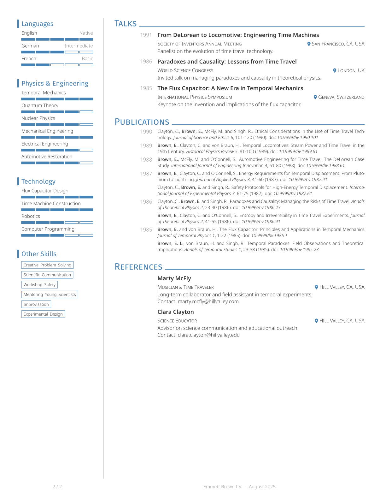

# Neat CV

[](https://github.com/dialvarezs/neat-cv/actions/workflows/ci.yml)

A modern and elegant CV template for Typst, inspired by [Awesome CV](https://github.com/posquit0/Awesome-CV) and [simple-hipstercv](https://github.com/latex-ninja/simple-hipstercv).

## Features

- Modern, clean two-column layout with sidebar
- Customizable accent color and fonts
- Publication list generated from Hayagriva YAML, grouped by year, with author highlighting
- Level bars for languages and skills
- Social/contact info with icons and clickable links

## Requirements

### Software

- [typst](https://typst.app/) (tested with v0.13.0+)

### Fonts

#### Text Fonts

By default, this template uses the Fira Sans and Noto Sans fonts.

If you use the template through the webapp (https://typst.app), you don't need to do anything.

If you want to use it locally instead, you will need to install these fonts on your system to use the template with its defaults. You have a few options for this:
- Use [fontist](https://github.com/fontist/fontist) to install the fonts automatically:
  ```bash
  fontist manifest-install manifest.yml
  fontist fontconfig update
  ```
- Download the fonts manually and install them in your system's font directory:
  - [Fira Sans](https://fonts.google.com/specimen/Fira+Sans)
  - [Noto Sans](https://fonts.google.com/specimen/Noto+Sans)
- (Linux) Install them via your package manager, as most distributions provide these fonts in their repositories.

#### Icon Fonts

This template uses FontAwesome icons via the [fontawesome](https://typst.app/universe/package/fontawesome) package.
To install the icons, you need to download the "FontAwesome Free For Desktop" package from the [FontAwesome website](https://fontawesome.com/download) and install the `.otf` files in your system's font directory.

> [!NOTE]
> If you are using the webapp (https://typst.app/), upload the entire `otf/` directory to your project and the fonts will be recognized automatically (possibly after a reload).

## Usage

Here is a basic usage example:

```typst
#import "@preview/neat-cv:0.3.1": cv, side, entry, item-with-level, contact-info, social-links

#show: cv.with(
  author: (
    firstname: "John",
    lastname: "Smith",
    email: "john.smith@example.com",
    position: ("Data Scientist"),
    github: "jsmith",
  ),
  profile-picture: image("my_profile.png"),
)

#side[
  = About Me
  Just someone learning Typst.

  = Contact
  #contact-info()

  = Skills
  #item-with-level("Python", 4)
  #item-with-level("Bash", 3)

  #v(1fr)
  #social-links()
]

= Education

#entry(
  title: "Master of Science in Data Science",
  institution: "University of Somewhere",
  location: "Somewhere, World",
  date: "2023",
  [Thesis: "My thesis title"],
)

= Experience

#entry(
  title: "Data Scientist",
  institution: "Somewhere Inc.",
  location: "Somewhere, World",
  date: "2023 - Present",
  [
    - Worked on some interesting projects.
  ],
)
```

For a more complete example, see the `template/cv.typ` file in the repository.

## Example

|                                |                                |
| ------------------------------ | ------------------------------ |
|  |  |
