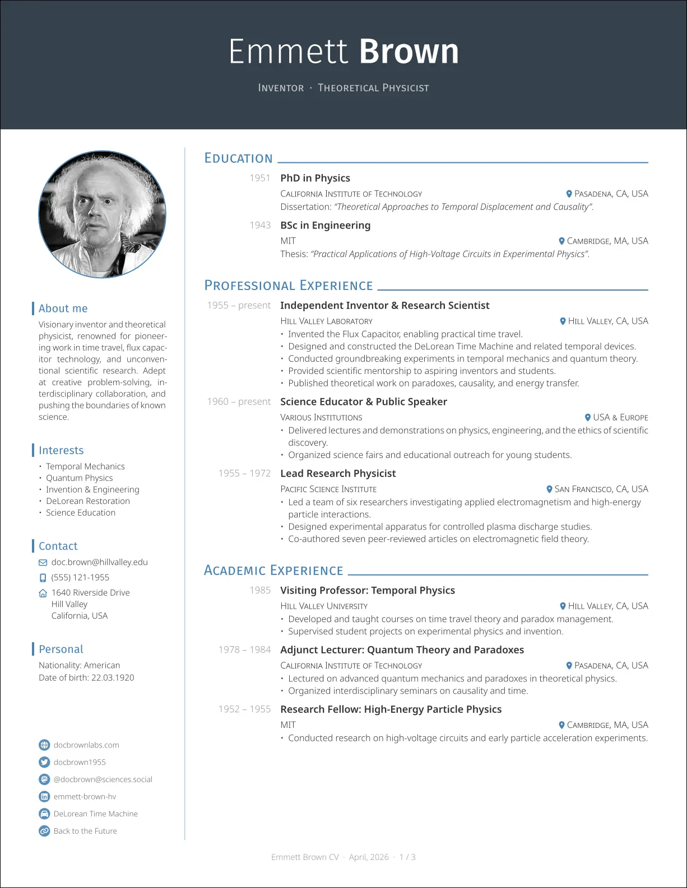
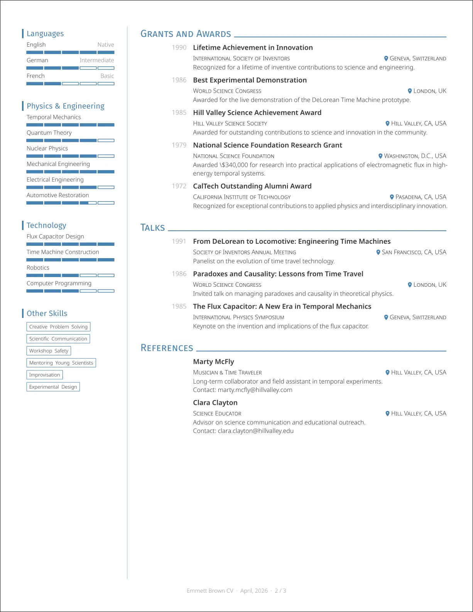
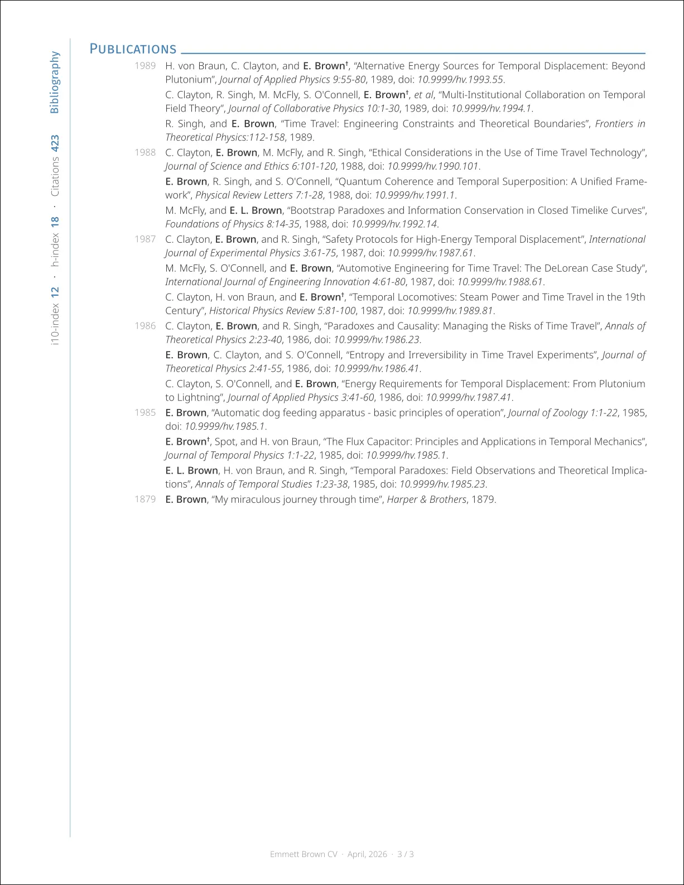
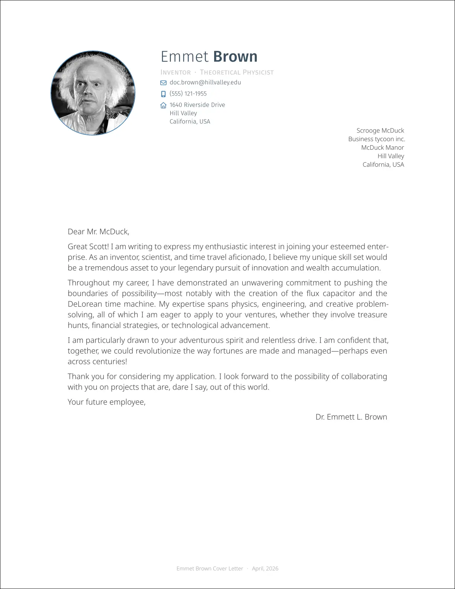

# Neat CV
[](https://typst.app/universe/package/neat-cv)
[](https://github.com/dialvarezs/neat-cv/actions/workflows/ci.yml)

[](https://github.com/dialvarezs/neat-cv/stargazers)

A modern and elegant CV template for Typst, inspired by [Awesome CV](https://github.com/posquit0/Awesome-CV) and [simple-hipstercv](https://github.com/latex-ninja/simple-hipstercv).

## Features

- Flexible per-page layout: full sidebar, thin decorative sidebar, or full-width
- Cover letter template
- Customizable accent color and fonts
- Publication list generated from Hayagriva YAML, grouped by year, with author highlighting
- Level bars for languages and skills
- Item pills for tags and keywords
- Social/contact info with icons and clickable links

## Preview

### CV

 



### Cover Letter



## Requirements

### Software

- [typst](https://typst.app/) (tested with v0.13.0+)

### Fonts

#### Text Fonts

By default, this template uses the Fira Sans and Noto Sans fonts. Roboto is used as a fallback font if Noto Sans is not available.

If you use the template through the webapp (https://typst.app), you don't need to do anything.

If you want to use it locally instead, you will need to install these fonts on your system to use the template with its defaults. You have a few options for this:
- Use [fontist](https://github.com/fontist/fontist) to install the fonts automatically:
  ```bash
  fontist manifest-install manifest.yml
  fontist fontconfig update
  ```
- Download the fonts manually and install them in your system's font directory:
  - [Fira Sans](https://fonts.google.com/specimen/Fira+Sans)
  - [Noto Sans](https://fonts.google.com/specimen/Noto+Sans)
- (Linux) Install them via your package manager, as most distributions provide these fonts in their repositories.

#### Icon Fonts

This template uses FontAwesome icons via the [fontawesome](https://typst.app/universe/package/fontawesome) package.
To install the icons, you need to download the "FontAwesome Free For Desktop" package from the [FontAwesome website](https://fontawesome.com/download) and install the `.otf` files in your system's font directory.

If you are using the webapp (https://typst.app/), upload the entire `otf/` directory to your project and the fonts will be recognized automatically (possibly after a reload).

## Usage

### CV

Here is a basic usage example:

```typst
#import "@preview/neat-cv:1.0.0": cv, cv-with-side, entry, item-with-level, contact-info, social-links

#show: cv.with(
  author: (
    firstname: "John",
    lastname: "Smith",
    email: "john.smith@example.com",
    position: ("Data Scientist"),
    github: "jsmith",
  ),
  profile-picture: image("my_profile.png"),
)

#cv-with-side[
  = About Me
  Just someone learning Typst.

  = Contact
  #contact-info()

  = Skills
  #item-with-level("Python", 4)
  #item-with-level("Bash", 3)

  #v(1fr)
  #social-links()
][
  = Education

  #entry(
    title: "Master of Science in Data Science",
    institution: "University of Somewhere",
    location: "Somewhere, World",
    date: "2023",
    [Thesis: "My thesis title"],
  )

  = Experience

  #entry(
    title: "Data Scientist",
    institution: "Somewhere Inc.",
    location: "Somewhere, World",
    date: "2023 – present",
    [
      - Worked on some interesting projects.
    ],
  )
]
```

For pages with a thin decorative sidebar (e.g. a publications section), use `cv-thin-side`:

```typst
#import "@preview/neat-cv:1.0.0": cv-thin-side, thin-label, thin-metrics, publications

// Use #pagebreak() to switch layout between pages
#pagebreak()

#cv-thin-side[
  #thin-label("Publications")
  #v(5mm)
  #thin-metrics((
    (label: "h-index", value: "12"),
    (label: "Citations", value: "280"),
  ))
][
  = Publications
  #publications(yaml("publications.yml"), highlight-authors: ("Smith, John",))
]
```

And if you want a full-width layout, you can just use the components directly without wrapping them in a `cv-with-side` or `cv-thin-side` block.

For a complete example, see the `template/cv.typ` file in the repository.

### Cover Letter

You can also create a matching cover letter:

```typst
#import "@preview/neat-cv:1.0.0": letter

#show: letter.with(
  author: (
    firstname: "John",
    lastname: "Smith",
    email: "john.smith@example.com",
    address: [123 Main St\ City, Country],
    phone: "(555) 123-4567",
    position: ("Data Scientist"),
  ),
  profile-picture: image("my_profile.png"),
  accent-color: rgb("#4682b4"),
  recipient: [
    Jane Doe\
    Hiring Manager\
    Company Inc.\ 456 Business Ave\ City, Country
  ],
)

Dear Ms. Doe,

I am writing to express my interest in the Data Scientist position at Company Inc.

// Your letter content here...

Sincerely,

#align(right)[John Smith]
```

For a complete example, see the `template/letter.typ` file in the repository.
