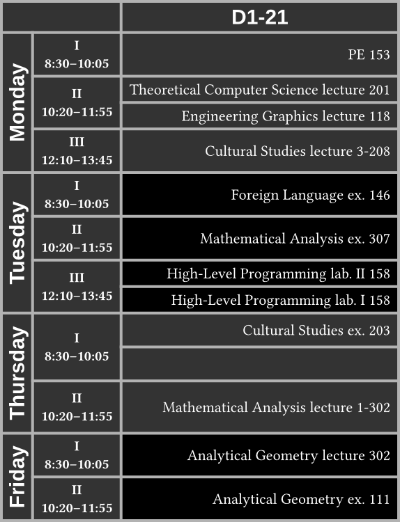
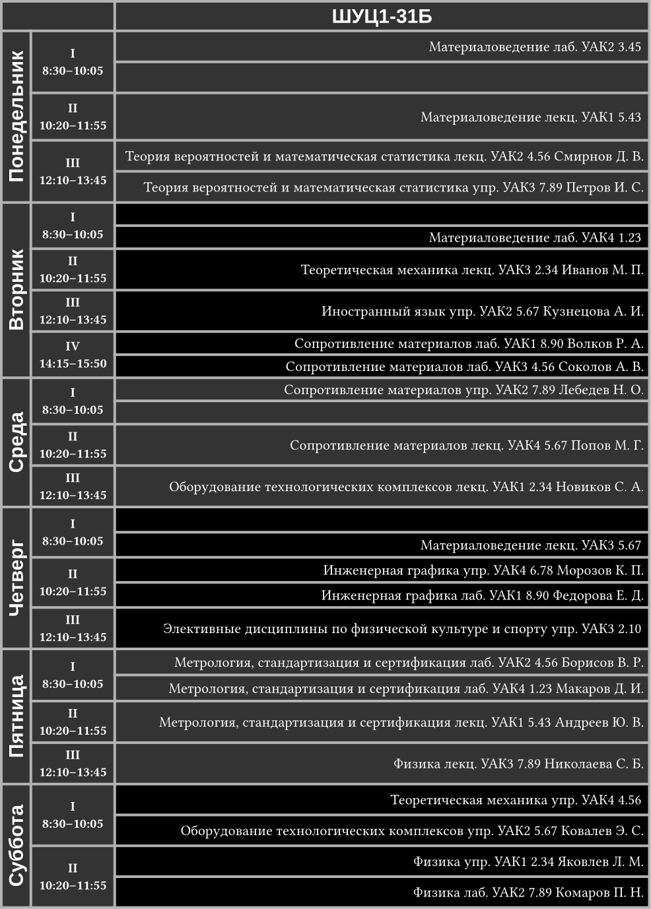
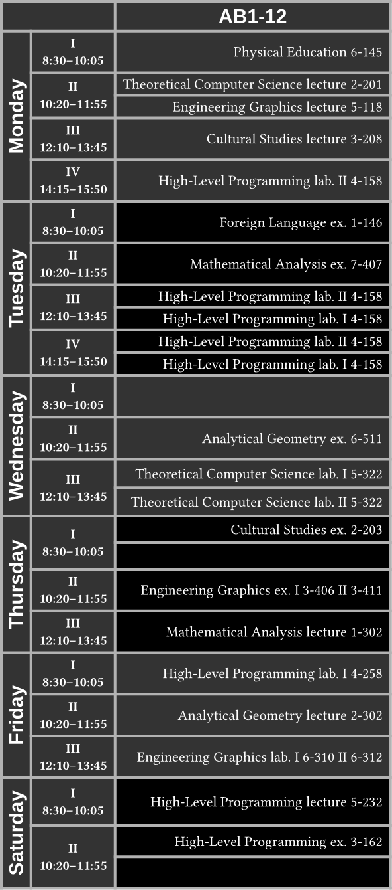
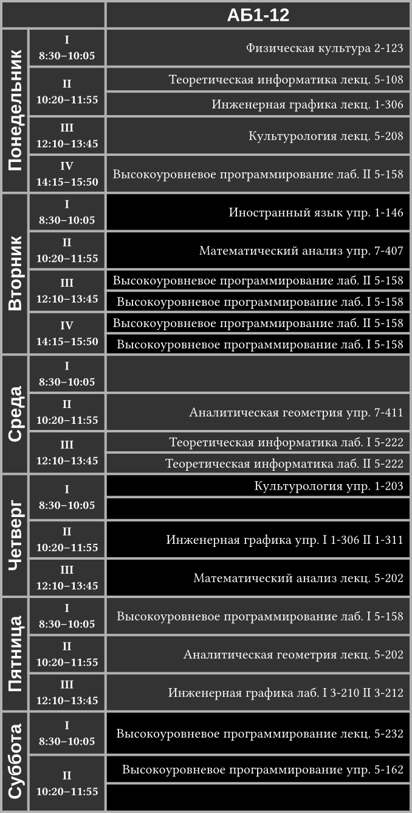

# neat-timetable (Typst template)

[neat-timetable] is a template for creating timetable for university
classes (class schedule) that use a 2-week system: numerator and denominator
week. Essentially, the first week is a numerator week, therefore the second
week is a denominator week, and then the cycle continues.

[neat-timetable]: https://codeberg.org/Andrew15-5/neat-timetable

## Usage

First, choose the "neat-timetable" template in https://typst.app or via CLI:

```sh
typst init @preview/neat-timetable:0.1.0
```

To use the default settings, you will need the [Liberation] typeface.
Particularly the [`LiberationSans-Bold.ttf`] file.

[Liberation]: https://github.com/liberationfonts/liberation-fonts
[`LiberationSans-Bold.ttf`]: https://codeberg.org/Andrew15-5/neat-timetable/raw/branch/main/fonts/Liberation/LiberationSans-Bold.ttf

You can also start using the template by directly importing it:

```typ
#import "@preview/neat-timetable:0.1.0": template, timetable
#show: template.with(group: "D1-21")
#pdf.embed("timetable.typ") // Make PDF reproducible and easy to edit.
#timetable(data: (
  "Monday": (
    ("PE 153",),
    (
      "Theoretical Computer Science lecture 201",
      "Engineering Graphics lecture 118",
    ),
    ("Cultural Studies lecture 3-208",),
  ),
  "Tuesday": (
    ("Foreign Language ex. 146",),
    ("Mathematical Analysis ex. 307",),
    (
      "High-Level Programming lab. II 158",
      "High-Level Programming lab. I 158",
    ),
  ),
  "Thursday": (
    ("Cultural Studies ex. 203", none),
    ("Mathematical Analysis lecture 1-302",),
  ),
  "Friday": (
    ("Analytical Geometry lecture 302",),
    ("Analytical Geometry ex. 111",),
  ),
))
```



Besides class name and location, you can, for example, include type of class
(lecture, exercise, laboratory work, etc.), subgroup (if it exists, when there
are many students), and professor name.

### Automating data creation

If you have a structured representation of timetable that can be transformed to
Typst `dict`ionary to be used by `timetable` (e.g., [`ШУЦ1-31Б.json`]), you can
automate everything, so that your Typst file only includes:

```typ
#import "/template.typ": get-timetable-info, template, timetable
#show: template
#pdf.embed("timetable.typ")
#timetable(..get-timetable-info(json("ШУЦ1-31Б.json")))
```



See [`automated-example-ru`] test.

[`automated-example-ru`]: ./tests/automated-example-ru
[`ШУЦ1-31Б.json`]: ./tests/automated-example-ru/ШУЦ1-31Б.json

If you would like to copy the Typst dictionary from the `get-timetable-info`,
use [`repr`]:

```typ
#import "@preview/neat-timetable:0.1.0": get-timetable-info
#repr(get-timetable-info(json("ШУЦ1-31Б.json")).at("data")) // Data only
#repr(get-timetable-info(json("ШУЦ1-31Б.json")).at("group")) // Group only
#repr(get-timetable-info(json("ШУЦ1-31Б.json")) // `arguments` value
```

Then simply select text from the generated PDF, paste it in Typst source file
and use like shown in [Usage](#usage) or [Examples](#examples). Note that
`repr` doesn't have stable/defined output, so in future it might not produce
valid Typst dictionary syntax. Furthermore, you will get a nice representation
only if `format-entry` outputs `str` and not `content` (default implementation
outputs `str`).

[`repr`]: https://typst.app/docs/reference/foundations/repr/

## Examples

```typ
#import "@preview/neat-timetable:0.1.0": template, timetable
#show: template.with(group: "AB1-12")
#timetable(data: (
  "Monday": (
    ("Physical Education 6-145",),
    (
      "Theoretical Computer Science lecture 2-201",
      "Engineering Graphics lecture 5-118",
    ),
    ("Cultural Studies lecture 3-208",),
    ("High-Level Programming lab. II 4-158",),
  ),
  "Tuesday": (
    ("Foreign Language ex. 1-146",),
    ("Mathematical Analysis ex. 7-407",),
    (
      "High-Level Programming lab. II 4-158",
      "High-Level Programming lab. I 4-158",
    ),
    (
      "High-Level Programming lab. II 4-158",
      "High-Level Programming lab. I 4-158",
    ),
  ),
  "Wednesday": (
    (none,),
    ("Analytical Geometry ex. 6-511",),
    (
      "Theoretical Computer Science lab. I 5-322",
      "Theoretical Computer Science lab. II 5-322",
    ),
  ),
  "Thursday": (
    ("Cultural Studies ex. 2-203", none),
    ("Engineering Graphics ex. I 3-406 II 3-411",),
    ("Mathematical Analysis lecture 1-302",),
  ),
  "Friday": (
    ("High-Level Programming lab. I 4-258",),
    ("Analytical Geometry lecture 2-302",),
    ("Engineering Graphics lab. I 6-310 II 6-312",),
  ),
  "Saturday": (
    ("High-Level Programming lecture 5-232",),
    ("High-Level Programming ex. 3-162", none),
  ),
))
```



---

```typ
#import "@preview/neat-timetable:0.1.0": template, timetable
#show: template.with(group: "AБ1-12")
#timetable(data: (
  "Понедельник": (
    ("Физическая культура 2-123",),
    (
      "Теоретическая информатика лекц. 5-108",
      "Инженерная графика лекц. 1-306",
    ),
    ("Культурология лекц. 5-208",),
    ("Высокоуровневое программирование лаб. II 5-158",),
  ),
  "Вторник": (
    ("Иностранный язык упр. 1-146",),
    ("Математический анализ упр. 7-407",),
    (
      "Высокоуровневое программирование лаб. II 5-158",
      "Высокоуровневое программирование лаб. I 5-158",
    ),
    (
      "Высокоуровневое программирование лаб. II 5-158",
      "Высокоуровневое программирование лаб. I 5-158",
    ),
  ),
  "Среда": (
    (none,),
    ("Аналитическая геометрия упр. 7-411",),
    (
      "Теоретическая информатика лаб. I 5-222",
      "Теоретическая информатика лаб. II 5-222",
    ),
  ),
  "Четверг": (
    ("Культурология упр. 1-203", none),
    ("Инженерная графика упр. I 1-306 II 1-311",),
    ("Математический анализ лекц. 5-202",),
  ),
  "Пятница": (
    ("Высокоуровневое программирование лаб. I 5-158",),
    ("Аналитическая геометрия лекц. 5-202",),
    ("Инженерная графика лаб. I 3-210 II 3-212",),
  ),
  "Суббота": (
    ("Высокоуровневое программирование лекц. 5-232",),
    ("Высокоуровневое программирование упр. 5-162", none),
  ),
))
```



## API

### `template`

```typ
/// Template function used together with `timetable`.
///
/// - group (str, content): timetable of this group/class
/// - time-data (array): array of timings for each class to show
/// - text-fill (color): `text.fill`
/// - table-fill (color): `table.fill`
/// - table-zebra-fill (color): alternating `table.fill` for readability
/// - table-zebra-odd (bool): whether to use zebra fill for odd weekdays
/// - table-stroke (stroke): `table.stroke`
/// - title (auto, none, str, content): document title
/// - extra-styling (bool): whether to apply extra styling that can't be
///     undone, because of show rule wrapper
/// - sans-font (str): which sans-serif font to use as a part of `extra-styling`
/// - doc (content): document to apply the template to
#let template(
  group: "group name",
  time-data: time-data,
  text-fill: white,
  table-fill: rgb("333"),
  table-zebra-fill: black,
  table-zebra-odd: false,
  table-stroke: 2pt + rgb("b2b2b2"),
  title: auto,
  extra-styling: true,
  sans-font: "Liberation Sans",
  doc,
)
```

---

### `timetable`

```typ
/// A table wrapper for creating class schedule.
///
/// - group (auto, str, content): timetable of this group/class.
///     `auto` uses data from used template, otherwise default is used.
/// - zebra-fill (auto, color): alternating `table.fill` for readability.
///     `auto` uses data from used template, otherwise default is used.
/// - zebra-odd (auto, bool): whether to use zebra fill for odd weekdays.
///     `auto` uses data from used template, otherwise default is used.
/// - time-data (auto, array): array of timings for each class to show.
///     `auto` uses data from used template, otherwise default is used.
/// - data (dictionary): dictionary of weekday as keys and array of classes as
///     values. Each class can be an array of 1 value (class on numerator and
///     denominator week) or 2 values (first class on numerator week, second
///     class on denominator week). Each value can one of: `none`, `str`,
///     `content`.
#let timetable(
  group: auto,
  zebra-fill: auto,
  time-data: auto,
  zebra-odd: auto,
  data: (:),
)
```

---

### `format-entry`

```typ
/// Format entry (class info) in the timetable.
///
/// - class (dictionary): source class data that contains everything necessary
///     for formatting an entry
/// -> content
#let format-entry(class)
```

---

### `get-timetable-info`

```typ
/// Transform source dictionary to `arguments` that can be passed to
/// `timetable`. To modify, simply create your own function from scratch, or
/// copy this one to your project and edit accordingly.
///
/// - source (dictionary): source dictionary. Can be obtained through data
///     loading functions.
/// - format-entry (function): used to format single entry from data. This
///     splits the schedule generation logic from class info generation logic.
/// -> arguments
#let get-timetable-info(source, format-entry: format-entry)
```

## License

This Typst package is licensed under AGPL-3.0-only license with exception for
`format-entry` and `get-timetable-info` functions in the [`template.typ`] file
that are licensed under MIT-0 license. You can view:
- the AGPL-3.0-only license in the [`AGPL-3.0-only.txt`] file in the
  [`LICENSES`] directory in the root of the project or at
  <https://www.gnu.org/licenses/agpl-3.0.txt>
- the MIT-0 licenses in the [`MIT-0.txt`] file in the [`LICENSES`] directory in
  the root of the project or at <https://romanrm.net/mit-zero>

[`template.typ`]: ./template.typ
[`LICENSES`]: ./LICENSES
[`AGPL-3.0-only.txt`]: ./LICENSES/AGPL-3.0-only.txt
[`MIT-0.txt`]: ./LICENSES/MIT-0.txt
