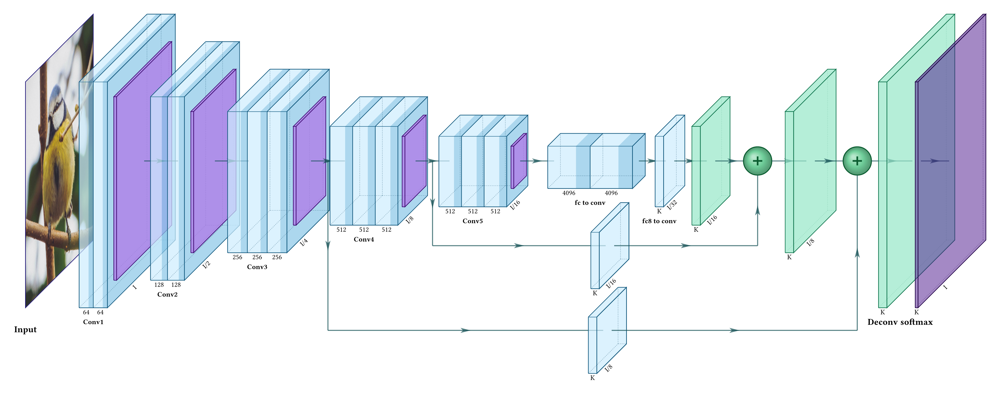
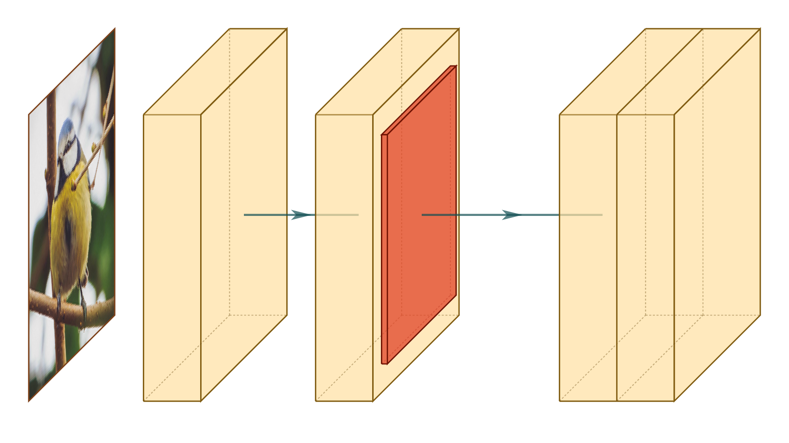
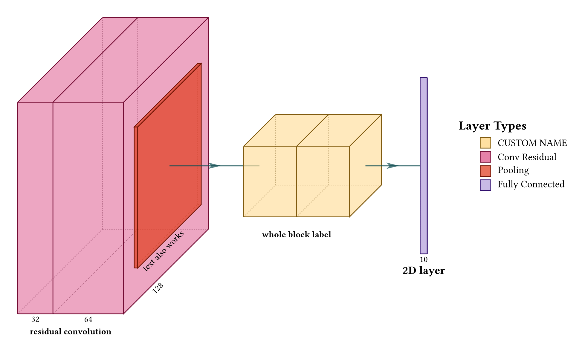
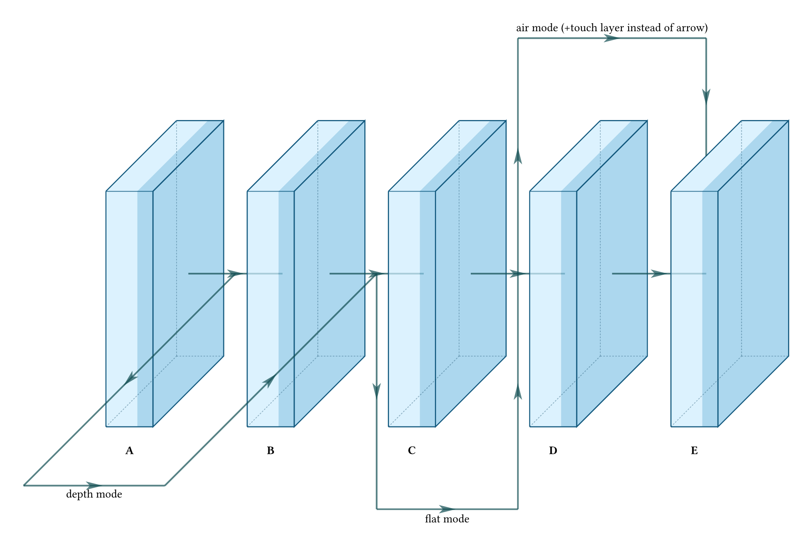
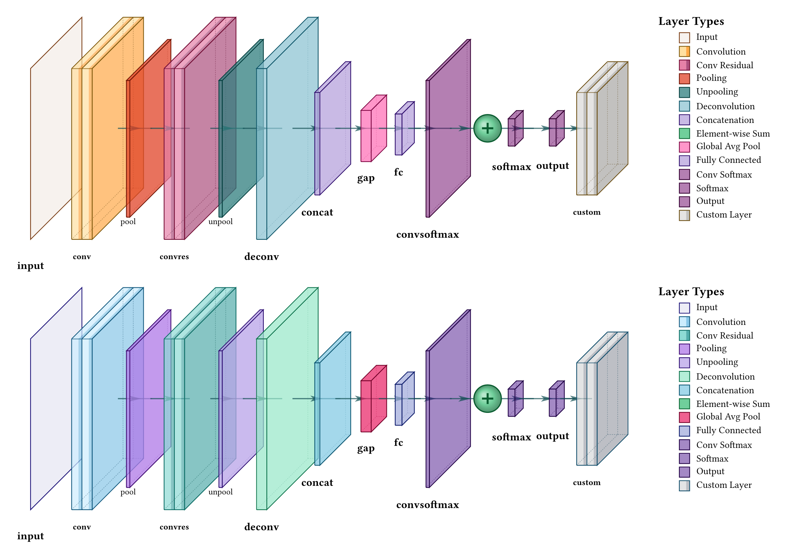
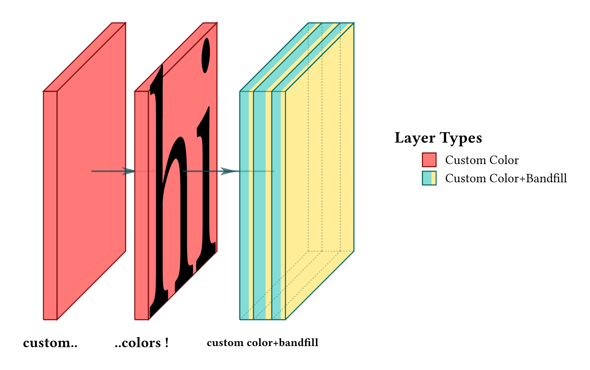
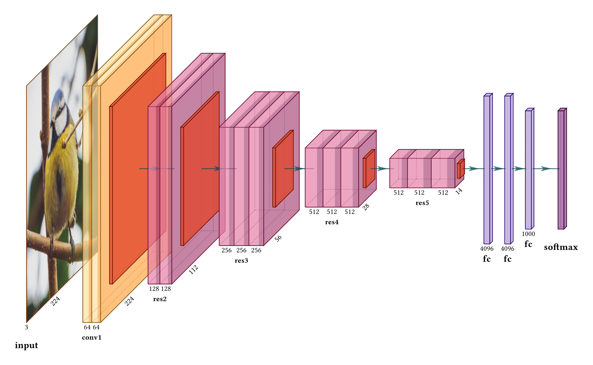

# neural-netz
Visualize Neural Network Architectures in high-quality diagrams using [Typst](https://typst.app), with style and API inspired by [PlotNeuralNet](https://github.com/HarisIqbal88/PlotNeuralNet).

<p align="center">


</p>

Under the hood, this package only uses the native Typst package [CeTZ](https://typst.app/universe/package/cetz/) for building the diagrams.

## Usage

Simply import the all-in-one drawing function from the neural-netz package:
```typ
#import "@preview/neural-netz:0.2.0": draw-network
```
You can then call `draw-network` which has the following arguments:
```typ
#draw-network(
  layers,
  connections: (),
  palette: "warm",
  show-legend: false,
  scale: 100%,
  stroke-thickness: 1,
  depth-multiplier: 0.3,
  show-relu: false,
)
```
See the examples in the following section to understand how to use it. Alternatively, you can also start from already written architecture examples (see the Examples section, near the end).

## Getting started

Here are a few simple features for getting started.

### Basic layout

```typ
#draw-network((
    (type: "input", image: "default"),
    (type: "conv", offset: 2), // Next layers are automatically connected with arrows
    (type: "conv", offset: 2),
    (type: "pool"), // Pool layers are sticked to previous convolution block
    (type: "conv", widths: (1, 1), offset: 3) // you can offset layers
))
```
<p align="center">

</p>

For the input type layer, you can also specify a custom image by giving `image: image("path/to/your/image.jpg")`. Additionally not giving any image is equivalent to giving `image: none`.

### Dimensions and labels


```typ
#draw-network((
    (
      type: "convres", // Each layer type has its own color
      widths: (1, 2),
      channels: (32, 64, 128), // An extra channel will be used as diagonal axis label
      height: 6,
      depth: 8,
      label: "residual convolution",
    ),(
      type: "pool",
      channels: ("", "text also works"),
      height: 4,
      depth: 6,
    ),(
      type: "conv",
      widths: (1.5, 1.5),
      height: 2,
      depth: 3,
      label: "whole block label",
      legend: "CUSTOM NAME", // you can overwrite the default legend of predefined layers
      offset: 3,
    ),(
      type: "fc",
      channels: (10,),
      height: 5,
      depth: 0, // With no depth, the layer is drawn as a 2D rectangle
      label: "2D layer",
      offset: 2,
    ),
),
show-legend: true,
)
```
<p align="center">

</p>

Using `show-legend: true` you can add a smart legend to your visual !

And if you network does not fit the page width of your Typst document, **you can reduce the scale by giving `scale: 50%` as argument of `draw-network`** (ajust to scale value to your need).


### Adding other connexions

Though the main axis connections will be drawn automatically, you can specify other connexions to draw using the `connexions` argument of `draw-network`. In order to make reference to a layer, it will need a `name`:

```typ
#draw-network((
  (type: "conv", label: "A", name: "a"),
  (type: "conv", label: "B", name: "b", offset: 2),
  (type: "conv", label: "C", name: "c", offset: 2),
  (type: "conv", label: "D", name: "d", offset: 2),
  (type: "conv", label: "E", name: "e", offset: 2),
), connections: (
  (from: "a", to: "c", type: "skip", mode: "depth", label: "depth mode", pos: 6),
  (from: "b", to: "d", type: "skip", mode: "flat", label: "flat mode", pos: 5),
  (from: "c", to: "e", type: "skip", mode: "air", label: "air mode (+touch layer instead of arrow)", pos: 5, touch-layer: true),
),
palette: "cold", // There is a "warm" and a "cold" color palette.
show-relu: true // visualize relu using darker color on convolution layers
)
```
<p align="center">

</p>

### Predefined layer types

Here is a visualization of all the predefined layer types, in both color palettes available (`"warm"` (default) and `"cold"`). You can find their associated name underneath each layer. Of course, this is just a starting point, you can modify most of their default attributes.
<p align="center">

</p>
<p style="text-align: center;"><a href="https://github.com/edgaremy/neural-netz/blob/56e7042b97a7856394963532438f316aea95a596/examples/features/predefined-layers.typ">code for this image</a></p>

### Custom layers

If you prefer to create you own type of layers, use `type: "custom"` as a starting point. It is a generic layer, that is easily customizable. It can have one or multiple channels, with an optional "bandfill" color for symbolizing activation functions (e.g. ReLU). Note that the visiblity of activations can be set with the boolean `show-relu` at the `draw-network` scale, and can be overwritten on a per-layer basis.

A custom layer can also be added to the smart legend, when specifying a `legend` label (no need to specify the legend everytime for the same-colored custom layers).

```typ
#draw-network((
  (
    type: "custom",
    width: 0.3, height: 5, depth: 5,
    label: "custom..",
    fill: rgb("#FF6B6B"),
    opacity: 0.9,
    legend: "Custom Color",
  ),(
    type: "custom",
    width: 0.3, height: 5, depth: 5,
    label: "..colors !",
    fill: rgb("#FF6B6B"),
    opacity: 0.9,
    offset: 1.7,
    image: [hi] // Add any content (image, text etc.)
  ),(
    type: "custom",
    widths: (0.3, 0.4, 0.3), height: 5, depth: 5,
    label: "custom color+bandfill", 
    fill: rgb("#4ECDC4"),
    bandfill: rgb("#FFE66D"),
    show-relu: true,
    offset: 2,
    legend: "Custom Color+Bandfill",
  ),
),
show-legend: true
)
```
<p align="center">

</p>


## Examples
Here are a few network architectures implemented with neural-netz (more examples can be found [in the repo](https://github.com/edgaremy/neural-netz/tree/5c434055a5bcf83eee75ab88ad5a7ac77c430feb/examples/networks)).

<h3 style="text-align: center;">ResNet18</h3>
<p align="center">

</p>
<p style="text-align: center;"><a href="https://github.com/edgaremy/neural-netz/blob/56e7042b97a7856394963532438f316aea95a596/examples/networks/ResNet18.typ">code for this image</a></p>

<h3 style="text-align: center;">U-Net</h3>
<p align="center">

</p>
<p style="text-align: center;"><a href="https://github.com/edgaremy/neural-netz/blob/56e7042b97a7856394963532438f316aea95a596/examples/networks/U-Net.typ">code for this image</a></p>

<h3 style="text-align: center;">FCN-8</h3>
<p align="center">

</p>
<p style="text-align: center;"><a href="https://github.com/edgaremy/neural-netz/blob/56e7042b97a7856394963532438f316aea95a596/examples/networks/FCN-8.typ">code for this image</a></p>

## Cite this work
If you use the neural-netz package for a scientific publication, you can cite it as follows:
#### APA
```
Remy, E. (2025). neural-netz, a Typst Package (Version 0.2.0) [Computer software]. https://github.com/edgaremy/neural-netz/
```
#### BibTeX

```bib
@software{Remy_neural-netz_a_Typst_2025,
author = {Remy, Edgar},
month = dec,
title = {{neural-netz, a Typst Package}},
url = {https://github.com/edgaremy/neural-netz/},
version = {0.2.0},
year = {2025}
}
```

## Acknowledgements

This package could not have existed without the great Python+LaTeX visualization package [PlotNeuralNet](https://github.com/HarisIqbal88/PlotNeuralNet) made by Haris Iqbal. It proposes an elegant way for viewing neural networks, and its visual style was obviously a strong inspiration for the implementation of neural-netz.

Default input image was [taken from iNaturalist](https://www.inaturalist.org/observations/205901632) (colors are slightly edited).

If you feel like contributing to this package (bug fixes, features, code refactoring), feel free to [make a PR to the neural-netz repo](https://github.com/edgaremy/neural-netz/pulls) :)