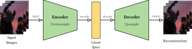
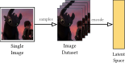
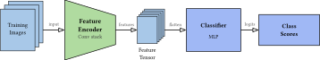
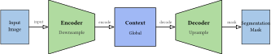
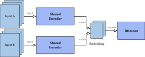
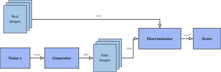

# neural-viz

Draw neural network graphs with CeTZ.

## Install

```typ
#import "@preview/neural-viz:0.1.0": *
```

## Quick start

```typ
#import "@preview/neural-viz:0.1.0": *

#graph-canvas({
  let ds = make-dataset("Image\nDataset", pos: (1.0, 0.0))
  let enc = make-trapezoid("Feature\nEncoder", subtitle: "Conv stack", after: ds, gap: 1.2)
  let head = make-box("Head", subtitle: "Prediction", after: enc, gap: 1.2)

  draw-node(ds)
  draw-node(enc)
  draw-node(head)

  let arrows = (
    make-arrow(ds, enc, from-outer: true, label: [input]),
    make-arrow(enc, head, label: [features]),
  )
  draw-arrows(arrows)
})
```

## API overview

- Node constructors: `make-dataset`, `make-image-dataset`, `make-image-node`, `make-latent-space`, `make-trapezoid`, `make-box`
- Drawing: `draw-node`, `make-arrow`, `draw-arrow`, `draw-arrows`, `edge-label`
- Helpers: `graph-canvas`, `draw-node-emoji`
- Defaults: `set-arrow-defaults`, `set-dataset-defaults`, `set-image-node-defaults`, `set-image-dataset-defaults`, `set-latent-space-defaults`, `set-trapezoid-defaults`, `set-box-defaults`
- Advanced helpers: `clip-str`, `truncate-title`, `fit-lines`, `chars-cap`, `node-edge`, `node-anchor`, `auto-pos-right`, `side-dir`

`make-latent-space` now defaults to a narrower width (`0.7`) so it reads more clearly as a bottleneck block.

## Exporting example diagrams

The example images below are exported as standalone SVG files. Generate them with:

```sh
bash scripts/render-examples.sh
```

This will write images to `docs/images/*.svg` so the README can link to them.
The script compiles each example with an auto-sized page so exported SVGs contain
only the diagram instead of an A4 canvas.

## Example gallery

### Autoencoder



```typ
#import "@preview/neural-viz:0.1.0": *

#graph-canvas({
  let input = make-image-dataset(
    "Input\nImages",
    src: "/assets/test.jpg",
    images: 3,
    image-width: 1.9,
    image-height: 2.3,
    image-spacing: 0.22,
    unit: 0.72cm,
    title-position: "below",
    pos: (1.0, 0.0),
  )
  let enc = make-trapezoid("Encoder", subtitle: "Downsample", after: input, gap: 1.2)
  let latent = make-latent-space(
    "Latent\nSpace",
    height: 3.0,
    after: enc,
    gap: 1.2,
  )
  let dec = make-trapezoid("Decoder", subtitle: "Upsample", mode: "decoder", after: latent, gap: 1.2)
  let output = make-image-dataset(
    "Reconstruction",
    src: "/assets/test.jpg",
    images: 3,
    image-width: 1.9,
    image-height: 2.3,
    image-spacing: 0.22,
    unit: 0.72cm,
    title-position: "below",
    after: dec,
    gap: 1.2,
  )

  draw-node(input)
  draw-node(enc)
  draw-node(latent)
  draw-node(dec)
  draw-node(output)

  let arrows = (
    make-arrow(input, enc, from-outer: true, label: [input]),
    make-arrow(enc, latent, label: [encode]),
    make-arrow(latent, dec, label: [decode]),
    make-arrow(dec, output, from-outer: true, label: [output]),
  )
  draw-arrows(arrows)
})
```

Note: Replace `/assets/test.jpg` with your own image file when using this in
your project. If you override `graph-canvas(length: ...)`, pass the same value
to `unit` in image constructors.
Tip: Prefer `src: "/path/to/file"` for automatic scaling and center-cropping.
`img:` also works for pre-built content and is now auto-fit into `image-size`.
You can provide target size either as `image-size: (w, h)` or as
`image-width: w, image-height: h`.
`make-image-dataset` now defaults to full-bleed (`image-pad: 0.0`) so the image
fills the dataset frame exactly; increase `image-pad` only if you want an inset.
The same fitted crop is reused on every stacked card in `make-image-dataset`.
Tip: use `draw-arrows((...))` when several arrows share one node side; anchors
are automatically spread evenly along that side.

### Image nodes



```typ
#import "@preview/neural-viz:0.1.0": *

#graph-canvas({
  let img = make-image-node(
    "Single\nImage",
    src: "/assets/test.jpg",
    image-width: 2.1,
    image-height: 2.1,
    image-pad: 0.08,
    unit: 0.72cm,
    title-position: "below",
    pos: (1.0, 0.0),
  )
  let ds = make-image-dataset(
    "Image\nDataset",
    src: "/assets/test.jpg",
    images: 4,
    image-width: 1.5,
    image-height: 2.0,
    image-spacing: 0.16,
    unit: 0.72cm,
    title-position: "below",
    after: img,
    gap: 1.4,
  )
  let latent = make-latent-space(
    "Latent\nSpace",
    height: 3.0,
    after: ds,
    gap: 1.4,
  )

  draw-node(img)
  draw-node(ds)
  draw-node(latent)

  let arrows = (
    make-arrow(img, ds, label: [samples]),
    make-arrow(ds, latent, label: [encode]),
  )
  draw-arrows(arrows)
})
```

### Classifier



```typ
#import "@preview/neural-viz:0.1.0": *

#graph-canvas({
  let ds = make-dataset("Training\nImages", pos: (1.0, 0.0))
  let enc = make-trapezoid("Feature\nEncoder", subtitle: "Conv stack", after: ds, gap: 1.2)
  let feat = make-dataset(
    "Feature\nTensor",
    images: 5,
    image-size: (1.1, 1.5),
    image-spacing: 0.1,
    title-position: "below",
    after: enc,
    gap: 1.2,
  )
  let cls = make-box("Classifier", subtitle: "MLP", after: feat, gap: 1.2)
  let out = make-box("Class\nScores", after: cls, gap: 1.0)

  draw-node(ds)
  draw-node(enc)
  draw-node(feat)
  draw-node(cls)
  draw-node(out)

  let arrows = (
    make-arrow(ds, enc, from-outer: true, label: [input]),
    make-arrow(enc, feat, label: [features]),
    make-arrow(feat, cls, from-outer: true, label: [flatten]),
    make-arrow(cls, out, label: [logits]),
  )
  draw-arrows(arrows)
})
```

### Segmentation



```typ
#import "@preview/neural-viz:0.1.0": *

#graph-canvas({
  let input = make-dataset("Input\nImage", pos: (1.0, 0.0), images: 1, image-size: (1.7, 2.1))
  let enc = make-trapezoid("Encoder", subtitle: "Downsample", after: input, gap: 1.2)
  let ctx = make-box("Context", subtitle: "Global", after: enc, gap: 1.2)
  let dec = make-trapezoid("Decoder", subtitle: "Upsample", mode: "decoder", after: ctx, gap: 1.2)
  let mask = make-dataset("Segmentation\nMask", images: 1, image-size: (1.7, 2.1), after: dec, gap: 1.2)

  draw-node(input)
  draw-node(enc)
  draw-node(ctx)
  draw-node(dec)
  draw-node(mask)

  let arrows = (
    make-arrow(input, enc, from-outer: true, label: [input]),
    make-arrow(enc, ctx, label: [encode]),
    make-arrow(ctx, dec, label: [decode]),
    make-arrow(dec, mask, from-outer: true, label: [mask]),
  )
  draw-arrows(arrows)
})
```

### Siamese encoder



```typ
#import "@preview/neural-viz:0.1.0": *

#graph-canvas({
  let a = make-dataset("Input A", pos: (1.0, 1.4))
  let b = make-dataset("Input B", pos: (1.0, -1.4))
  let enc-a = make-box("Shared\nEncoder", after: a, gap: 1.2)
  let enc-b = make-box("Shared\nEncoder", after: b, gap: 1.2)
  let emb = make-dataset(
    "Embedding",
    images: 2,
    image-size: (1.2, 1.5),
    title-position: "below",
    after: enc-a,
    gap: 1.6,
    y: 0.0,
  )
  let cmp = make-box("Distance", after: emb, gap: 1.2)

  draw-node(a)
  draw-node(b)
  draw-node(enc-a)
  draw-node(enc-b)
  draw-node(emb)
  draw-node(cmp)

  let arrows = (
    make-arrow(a, enc-a, from-outer: true, label: [input]),
    make-arrow(b, enc-b, from-outer: true, label: [input]),
    make-arrow(enc-a, emb, in-side: "left", label: [embed]),
    make-arrow(enc-b, emb, in-side: "left", label: [embed]),
    make-arrow(emb, cmp, from-outer: true, label: [compare]),
  )
  draw-arrows(arrows)
})
```

### GAN



```typ
#import "@preview/neural-viz:0.1.0": *

#graph-canvas({
  let real = make-dataset("Real\nImages", pos: (1.0, 1.6))
  let noise = make-box("Noise z", pos: (1.0, -1.6))
  let gen = make-box("Generator", after: noise, gap: 1.2)
  let fake = make-dataset("Fake\nImages", after: gen, gap: 1.2)
  let disc = make-box("Discriminator", after: fake, gap: 1.4, y: 0.0)
  let out = make-box("Score", after: disc, gap: 1.0)

  draw-node(real)
  draw-node(noise)
  draw-node(gen)
  draw-node(fake)
  draw-node(disc)
  draw-node(out)

  let arrows = (
    make-arrow(noise, gen, label: [noise]),
    make-arrow(gen, fake, from-outer: true, label: [fake]),
    make-arrow(fake, disc, from-outer: true, label: [fake]),
    make-arrow(real, disc, out-side: "right", in-side: "top", from-outer: true, mode: "hv", label: [real]),
    make-arrow(disc, out, label: [score]),
  )
  draw-arrows(arrows)
})
```

## Local development

The example files in `examples/` import the local `lib.typ` so they can be
compiled before publishing.
