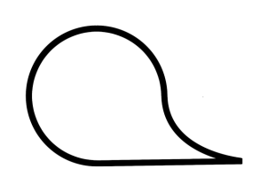
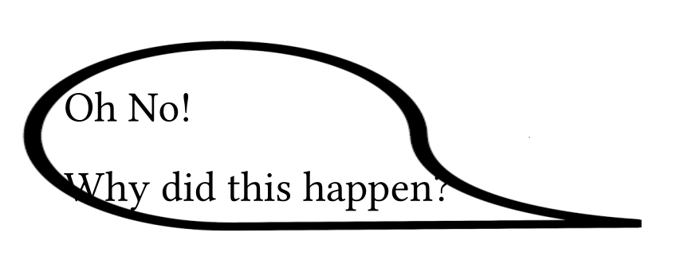
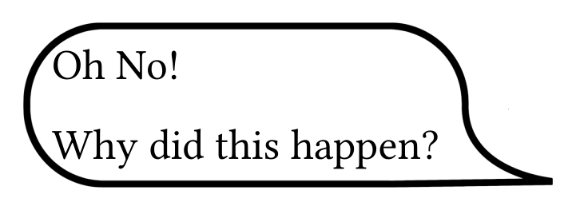
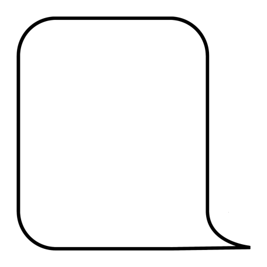
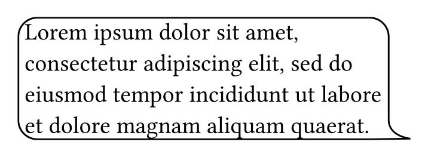

# Typst 9-Patch Plugin

This plugin adds support for resizable PNG images using the Android-style 9-patch format. It enables scalable UI elements by preserving corners and edges while stretching the center.

* Stretch and padding regions are read from black pixels in the image’s 1-pixel border.

* Follows [Android’s 9-patch](https://developer.android.com/studio/write/draw9patch) format for parsing and scaling logic.

* Only `.png` images with 1-pixel black border markers are supported.

## Example

Given an image like this:



Scaling the image non-uniformly would result into a highly stretched one:



Using 9-tile-scaling would solve this, as it only scales the edges and center of the image:



## Usage

Import the plugin:

```typ
#import "@preview/nine-patch:0.1.0": auto-9patch, scale-9patch
```

### Simple Scaling

```typ
#let img = read("bubble.9.png", encoding: none)

#scale-9patch(img, 400pt, 400pt)
```



### Auto-scaling with context content

The `auto-9patch` function automatically resizes to its content size.

```typ
#let img = read("bubble.9.png", encoding: none)

#context auto-9patch(img, scale: .1pt)[
  #box(width: 300pt,lorem(20))
]
```




## Develop

**Build the Plugin:**

To compile the plugin for WebAssembly, run:

```bash
cargo build --target wasm32-unknown-unknown --release
```

**Run Tests:**

To run the tests for the plugin, use:

```bash
cargo test
```

Make sure you have the appropriate Rust toolchain for WebAssembly (`wasm32-unknown-unknown`) installed before building.