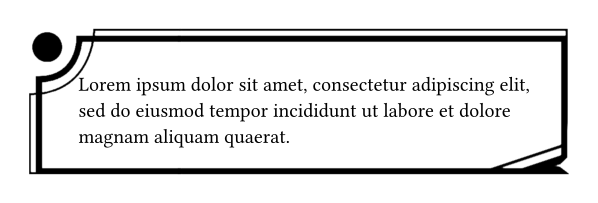

# Typst 9-Patch Plugin

This plugin adds support for resizable PNG images using the Android-style 9-patch format. It enables scalable UI elements by preserving corners and edges while stretching the center.

* Stretch and padding regions are read from black pixels in the image’s 1-pixel border.

* Follows [Android’s 9-patch](https://developer.android.com/studio/write/draw9patch) format for parsing and scaling logic.

* Only `.png` images with 1-pixel black border markers are supported.

## Usage

Import the plugin:

```typ
#import "@preview/nine-patch:0.1.0": auto-9patch, scale-9patch
```

### Simple Scaling

```typ
#let img = read("example.png", encoding: none)
#scale-9patch(img, 200pt, 300pt)
```


### Auto-scaling with context content

```typ
#let img = read("example.png", encoding: none)
#context auto-9patch(img)[
  #text(size: 50pt, fill: white)[
    Oh No
    
    Whats this!
  ]
]
```


```typ
#let img = read("example.png", encoding: none)
#context auto-9patch(img, scale: .5pt)[
  #set text(20pt)
  #box(width: 460pt, lorem(20))
]
```




## Develop

**Build the Plugin:**

To compile the plugin for WebAssembly, run:

```bash
cargo build --target wasm32-unknown-unknown --release
```

**Run Tests:**

To run the tests for the plugin, use:

```bash
cargo test
```

Make sure you have the appropriate Rust toolchain for WebAssembly (`wasm32-unknown-unknown`) installed before building.