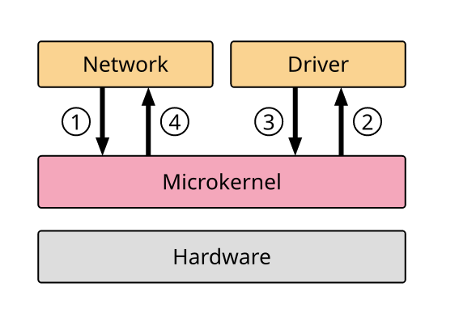
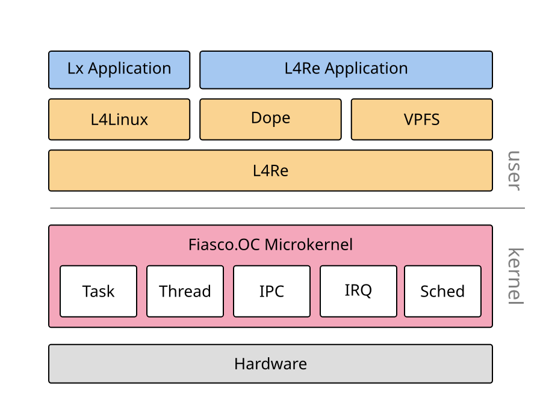

# typst-nodes

A [CeTZ](https://github.com/cetz-package/cetz)-based library for drawing labeled rectangular nodes and routed edges — the building blocks for block diagrams, flowcharts, and architecture drawings in [Typst](https://typst.app).

Instead of placing boxes by hand with raw coordinates, `typst-nodes` lets you describe layout relationally: put this node *north of* that one, *inside* a container, or *between* two others. Edges between nodes support straight lines and several orthogonal routing strategies, with optional labels.

## Examples

<table>
<tr>
<td align="center"><a href="examples/microkernel.typ"></a></td>
<td align="center"><a href="examples/l4re.typ"></a></td>
</tr>
</table>

## Usage

This package provides `canvas(...)` as a replacement for `cetz.canvas(...)` to enable the coordinate resolvers of this package. Inside the `canvas`, `node` and `edge` can be used (see below), but also all existing CeTZ primitives.

### Nodes

`node(origin, body, ..style)` draws a labeled rectangle on the canvas.

#### Absolute placement

```typst
#canvas({
  node((0, 0), [Hello], name: "a")
  node((3, 0), [World], name: "b", fill: silver)
})
```

#### Relative placement — adjacent to another node

Use `north-of`, `south-of`, `east-of`, `west-of` (and diagonal variants) to place a node next to an existing one. The value can be a name string, a `(name, gap)` pair, or a `(name, gap, align)` triple:

```typst
#canvas({
  node((0, 0),                  [Start],  name: "s")
  node((east-of:  ("s", .4cm)), [Right],  name: "r")
  node((north-of: ("s", .4cm)), [Top],    name: "t")
  // Align the new node's left border with "s"'s left border:
  node((north-of: ("s", .4cm, "left")), [Top-left])
})
```

#### Relative placement — inside a container

Use `in-north`, `in-south`, `in-east`, `in-west` (and corner variants) to pin a child node to an inner edge of a parent. Width and height may be given as ratios relative to the container:

```typst
#canvas({
  node((0, 0), [], name: "box", width: 5cm, height: 5cm)
  node((in-north:      ("box", .1cm)), [N],  fill: silver, width: 1.2cm, height: .6cm)
  node((in-south-west: ("box", .1cm)), [SW], fill: silver, width: 40%,   height: 20%)
})
```

#### Placement between two coordinates

```typst
#canvas({
  node((-2.5, 0), [Left],  name: "l")
  node(( 2.5, 0), [Right], name: "r")
  node((between: ("l", "r")), [Mid], width: 1.5cm, height: .8cm, fill: silver)
  node((between: ("l.north", "r.south")), [Anchors], width: 1.7cm, height: .8cm)
})
```

### Edges

`edge(..points, ..style)` draws a line between two coordinates or named node anchors.

#### Straight edge

```typst
#canvas({
  node((-2.5, 0), [A], name: "a")
  node(( 2.5, 0), [B], name: "b")
  node(( 0,  -2), [C], name: "c")

  edge("a.east",  "b.west",  mark: (end: ">"))
  edge("a.south", "c.north", mark: (end: ">"), stroke: blue)
  edge("b.south", "c.north", mark: (end: ">"), stroke: red)
})
```

#### Horizontal / vertical single-segment routing

```typst
edge("a.north-east", "b.west",  routing: "horizontal", mark: (end: ">"))
edge("c.north",      "a.south", routing: "vertical",   mark: (end: ">"), stroke: red)
```

`shift` offsets the line perpendicular to its direction (useful for parallel edges):

```typst
edge("a.north-east", "b.west", routing: "horizontal", shift: -.3cm, stroke: blue, mark: (end: ">"))
```

#### 2-segment orthogonal routing

Routes the edge with a single elbow. `2w-north`/`2w-south` go vertical first to the destination's y coordinate, then horizontal; `2w-east`/`2w-west` go horizontal first to the destination's x coordinate, then vertical:

```typst
edge("a.south", "b.west", routing: "2w-south", mark: (end: ">"))
edge("a.north", "b.east", routing: "2w-north", shift: .3cm, mark: (end: ">"), stroke: blue)
```

`shift` offsets the two route segments. For `2w-north`/`2w-south`, `shift: (a, b)` means horizontal shift `a` for the first segment and vertical shift `b` for the second. For `2w-east`/`2w-west`, it means vertical shift `a` for the first segment and horizontal shift `b` for the second. A scalar applies to both. Labels on `2w-*` routes are positioned along the second segment.

```typst
edge("a.north", "b.east", routing: "2w-north", shift: (.3cm, -.2cm), mark: (end: ">"))
```

#### 3-segment orthogonal routing

Routes the edge out in a given direction, runs a horizontal or vertical middle segment, then turns back to the destination. Use the explicit `3w-*` routing names. `bend` controls how far the route extends before turning. `auto` (the default) uses half the x distance for `3w-north`/`3w-south` when the endpoints share y and otherwise half the y distance; `3w-east`/`3w-west` analogously use half the y distance when the endpoints share x and otherwise half the x distance. `bend: "same-dir"` keeps both outer legs moving in the routing direction, while `bend: "opposite-dir"` returns to the starting axis:

```typst
edge("a.south", "b.south", routing: "3w-south", bend: .5, mark: (end: ">"))
edge("a.east",  "c.east",  routing: "3w-east",  bend: .8, mark: (end: ">"), stroke: red)
edge("a.south", "c.north", routing: "3w-south", bend: "same-dir", mark: (end: ">"), stroke: blue)
edge("a.south", "c.north", routing: "3w-south", bend: "opposite-dir", mark: (end: ">"), stroke: green)
```

`shift` offsets each endpoint along the middle segment. Pass an array for independent per-endpoint control:

```typst
edge("a.south", "b.south", routing: "3w-south", shift: (-.2, .2), mark: (end: ">"))
```

#### Edge labels

```typst
// Label at 50% along the edge, on the north side (default)
edge("a.east", "b.west", label: [A to B], mark: (end: ">"))

// Label at 25%, south side (negative dist = south for horizontal edge)
edge("c.east", "d.west",
  label: [25% south],
  label-pos: (25%, -0.3),
  mark: (end: ">"),
)

// Rotate the label to follow the selected edge segment
edge("a.south", "c.north",
  label: [diagonal],
  label-angle: auto,
  label-pos: (60%, 0.2),
  mark: (end: ">"),
)
```

## Running the tests

The test suite compiles each `.typ` file in `tests/` and compares the output PNG against a reference in `tests/ref/`. It requires Python 3, [Pillow](https://python-pillow.org/), and the `typst` CLI.

```sh
pip install Pillow
python3 tests/run_tests.py                           # run all tests
python3 tests/run_tests.py node-basic edge-straight  # run specific tests
python3 tests/run_tests.py --update                  # regenerate reference images
```
