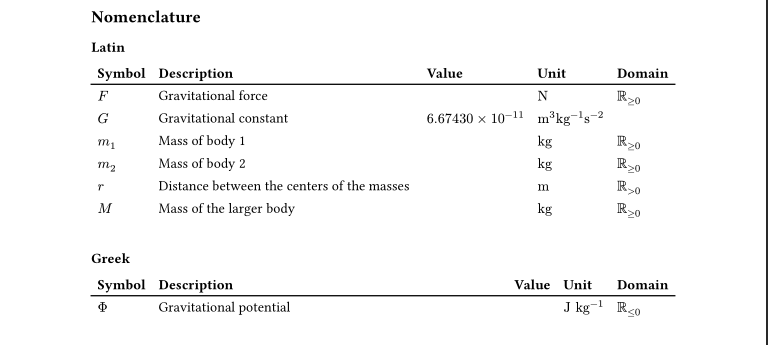

# Nomos

**Nomos** is a Typst package designed to manage nomenclature, specifically focusing on variable descriptions, symbols, and their associated units.

It streamlines technical writing by ensuring that every variable is defined upon its first occurrence and maintains a consistent list of symbols throughout your document.




**Nomos** operates differently than standard state-based packages:

* Metadata: Every time you call `#add-ncl` (or `#add-ncl-silent`), the package inserts a metadata element with a specific label.
* Query: The `#print-nomenclature` function uses a locate and query call to find every instance of that label in the document, regardless of where the function is called.
* Execution: Because it uses queries, you may notice your document recompiles 2-3 times as Typst calculates the positions and contents of the metadata. This is normal behavior for "time-traveling" elements in Typst.


## Quick Start

```typst
#import "@preview/nomos:0.1.0": *

// 1. Print the index (it will find variables defined later!)
#print-nomenclature(value: false)

// 2. Define and use variables on the fly
The force #add-ncl("$F_g$", "Gravitational Force", unit: "$N$", sec: "Latin") is proportional 
to the mass #add-ncl("$m$", "Mass", unit: "$kg$", domain: "$RR^+$", sec: "Latin"). 

Later, we can just refer to #ncl("$m$") and its unit #ncl-u("$m$").
```

## Usage
With **Nomos**, there is no need for a central dictionary.

### Define and Reference Variables

You can define a variable the very first time you need it using `#add-ncl()`.

```typst
#add-ncl(
    symb,
    description,
    value: none,
    unit: none,
    domain: none,
    sec: none,
    clickable: true,
)
```

This function registers a variable into the nomenclature and displays it in the text.

* `symb`: The symbol used for the variable (e.g., `"v"` or `$a$`).
* `description`: A brief explanation of what the variable represents.
* `value`: The specific value of the symbol, if applicable. Defaults to `none`.
* `unit`: The unit of measurement for the symbol. Defaults to `none`.
* `domain`: The domain of definition for the symbol (e.g., `"$RR^+$"`). Defaults to `none`.
* `sec`: The section name used to categorize the variable in the printed nomenclature. For example, setting this to `"Latin"` will group the variable under a `"Latin"` heading. If set to `none` (default), the variable will be listed without a specific section header.
* `clickable`: Creates a clickable link to the nomenclature index if `clickable` is set to `true`. Defaults to `true`.

There is also `#add-ncl-silent`, which functions identically to `#add-ncl` but does not display the symbol in the document.

### Calling Functions

| Function                      | Description                                                                                                                                             |
| ----------------------------- | ------------------------------------------------------------------------------------------------------------------------------------------------------- |
| `#ncl(symb, clickable: true)` | **Standard Reference**: Displays the symbol and creates a clickable link to the nomenclature index if `clickable` is set to `true`. Defaults to `true`. |
| `#ncl-d(symb)`                | Returns the **description** of the symbol.                                                                                                              |
| `#ncl-dl(symb)`               | Returns the **description** of the symbol in lower case.                                                                                                |
| `#ncl-v(symb)`                | Returns the **value** associated with the symbol.                                                                                                       |
| `#ncl-u(symb)`                | Returns the **unit** of the symbol.                                                                                                                     |
| `#ncl-vu(symb)`               | Returns the **value** and the **unit** associated with the symbol.                                                                                      |
| `#ncl-dm(symb)`               | Returns the **domain** of definition for the symbol.                                                                                                    |


### Printing the Nomenclature
You can print the nomenclature anywhere in your document—even before the symbols have been defined—using the `#print-nomenclature()` function. Thanks to the query-based system, it will automatically find all variables registered later in the document.

```typst
#print-nomenclature(
    symb: true, 
    description: true, 
    value: true, 
    unit: true, 
    domain: true,
    title: "Nomenclature",
    depth: 1,
    numbering: none,
    outlined: false,
    sections: none,
)
```

This function generates a table containing all the variables registered with `#add-ncl` or (`#add-ncl-silent`). You can toggle specific columns on or off, or provide custom header names.

* `symb`: Set to `true` (default) to display the symbol column, or `false` to hide it. Alternatively, provide a `str` to use as a custom column header (e.g., `"Symbols"`).
* `description`: Set to `true` (default) to display descriptions, or `false` to hide them. You can also provide a `str` for a custom header (e.g., `"Designation"`).
* `value`: Set to `true` (default) to display values, or `false` to hide them. You can also provide a `str` for a custom header (e.g., `"Typical Value"`).
* `unit`: Set to `true` (default) to display units, or `false` to hide them. You can also provide a `str` for a custom header (e.g., `"SI Units"`).
* `domain`: Set to `true` (default) to display the domain of definition, or `false` to hide it. You can also provide a `str` for a custom header (e.g., `"Range"`).
* `title`: A `str` or content block that defines the title of the nomenclature section (default is "Nomenclature").
* `depth`: An `int` the relative nesting depth of the heading, starting from one.
* `numbering`: Defines the numbering style for the heading (e.g., "1.1"). Set to none (default) for an unnumbered heading.
* `outlined`: Set to `true` to include the nomenclature heading in the document's table of contents (outline), or `false` (default) to exclude it.
* `sections`: An `array` of strings defining which sections to print and in what order (e.g., `("Latin", "Greek")`). You can include `none` in the array to specify exactly where un-sectioned variables should appear. If set to `none` (default), the package will automatically detect and print all unique sections found in the document.

## Comprehensive Walkthrough
The following comprehensive example showcases almost all features and functions provided by this package in a single document. You can view the pre-compiled PDF version [here](https://raw.githubusercontent.com/eiglss/nomos/daae6c6a445df2cfd38341d0c9b4a6959ecffe6d/examples/example.pdf).

```typst
#import "@preview/nomos:0.1.0": *

= Nomos package

---

#print-nomenclature(
    title: "Nomenclature",
    depth: 2,
    numbering: none,
    outlined: false,
    symb: "Symbol",
    description: "Description",
    value: "Value",
    unit: "Unit",
    domain: "Domain",
    sections: none,
) // Reseting some parameters to default value to expose them all

---

== Newton's Law
The relationship between the Earth and the Moon is governed by Newton's Law of Universal Gravitation. It posits that the gravitational force (#add-ncl($F$, "Gravitational force", unit: $"N"$, domain: $RR_(>=0)$, sec: "Latin")) between two bodies is proportional to the product of their masses and inversely proportional to the square of the distance between them. Since its a force, #ncl($F$) is express in #ncl-u($F$).

=== The Formula
The central equation for this interaction is:
#add-ncl-silent(
    $G$,
    "Gravitational constant",
    value: $6.67430 times 10^(-11)$,
    unit: $"m"^3 "kg"^(-1) "s"^(-2)$,
    sec: "Latin",
)
#add-ncl-silent($m_1$, "Mass of body 1", unit: $"kg"$, domain: $RR_(>=0)$, sec: "Latin")
#add-ncl-silent($m_2$, "Mass of body 2", unit: $"kg"$, domain: $RR_(>=0)$, sec: "Latin")
#add-ncl-silent($r$, "Distance between the centers of the masses", unit: $"m"$, domain: $RR_(>0)$, sec: "Latin")

$ #ncl($F$) = #ncl($G$) (#ncl($m_1$) #ncl($m_2$)) / #ncl($r$)^2 $ // Clikable symbole

Where:
- #ncl($F$) is the #ncl-dl($F$) expressed in #ncl-u($F$) in #ncl-dm($F$).
- #ncl($G$) is the #ncl-dl($G$) which is equal to #ncl-vu($G$).
- #ncl($m_1$) is the #ncl-dl($m_1$) expressed in #ncl-u($m_1$) in #ncl-dm($m_1$).
- #ncl($m_2$) is the #ncl-dl($m_2$) expressed in #ncl-u($m_2$) in #ncl-dm($m_2$).
- #ncl($r$) is the #ncl-dl($r$) expressed in #ncl-u($r$) in #ncl-dm($r$).

== Gravity at the Local Level
The potential energy or the force acting on an object is the gravitational potential (#add-ncl($Phi$, "Gravitational potential", unit: $"J" "kg"^(-1)$, domain: $RR_(<=0)$, sec: "Greek")) given by:
#add-ncl-silent($M$, "Mass of the larger body", unit: $"kg"$, domain: $RR_(>=0)$, sec: "Latin")

$ #ncl($Phi$) = -frac(#ncl($G$) #ncl($M$), #ncl($r$)) $ // Clikable symbole

Where:
- #ncl($Phi$) is the #ncl-dl($Phi$) expressed in #ncl-u($Phi$) in #ncl-dm($Phi$).
- #ncl($M$) is the #ncl-dl($M$) expressed in #ncl-u($M$) in #ncl-dm($M$).
```