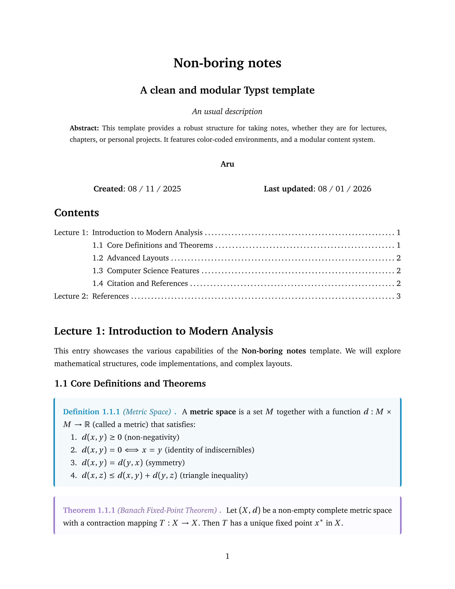

# Non-boring notes

A modular, colorful, and highly customizable Typst template for academic
documentation, lecture notes, and assignments. Designed to be simple to use,
yet powerful.



## Quick Start

You can initialize a project directly from the CLI:

```bash
typst init @preview/non-boring-notes
```

Or copy this minimal template into your existing document:

```typst
#import "@preview/non-boring-notes:0.1.0": *

#show: template.with(
  title: [Document Title],
  subtitle: [Optional Subtitle],
  short_title: "Notes",
  description: [Document description],
  abstract: [
    Your abstract or brief summary goes here.
  ],
  creation_date: datetime.today(),
  authors: (
    (
      name: "Your Name",
      link: "[https://example.com](https://example.com)",
    ),
  ),
  paper_size: "us-letter",
  cols: 1,
  h1_prefix: "lecture",
  text_lang: "en",
)

= Introduction

Start writing your notes here...
```

If you want some inspiration, an example using all the features can be found in
[examples/showcase.typ](https://github.com/aruzdh/non-boring-notes/blob/311756828cf77b5c309ebc8d048e9156ccdbeab3/examples/showcase.typ).

## Configuration

Configure the `template` function at the top of your document to suit your needs:

| Parameter | Type | Description |
| :--- | :--- | :--- |
| `title` | `content` | Title of the document. |
| `subtitle` | `content` | Subtitle. |
| `short_title` | `content` | Used in header. |
| `authors` | `array` | Array of `(name: "", link: "")` dictionaries. |
| `creation_date` | `datetime` | Document creation date. |
| `abstract` | `content` | Brief document abstract or summary. |
| `description` | `content` | Brief document description. |
| `accent` | `color` | Primary accent color for headers and links. |
| `paper_size` | `string` | Page format (e.g., `"a4"`, `"us-letter"`). |
| `cols` | `integer` | Number of columns in the document layout. |
| `h1_prefix` | `string` | Prefix for top-level headings (e.g., `"lecture"`). |
| `text_lang` | `string` | Language code: `"en"` (English) or `"es"` (Spanish). |

All the parameters, alongside their default values, can be found in the `template`
function in [src/template.typ](https://github.com/aruzdh/non-boring-notes/blob/311756828cf77b5c309ebc8d048e9156ccdbeab3/src/template.typ).

## Features

### Theorem-like Environments

Includes pre-styled, color-coded boxes out of the box:

```typst
#definition("Metric Space")[
  A metric space is a set $M$ together with a metric $d$.
]

#theorem("Banach Fixed-Point Theorem")[
  Let $(X, d)$ be a complete metric space...
]

#proof[
  The proof proceeds by contraction...
]
```

Some available environments include: `theorem`, `lemma`, `corollary`, `proposition`,
`hypothesis`, `definition`, `proof`, `important`, `tip`, and `exercise`.

All the theorem-like boxes can be found in the in [src/boxes.typ](https://github.com/aruzdh/non-boring-notes/blob/311756828cf77b5c309ebc8d048e9156ccdbeab3/src/boxes.typ)

### Multi-language Support

Switch between English and Spanish seamlessly. All environment labels (e.g.,
*Theorem* vs. *Teorema*) and headers (e.g., *Contents* vs. *Contenido*) update
automatically based on `text_lang`.

The full list of labels can be found in [src/translated_terms.typ](https://github.com/aruzdh/non-boring-notes/blob/311756828cf77b5c309ebc8d048e9156ccdbeab3/src/translated_terms.typ)

## Project Structure

- `main.typ`: Entry point of your project.
- `.typst_main_file`: Internal marker for project identification (mainly for nvim).
