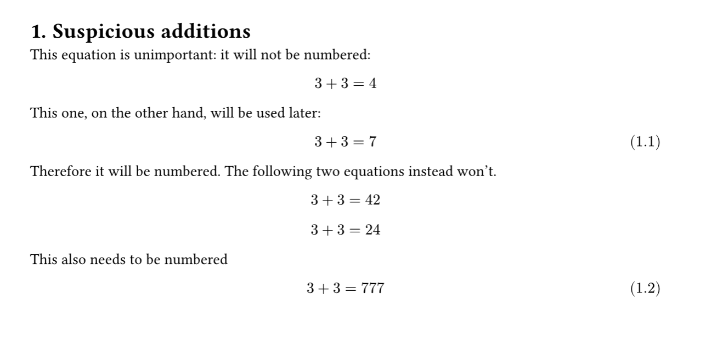

# NoN Unlabeled: No Numbering for Unlabeled objects
**Non Unlabeled** prevents unlabeled objects (like `math.expression` or `figure`) from being automatically numbered.

Example:

```typst
#import "@preview/non-unlabeled:0.2.0": *

// You need to do this to enable the package
#show math.equation: dont-number-unlabeled(math.equation) // For maths expressions
#show figure: dont-number-unlabeled(figure) // For numbers

// You also need to define how you number your objects (you can do this also without using headcount)
#import "@preview/headcount:0.1.0": *
#set math.equation(numbering: dependent-numbering("(1.1)", levels: 1))
#set heading(numbering: "1.")

= Suspicious additions

This equation is unimportant: it will not be numbered:
$
3 + 3 = 4
$

This one, on the other hand, will be used later:
$
3 + 3 = 7
$ <label>

Therefore it will be numbered. The following two equations instead won't.

$
3 + 3 = 42
$

$
3 + 3 = 24
$

This also needs to be numbered
$
3 + 3 = 777
$ <label2>
```



If you are working with something else than a `math.expression` or `figure` (like tables) it's highly suggested to wrap it into a `figure` first. Otherwise, since the source code of this package is very small, you can also modify it directly, you just need to copy the same pattern used for `math.expression` and `figure`:

```typst
#let dont-number-unlabeled(object) = {
  it => {
    if object == math.equation{
      if it.block and not it.has("label") [
        #counter(object).update(v => v - 1)
        #object(
          it.body, 
          block: true, 
          numbering: none)#label("no_label")
      ] else {
        it
      }     
    } else if object == figure{
      if not it.has("label") [
        #counter(object).update(v => v - 1)
        #object(
          it.body, 
          caption:it.caption, 
          numbering: none,
          placement: it.placement,
          scope:it.scope,
          kind:it.kind,
          supplement:it.supplement,
          gap:it.gap,
          outlined:it.outlined
        )#label("no_label")
      ] else {
        it
      }
    // else if object == something-else-i-need ...
    } else [
      \=== Error ===
      
      unsupported object "#repr(object)"
    ]

  }
}
```

Send a pull request to [my github repo](https://github.com/ravasioluca/packages) if you believe that could be useful for other users too.
