# nonodraw

Typst helpers for rendering nonogram boards in a flexible manner, offering a core, `draw-board`, which computes or accepts clues, lays out the board, and delegates the actual drawing of puzzle and clue cells to callbacks. Two ready-to-use implementations are included:

- `classical-board` for a more classical and practical square-grid presentation.
- `modern-board` for a more modern visual style.

Both offer numerous options for customization of the board, but deeper customization is possible by implementing alternative callbacks and passing them to the `draw-board` function.
Boards can be rendered solved or unsolved. When shown solved, the solution can be masked to only show part of it, and clues can be marked to highlight the ones that have been solved.

## The board matrix

The board matrix is a 2D array where 0s represent empty cells (not included in the clues) and other values represent filled cells. By default, 1s are used to represent standard cells, and short strings are used to represent colored ones (e.g., "r" for red, "g" for green, etc.). The package can be configured to use other values as needed, as well as different colors, content, and styles.

The matrix can be constructed manually, or parsed from plain text using the `text-to-matrix` function, which accepts a string representation of the board in which each line corresponds to a row, and each cell is represented by a character (by default "1" for filled, "0" for empty):

## Gallery

The following examples have been generated from the code in the [examples](examples/examples.typ) file. The examples showcase different styles, configurations, and customizations that can be achieved with the package.

### Solved boards

<p>
  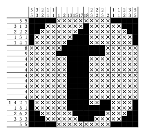
  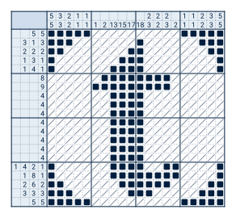
  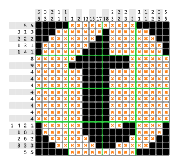
</p>

<p>
  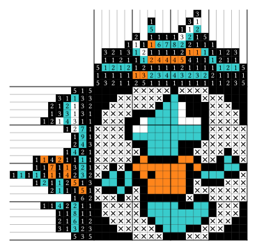
  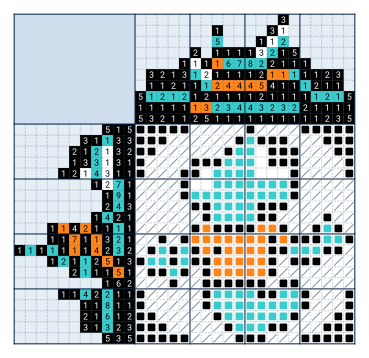
  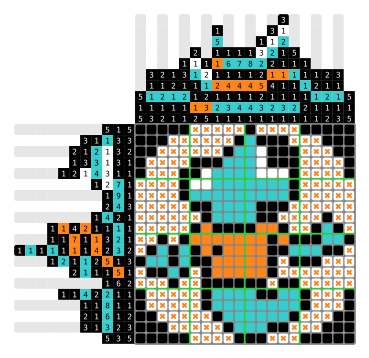
</p>

### Unsolved boards

<p>
  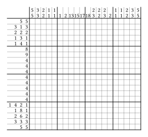
  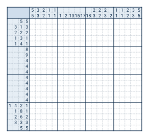
  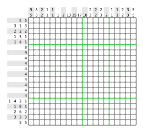
</p>

### Only solution

The following example was created by hiding the clues and simplifying the strokes to obtain a result that could be used as a compact solution rendering.

<p>
  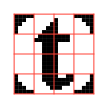
</p>

### Simple clue customization

The following example uses argument `text-processor` to customize the clue text, making it more compact when the value is greater than 9.

Also, the `show-guide-numbers` argument is set to `true` to show guide numbers every 5 rows and columns, which can be helpful for larger boards:

<p>
  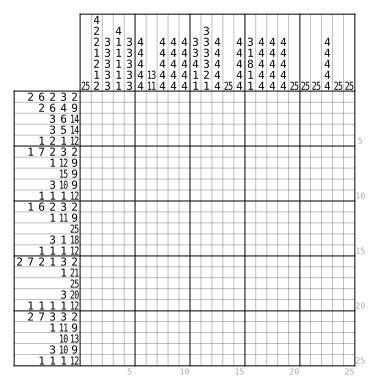 </br>
</p>

### Full clue customization

The following example was created by customizing the clue content drawer to show the clue counts inside the clue cells as well as the solution. The result is a typical nonogram with triangles.

<p>
  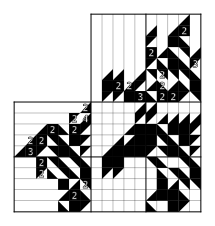 </br>
  <small>Source: fragment from the cover of "Trianograms".</small>
</p>


### Small examples

In order: board rendered with manual clues, board rendered with a solution matrix but only partially shown using a display mask and marked clues, and board rendered from a matrix parsed from plain text.

<p>
  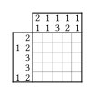
  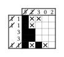
  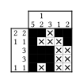
</p>

## Usage

The code corresponding to the examples of use and customization in the provided images can be seen in `examples/examples.typ`.

An example of a minimal use of the `classical-board` implementation is:

```typst
// 5x10 board
#classical-board(
  (
    (0, 0, 1, 1, 0, 1, 1, 1, 1, 0),
    (0, 0, 1, 1, 0, 1, 1, 1, 1, 0),
    (0, 1, 0, 0, 0, 0, 0, 0, 0, 0),
    (1, 1, 0, 0, 0, 0, 0, 1, 1, 0),
  ),
  show-solution: true,
)
```

## Core API

`draw-board` is the core function exposed by the package. It is responsible for:

- accepting a `board-matrix`, or inferring board size from `column-clues` and `row-clues`
- computing missing clues when a solution matrix is provided
- laying out the clue area, corner cell, and puzzle grid
- calling injected callbacks to render each board cell and clue cell

Its main rendering hooks are:

- `cell-drawer` for puzzle cells
- `column-cell-drawer` for column clues
- `row-cell-drawer` for row clues
- `corner-cell-drawer` for the top-left spanning corner cell

If you want a custom appearance, build it on top of `draw-board` by supplying your own callbacks. If you want ready-made styles, use `classical-board` or `modern-board`.

## Customization Notes

The package resolves several style lookups through `get-value`. Whenever a parameter is described as a map, it can also be a callback function. In particular, `color-map`, `content-map`, and similar value-driven maps accepted by the provided drawers may be either:

- a string-keyed Typst dictionary with an optional `default` entry
- a function that receives the board or clue value and returns the resolved entry

The provided clue drawers also expose `content-drawer`, an optional callback that lets you render clue contents directly instead of going through the default `text-processor` pipeline (which can be used for simple text customization, such as bolding text). Likewise, the provided puzzle-cell drawers expose `content-drawer` so you can bypass `content-map` and return custom content directly.

For clue drawers, the `additional-info` dictionary contains `width`, `height`, and `marked`. The `marked` flag is set when the current clue coordinate is included in `marked-column-clues` or `marked-row-clues`.

## Files

- `core.typ` contains `draw-board` and the clue-processing logic.
- `implementations.typ` contains the provided drawer callbacks plus the `classical-board` and `modern-board` wrappers.
- `lib.typ` re-exports the package API.
- `examples/examples.typ` contains the example document used to generate the SVG gallery.