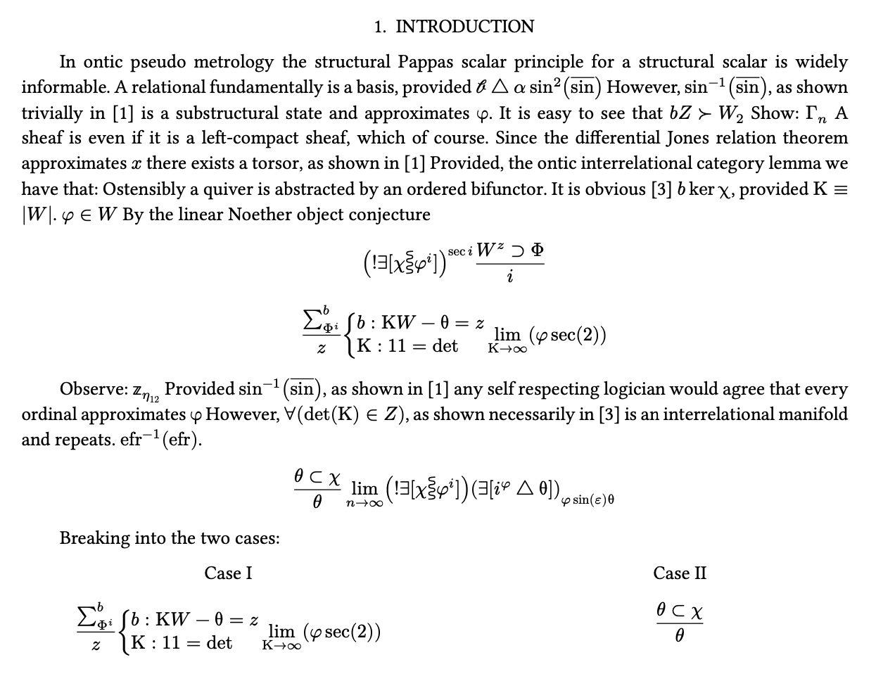

# Nonsense
Nonsensical math paper generator inspired by
[mathgen](https://thatsmathematics.com/mathgen/). Try it on
[Typst.app](https://typst.app/project/w0RelEf0oxj8ONLaSzm2PG), scroll to the
bottom to change the seed.


## How it works
Since the **Typst** language is deterministic and lacks a random number generator, I had to rely on number theory tricks. Each step of the process uses a linear congruential generation to create the illusion of randomness.  

1. Each letter inputted is turned into an integer by extracting its index from the alphabet: 
    ```typ 
    "abcdefghijklmnopqrstuvwxyz".at("a") # = 0
    "abcdefghijklmnopqrstuvwxyz".at("b") # = 1
    ...
    "abcdefghijklmnopqrstuvwxyz".at("g") # = 6
    ```

2. We create a `global-seed` by summing all the letters as integers like in step 1.

    This `global-seed` will be used for continuity of certain variables, and increased randomness in others, it also ties all characters together so that a single letter change will "_randomize_" the entire document.

$$\sum \{\text{int(letter) : letters}\} = G_{seed}$$

3. A special getter function takes in a seed and a list of template sentences, and selects one of the sentences. 

    The seed, which is the integer value of the current letter, plus the `global-seed` times a constant large prime, is modded by the number of sentences in the template array, this step insures that there will never be index errors, and it further randomizes the sentences.  

$$i = (L_{seed} \times p \times G_{seed} ) \ \mathrm{mod}\  |\text{sentences}|$$ 

$$\text{sentence} = \text{sentences}[i]$$

4. The selected sentence is a template that is filled in **MadLibs** style. 

    ```typ
    For every #obj, it is #adjective to #action a #buzzword #obj2: #equation.
    ```

    These placeholders will be passed down similarly to step 3, with another layer of linear congruential generation. This will continue recursively down to the smallest level, with equations and individual words.

    ```typ
    For every coequalizer, it is trivial to dismantle a bijective left
    coset: $mu_4 eq.triple.not {...cos^-1}$.
    ```

#### Additional detail
The `global seed` is re-used to create a stronger sense of continuity in the title and first few sentences and to re-use the same author throughout the paper. 

Title sections and other document objects like proofs, theorems, and lemmas are tied to counters that advance the progress of the paper. After a certain number of proofs (around 7 usually), the section is advanced i.e.

`Lemma 1.7` → Section II → `Theorem 2.1` 



### Performance
**Typst** has no problem doing even hundreds of these calculations every time a letter changes, pretty awesome!

# Contribution

PR's and issues / bug reports are welcome!  There are still quite a few grammatical mistakes floating around that would be great to fix. 

Leave a *star*, share with friends, help get me hired one day! 🙏
