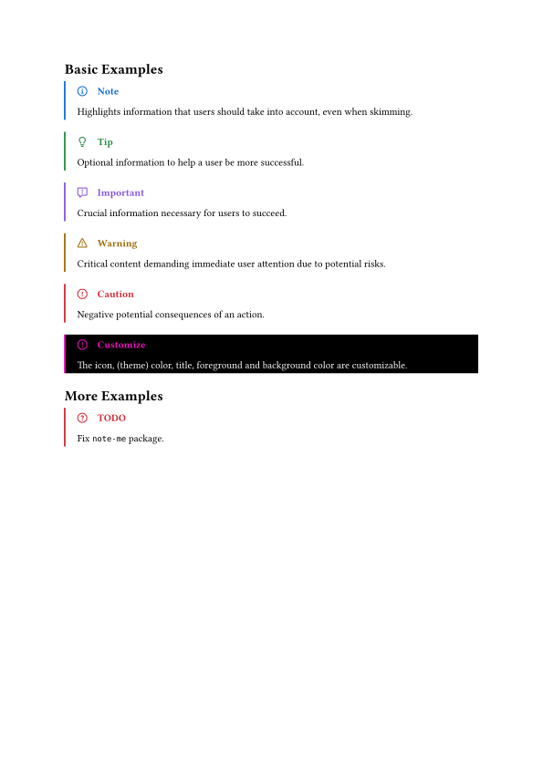

# GitHub Admonition for Typst

> [!NOTE]
> Add GitHub style admonitions (also known as alerts) to Typst.

## Usage

Import this package, and do

```typ
= Basic Examples

#note[
  Highlights information that users should take into account, even when skimming.
]

#tip[
  Optional information to help a user be more successful.
]

#important[
  Crucial information necessary for users to succeed.
]

#warning[
  Critical content demanding immediate user attention due to potential risks.
]

#caution[
  Negative potential consequences of an action.
]

#admonition(
  icon: "icons/stop.svg",
  color: color.fuchsia,
  title: "Customize",
  foreground-color: color.white,
  background-color: color.black,
)[
  The icon, (theme) color, title, foreground and background color are customizable.
]

= More Examples

#todo[
  Fix `note-me` package.
]
```



Further Reading: 

- https://github.com/orgs/community/discussions/16925
- https://docs.asciidoctor.org/asciidoc/latest/blocks/admonitions/

## Style

It borrows the style of GitHub's admonition.

> [!NOTE]  
> Highlights information that users should take into account, even when skimming.

> [!TIP]
> Optional information to help a user be more successful.

> [!IMPORTANT]  
> Crucial information necessary for users to succeed.

> [!WARNING]  
> Critical content demanding immediate user attention due to potential risks.

> [!CAUTION]
> Negative potential consequences of an action.

## Credits

The admonition icons are from [Octicons](https://github.com/primer/octicons).