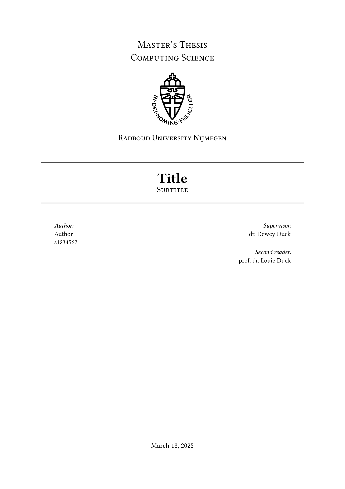

# Radboud Thesis Template

<p align="center">
    
</p>

Template for Radboud University Bachelor's/Master's thesis

Title page based on LaTeX package https://ctan.org/pkg/rutitlepage

## Example Usage
```typ
#import "@preview/now-radboud-thesis:0.1.0": radboud-thesis, appendix

#show: radboud-thesis.with(
  title: "Title",
  subtitle: "Subtitle",
  author: (
    name: "Author",
    student-number: "s1234567",
  ),
  supervisors: (("Supervisor", "dr. Dewey Duck"), ("Second reader", "prof. dr. Louie Duck")),
  abstract: [Abstract],
  thesis-type: "Master's Thesis",
  study: "Computing Science",
  date: datetime.today(),
)

#outline()

= Introduction
#lorem(100)
#bibliography("bibliography.bib", style: "association-for-computing-machinery")

#show: appendix

= Proofs
#lorem(100)
```
