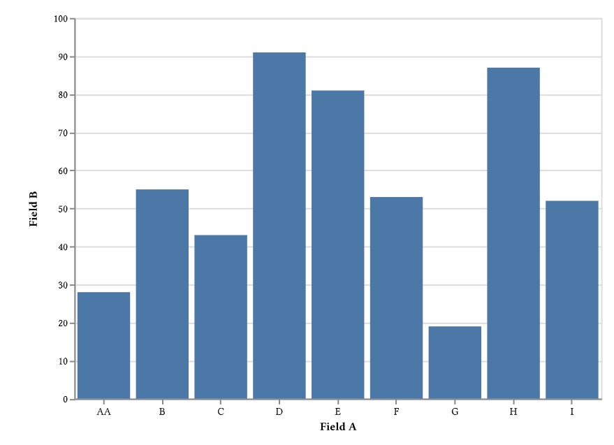

# nulite

A typst plugin to generate charts using [vegalite](https://vega.github.io/vega-lite/)

## Usage

```typst
#import "@preview/nulite:0.1.0" as vegalite

#vegalite.render(
  width: 100%,
  height: 100%,
  zoom: 1,
  json("spec.json")
  )

```



The module exports a single function, `render` with four arguments

* `width`: Width of the chart in percent of the container's width
* `height`: Height of the chart in percent of the container's height
* `zoom`: Zoom factor applied to the SVG. This mainly affects the sizing of text in relation to the graphical elements.
* `spec`: [Vegalite specification](https://vega.github.io/vega-lite/docs/spec.html)

## Compatibility

This plugin uses vegalite v5.21 and vega v5.30.

The following features of vegalite are **not supported**:

* Setting `width` and `height` in the spec. These values should be provided as arguments to `render`. If `width` or `height` are included in the spec then they will be ignored.
* Loading data with the `url` property. Attempting to do this will result in an error while trying to compile the `typst` document. All data should be provided as part of the spec itself (inline).
* Interactive charts and tooltips. 