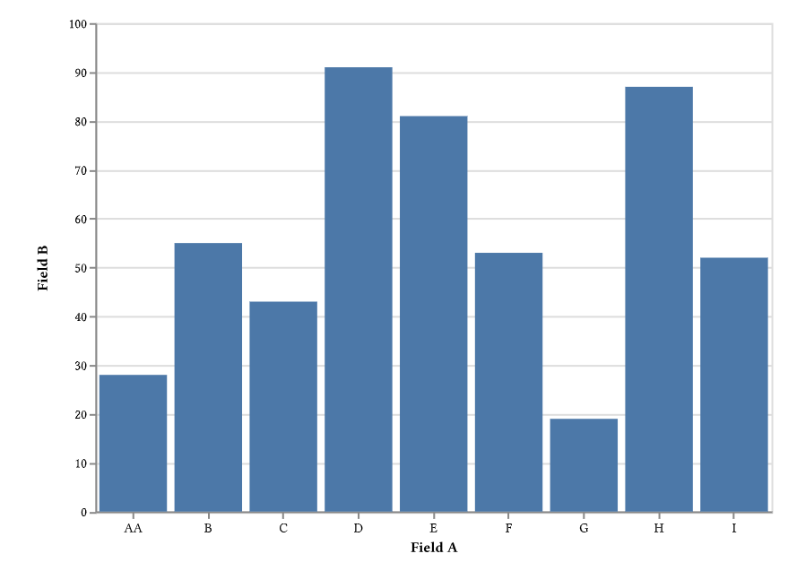

# nulite

A typst plugin to generate charts using [vegalite](https://vega.github.io/vega-lite/)

## Usage

```typst
#import "@preview/nulite:0.2.0" as nulite

#nulite.render(
  width: 100%,
  height: 100%,
  zoom: 1,
  json("spec.json")
  )

```



See the [complete example](examples/bar-chart.typ) and its [inline data](examples/spec.json).

The module exports a single function, `render` with four arguments

* `width`: Chart box width as a length or a percentage of the container. `auto` uses 300pt.
* `height`: Chart box height as a length or a percentage of the container. `auto` uses 200pt.
* `zoom`: Positive, finite zoom factor. Larger values enlarge labels and marks within the same chart box.
* `spec`: [Vegalite specification](https://vega.github.io/vega-lite/docs/spec.html)

## Compatibility

This plugin requires Typst 0.13.0 or newer and uses ctxjs 0.5.0, Vega-Lite 6.4.3,
and Vega 6.4.0. The package is tested with Typst 0.13.0 and 0.15.1.

Widths and heights must be positive and finite. Mixed lengths such as
`50% + 10pt` are supported. Relative dimensions require a bounded container;
use absolute dimensions or `auto` on an automatically sized page. The chart
keeps its aspect ratio within the requested box.

Vega-Lite 6 is a major upgrade from the previous 5.x dependency. Check existing
specifications against the Vega-Lite 6 schema when upgrading.

The following features of vegalite are **not supported**:

* Setting `width` and `height` in the spec. These values should be provided as arguments to `render`. If `width` or `height` are included in the spec then they will be ignored.
* Loading data with the `url` property. Attempting to do this will result in an error while trying to compile the `typst` document. All data should be provided as part of the spec itself (inline).
* Interactive charts and tooltips. 

## Migrating from 0.1.0

- Update the import to `@preview/nulite:0.2.0` and use Typst 0.13.0 or newer.
- Check your specifications against Vega-Lite 6. Inline data is still required.
- Width and height specify the chart box, including axes and labels. Omitted
  dimensions use 300pt × 200pt. Zoom changes the label and mark sizes within that
  box; relative dimensions require a bounded container.

## License

The Typst wrapper is licensed under MIT. `vegalite.kbc1` contains bundled
JavaScript dependencies under their respective licenses; see
[third-party notices](THIRD-PARTY-NOTICES.txt) for their license texts.

## Acknowledgements

Thanks to [ConnorBaker](https://github.com/ConnorBaker) for the rewrite.

Thanks to [lublak](https://github.com/lublak) for making the excellent [echarm](https://typst.app/universe/package/echarm) and [ctxjs](https://typst.app/universe/package/ctxjs/) packages
