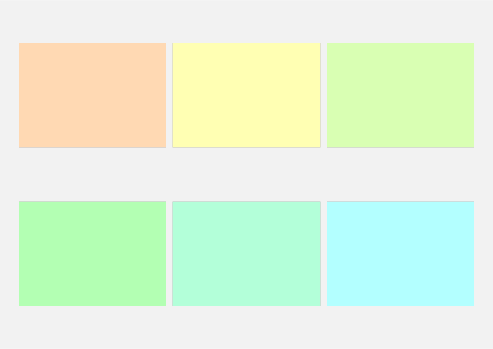

# nup

Preview multipage documents with a defined grid layout.

## Usage

The main function of this package is `nup`, which takes two main arguments: `layout` specifying the number of rows and columns, and `pages`, an array of images to place in the layout. The function also takes optional keyword arguments for customization:

| Parameter       | Type                | Description                                          | Default  |
| --------------- | ------------------- | ---------------------------------------------------- | -------- |
| `gutter`        | `size`              | Spacing between cells in the grid layout.            | `0.1cm`  |
| `shadow`        | `boolean`           | Whether to draw a shadow around images.              | `true`   |
| `shadow-args`   | `"line"`, `"label"` | Arguments passed to `shadowed()`.                    | `(:)`    |
| `rect-args`     | `"line"`, `"label"` | Arguments passed to `rect()`                         | `(:)`    |
| `page-args`     | `"line"`, `"label"` | Arguments passed to `page()`                         | `(:)`    |


Some notes about these parameters:

- By default, a thin shadow is drawn around images, with built-in parameters `fill: white, radius: 0pt, inset: 0pt, clip: false, shadow: 4pt, color: luma(50%)`. 

- Setting `shadow: false` will switch to wrapping the images with a `rect` element instead, which by default is invisble with `stroke: none, inset: 0pt`.

- The document page is set by default as `paper:"a4", margin:1cm, flipped:true, background:rect(width:100%, height:100%, fill: luma(95%))`. The page can be set differently using the `page-args` argument, noting that `auto` sizes are unlikely to work as intended as the grid needs concrete sizes to work out the number of rows.


### Intended use

This package grew from the need to preview multipage documents, similar to the `\includepdfpages[nup=...]{}` function in LaTeX. The original document must first be exported as multipage pdf (locally), or multiple images (svg or png), before being placed in the preview document.

Unfortunately, at the time of writing, it is not possible to call Typst as a subprocess, which would bypass the need for intermediate files. 
When using the online typst.app rather than a local typst compiler, one must first export images before reimporting them on the app (and note that multipage pdf files cannot be uploaded).

## Example

The script below illustrates the use of a script to export images from a multipage document, and arrange them using `nup`.

```typ
#set page(margin:0pt,flipped: true)
#let pages = range(1,13).map(i => rect(width:100%, height:100%,fill: color.hsv(i*30deg, 30%, 100%)))
#stack(..pages)
```

Compiled with 
```
typst compile test.typ 
```

```typ
#import "@preview/nup:0.1.0": nup
// #import "src/nup.typ": nup
#import "@preview/muchpdf:0.1.0": muchpdf
#let images = muchpdf(read("preview.pdf", encoding: none))
// use data from image sequence
#nup("2x3", images.children.map(x => x.source))
```




Alternatively, export and reimport pages as individual image files, 

```
mkdir images
typst compile preview.typ images/preview{p}.svg
```

```typ
#let pages = range(1,12).map(
  i => "/images/preview" + str(i) + ".svg")
#nup("3x4", pages)
```


Of course one must try to export _these_ pages and preview them,


