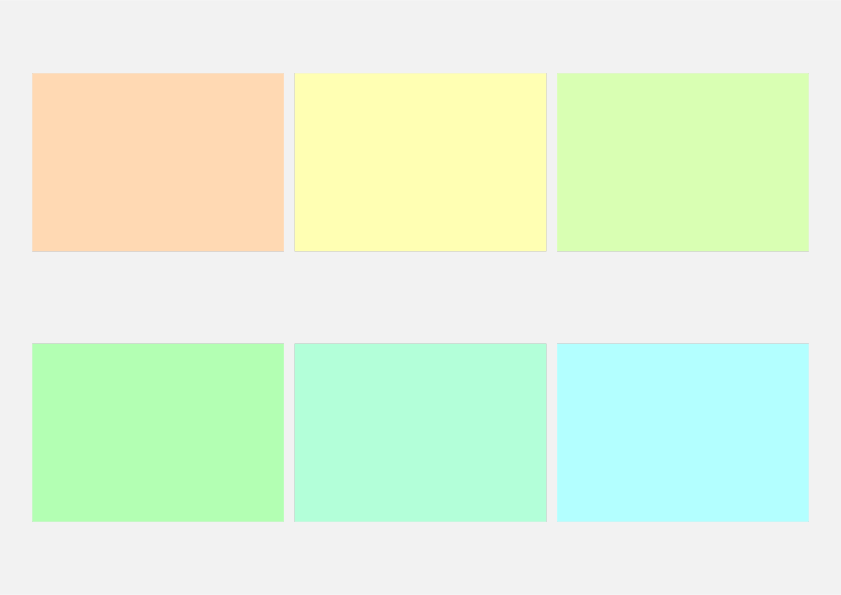
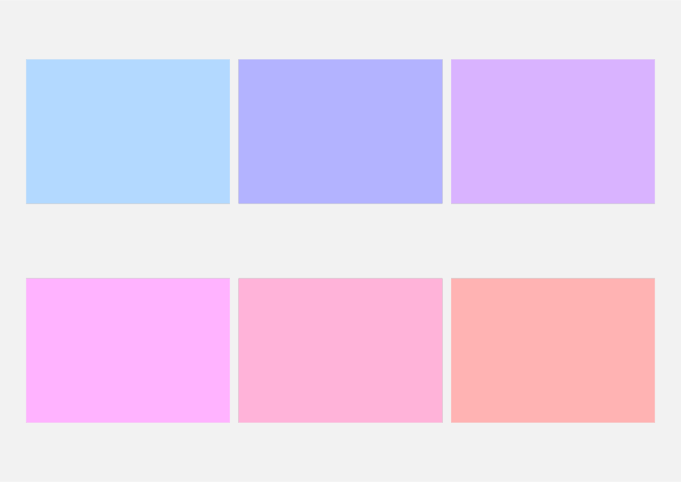
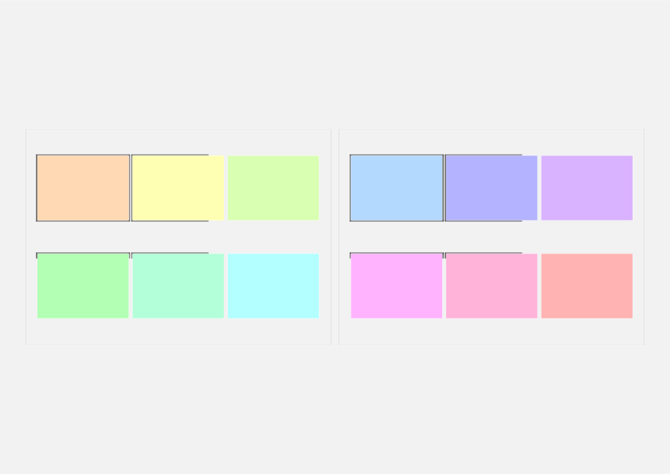

# nup

Preview multipage documents with a defined grid layout.

## Usage

The main function of this package is `nup`, which takes two main arguments: `layout` specifying the number of rows and columns, and `pages`, an array of images to place in the layout. The function also takes optional keyword arguments for customisation:

| Parameter       | Type                | Description                                          | Default  |
| --------------- | ------------------- | ---------------------------------------------------- | -------- |
| `gutter`        | `size`              | Spacing between cells in the grid layout.            | `0.1cm`  |
| `row-first`     | `boolean`           | Fill the layout rowwise or columnwise                | `true`   |
| `shadow`        | `boolean`           | Whether to draw a shadow around images.              | `true`   |
| `shadow-args`   | `"line"`, `"label"` | Arguments passed to `shadowed()`.                    | `(:)`    |
| `rect-args`     | `"line"`, `"label"` | Arguments passed to `rect()`                         | `(:)`    |
| `page-args`     | `"line"`, `"label"` | Arguments passed to `page()`                         | `(:)`    |


Some notes about these parameters:

- By default, a thin shadow is drawn around images, with built-in parameters `fill: white, radius: 0pt, inset: 0pt, clip: false, shadow: 4pt, color: luma(50%)`. 

- Setting `shadow: false` will switch to wrapping the images with a `rect` element instead, which by default is invisble with `stroke: none, inset: 0pt`. Use `rect-args` to change these settings.

- The document page is set by default as `paper:"a4", margin:1cm, flipped:true, background:rect(width:100%, height:100%, fill: luma(95%))`. The page can be set differently using the `page-args` argument, noting that `auto` sizes are unlikely to work as intended as the grid needs concrete sizes to work out the number of rows.


### Intended use

This package grew from the need to preview multipage documents, similar to the `\includepdfpages[nup=...]{}` function in LaTeX. The original document must first be exported as multipage pdf (locally), or multiple images (svg or png), before being placed in the preview document.

Unfortunately, at the time of writing, it is not possible to call Typst as a subprocess, which would bypass the need for intermediate files. 
When using the online typst.app rather than a local typst compiler, one must first export images before reimporting them on the app (and note that multipage pdf files cannot be uploaded).

## Example

The script below generates a multipage document, and arranges them using `nup`.

```typ
#set page(margin:0pt, flipped: true)
#let pages = range(1,13).map(i => rect(width:100%, height:100%,fill: color.hsv(i*30deg, 30%, 100%)))
#stack(..pages)
```

Compiled with 
```
typst compile dummy.typ 
```

```typ
#import "@preview/nup:0.1.2": nup

// native import of pdf in recent typst
#nup("2x3", range(1,13).map(p => image("dummy.pdf", page: p)))

// alternatively, use muchpdf
#import "@preview/muchpdf:0.1.1": muchpdf
#let images = muchpdf(read("dummy.pdf", encoding: none))
// use data from image sequence
#nup("2x3", images.children)
```




Alternatively, export and reimport pages as individual image files, 

```
mkdir images
typst compile preview.typ images/dummy{p}.svg
```

```typ
#let pages = range(1,12).map(
  i => image("/images/dummy" + str(i) + ".svg"))
#nup("3x4", pages)
```


Of course one must try to export _these_ pages and preview them,





## Command line helper

The following bash script may be useful for generating a quick multipage preview of a document with the default settings (disclaimer: it hasn't been tested much), 

```bash
#!/bin/bash

# Exit on error
set -e

# Parse options
LAYOUT="1x2"  # default
while getopts "l:" opt; do
  case ${opt} in
    l ) LAYOUT="$OPTARG" ;;
    \? ) echo "Usage: nup [-l layout] document.typ"; exit 1 ;;
  esac
done
shift $((OPTIND -1))

# Input file
INPUT_FILE="$1"
if [ -z "$INPUT_FILE" ]; then
  echo "Error: No Typst input file provided."
  exit 1
fi

# Filenames and paths
TMPDIR=$(mktemp -d)
BASENAME=$(basename "$INPUT_FILE" .typ)
NUP_FILE="${TMPDIR}/nup_typst_document.typ"
OUTPUT_PDF="${BASENAME}-nup.pdf"

# Compile original document to SVG pages
typst compile "$INPUT_FILE" "${TMPDIR}/preview{p}.svg"

# Count number of SVG files
NUM_PAGES=$(ls "$TMPDIR"/preview*.svg | wc -l)
UPPER_BOUND=$((NUM_PAGES + 1))

# Generate Typst file to n-up the pages
cat > "$NUP_FILE" <<EOF
#import "@preview/nup:0.1.2": nup
#let pages = range(1, ${UPPER_BOUND}).map(
  i => image("preview" + str(i) + ".svg"))
#nup("${LAYOUT}", pages)
EOF

# Absolute path to output
OUTPUT_PNG="$(pwd)/${BASENAME}-nup.png"

# Move into TMPDIR and compile the nup document from there
(
  cd "$TMPDIR"
  typst compile --ppi 200 "$(basename "$NUP_FILE")" "$OUTPUT_PNG"
  optipng "$OUTPUT_PNG"
)


# Clean up
rm -r "$TMPDIR"

echo "Done! Output written to $OUTPUT_PNG"
```
