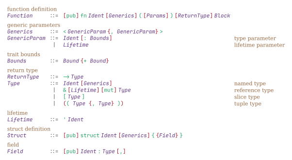

# nutthead-ebnf

A Typst package for rendering Extended Backus-Naur Form (EBNF) grammars with customizable fonts and color schemes. Fully compliant with ISO 14977.



## Usage

```typst
#import "@preview/nutthead-ebnf:0.1.0": *

#ebnf(
  mono-font: "JetBrains Mono",
  prod(
    n[Expression],
    {
      alt[#n[Term] #rep[#t[+] #n[Term]]][arithmetic expression]
    },
  ),
  prod(
    n[Term],
    {
      alt[#n[Factor] #rep[#t[*] #n[Factor]]][multiplication]
    },
  ),
)
```

## API Reference

### `ebnf()`

Renders an EBNF grammar as a formatted 4-column grid (LHS, delimiter, RHS, comments).

| Parameter            | Type            | Default           | Description                              |
| -------------------- | --------------- | ----------------- | ---------------------------------------- |
| `mono-font`          | `str` or `none` | `none`            | Font for grammar symbols                 |
| `colors`             | `dict`          | `colors-colorful` | Color scheme                             |
| `production-spacing` | `length`        | `0.5em`           | Extra vertical space between productions |
| `column-gap`         | `length`        | `0.75em`          | Horizontal spacing between columns       |
| `row-gap`            | `length`        | `0.5em`           | Vertical spacing between rows            |
| `..body`             | `prod()`        | —                 | Production rules                         |

### `prod()`

Defines a production rule.

```typst
prod(
  n[NonTerminal],        // Left-hand side
  delim: "::=",          // Optional custom delimiter (default: auto)
  {
    alt[...][comment]    // One or more alternatives with optional comments
  },
)
```

### `alt()`

Defines an alternative in a production's right-hand side. The second argument is an optional comment rendered as `(* ... *)` in a dedicated column.

```typst
alt[#t[terminal] #n[NonTerminal]][optional comment]
alt[#t[another]][]  // Empty comment renders nothing
```

### Symbol Functions

| Function     | Description                      | Example                  |
| ------------ | -------------------------------- | ------------------------ |
| `t[...]`     | Terminal symbol                  | `t[if]`                  |
| `n[...]`     | Non-terminal reference (italic)  | `n[Expr]`                |
| `nt[...]`    | Non-terminal with angle brackets | `nt[digit]` → ⟨_digit_⟩  |
| `opt[...]`   | Optional: `[content]`            | `opt[#t[else]]`          |
| `rep[...]`   | Zero or more: `{content}`        | `rep[#n[Stmt]]`          |
| `rep-1[...]` | One or more: `{content}+`        | `rep-1[#t[a]]`           |
| `grp[...]`   | Grouping: `(content)`            | `grp[#t[a] #t[b]]`       |

### ISO 14977 Functions

| Function              | Description                     | Example                          |
| --------------------- | ------------------------------- | -------------------------------- |
| `exc(a, b)`           | Exception: `a − b` (a except b) | `exc(n[letter], t[x])`           |
| `seq(...)`            | Concatenation: `a , b , c`      | `seq(t[a], t[b], t[c])`          |
| `times(n, x)`         | Repetition count: `n ∗ x`       | `times(3, t[a])`                 |
| `special[...]`        | Special sequence: `? ... ?`     | `special[any character]`         |
| `ebnf-comment[...]`   | Inline comment: `(* ... *)`     | `ebnf-comment[see 4.2]`          |
| `empty`               | Empty/epsilon: `ε`              | `alt[#empty][empty production]`  |

## Color Schemes

Two built-in color schemes are provided:

### `colors-colorful` (default)

Distinct colors for each element type:

- **LHS**: Blue (`#1a5fb4`)
- **Non-terminal**: Purple (`#613583`)
- **Terminal**: Green (`#26a269`)
- **Operator**: Red (`#a51d2d`)
- **Delimiter**: Gray (`#5e5c64`)
- **Comment**: Gray (`#5e5c64`)

### `colors-plain`

No colors applied (all elements use default text color).

### Custom Colors

```typst
#let my-colors = (
  lhs: rgb("#000000"),
  nonterminal: rgb("#0000ff"),
  terminal: rgb("#008000"),
  operator: rgb("#ff0000"),
  delim: rgb("#808080"),
  comment: rgb("#808080"),
)

#ebnf(colors: my-colors, ...)
```

## Comments

Comments are specified as the second argument to `alt()` and rendered as ISO 14977 `(* ... *)` notation in a dedicated fourth column:

```typst
prod(n[Modifier], {
  alt[#t[public]][access modifier]   // → (* access modifier *)
  alt[#t[private]][]                 // → (no comment)
  alt[#t[static]][other modifiers]   // → (* other modifiers *)
})
```

For inline comments within the RHS, use `ebnf-comment[...]`.

## Examples

### Rust Function Grammar

```typst
#import "@preview/nutthead-ebnf:0.1.0": *

#ebnf(
  mono-font: "JetBrains Mono",
  prod(
    n[Function],
    {
      alt[#opt[#t[pub]] #t[fn] #n[Ident] #t[\(] #opt[#n[Params]] #t[\)] #n[Block]][function definition]
    },
  ),
  prod(
    n[Type],
    {
      alt[#n[Ident] #opt[#n[Generics]]][named type]
      alt[#t[&] #opt[#n[Lifetime]] #opt[#t[mut]] #n[Type]][reference type]
      alt[#t[\[] #n[Type] #t[\]]][slice type]
    },
  ),
)
```

### Java Class Grammar

```typst
#import "@preview/nutthead-ebnf:0.1.0": *

#ebnf(
  mono-font: "Fira Mono",
  prod(
    n[ClassDecl],
    {
      alt[#opt[#n[Modifier]] #t[class] #n[Ident] #opt[#t[extends] #n[Type]] #n[ClassBody]][class declaration]
    },
  ),
  prod(
    n[Modifier],
    {
      alt[#t[public]][access modifier]
      alt[#t[private]][]
      alt[#t[protected]][]
      alt[#t[static]][other modifiers]
      alt[#t[final]][]
    },
  ),
)
```

## License

MIT
