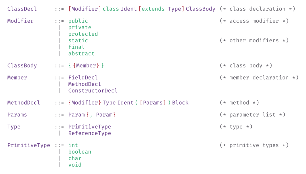
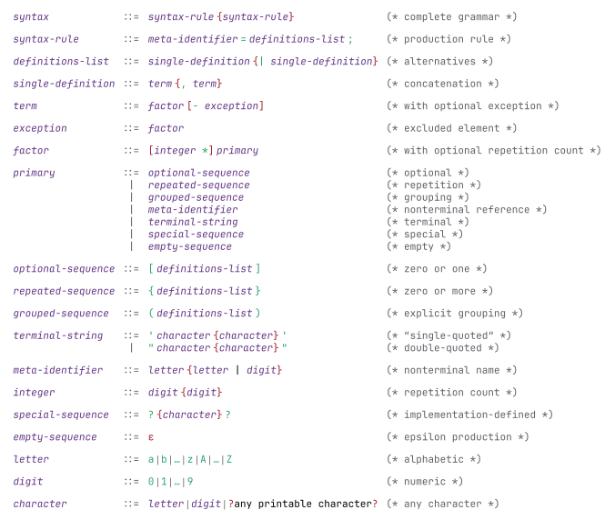

# nutthead-ebnf

A Typst package for rendering Extended Backus-Naur Form (EBNF) grammars with customizable fonts and color schemes. Fully compliant with ISO 14977.

## Java Grammar Example



## ISO 14977 Grammar Example



## Usage

```typst
#import "@preview/nutthead-ebnf:0.1.0": *

#syntax(
  mono-font: "JetBrains Mono",
  syntax-rule(
    meta-identifier[Expression],
    {
      definitions-list[#meta-identifier[Term] #repeated-sequence[#terminal-string[\+] #meta-identifier[Term]]][arithmetic expression]
    },
  ),
  syntax-rule(
    meta-identifier[Term],
    {
      definitions-list[#meta-identifier[Factor] #repeated-sequence[#terminal-string[\*] #meta-identifier[Factor]]][multiplication]
    },
  ),
)
```

## API Reference

### `syntax()`

Renders an EBNF grammar as a formatted 4-column grid (LHS, delimiter, RHS, comments).

| Parameter            | Type            | Default           | Description                              |
| -------------------- | --------------- | ----------------- | ---------------------------------------- |
| `mono-font`          | `str` or `none` | `none`            | Font for grammar symbols                 |
| `colors`             | `dict`          | `colors-colorful` | Color scheme                             |
| `production-spacing` | `length`        | `0.5em`           | Extra vertical space between productions |
| `column-gap`         | `length`        | `0.75em`          | Horizontal spacing between columns       |
| `row-gap`            | `length`        | `0.5em`           | Vertical spacing between rows            |
| `..body`             | `syntax-rule()` | —                 | Production rules                         |

### `syntax-rule()`

Defines a production rule.

```typst
syntax-rule(
  meta-identifier[NonTerminal],  // Left-hand side
  delim: "::=",                  // Optional custom delimiter (default: auto)
  {
    definitions-list[...][comment]  // One or more alternatives with optional comments
  },
)
```

### `definitions-list()`

Defines an alternative in a production's right-hand side. The second argument is an optional comment rendered as `(* ... *)` in a dedicated column.

```typst
definitions-list[#terminal-string[terminal] #meta-identifier[NonTerminal]][optional comment]
definitions-list[#terminal-string[another]][]  // Empty comment renders nothing
```

### Symbol Functions

| Function                 | Description                     | Example                                                     |
| ------------------------ | ------------------------------- | ----------------------------------------------------------- |
| `terminal-string[...]`   | Terminal symbol                 | `terminal-string[if]`                                       |
| `meta-identifier[...]`   | Non-terminal reference (italic) | `meta-identifier[Expr]`                                     |
| `optional-sequence[...]` | Optional: `[content]`           | `optional-sequence[#terminal-string[else]]`                 |
| `repeated-sequence[...]` | Repetition: `{content}`         | `repeated-sequence[#meta-identifier[Stmt]]`                 |
| `grouped-sequence[...]`  | Grouping: `(content)`           | `grouped-sequence[#terminal-string[a] #terminal-string[b]]` |
| `exception(a, b)`        | Exception: `a − b`              | `exception(meta-identifier[letter], terminal-string[x])`    |
| `single-definition(...)` | Concatenation: `a , b , c`      | `single-definition(terminal-string[a], terminal-string[b])` |
| `syntactic-factor(n, x)` | Repetition count: `n ∗ x`       | `syntactic-factor(3, terminal-string[a])`                   |
| `special-sequence[...]`  | Special sequence: `? ... ?`     | `special-sequence[any character]`                           |
| `comment[...]`           | Inline comment: `(* ... *)`     | `comment[see 4.2]`                                          |
| `empty-sequence`         | Empty/epsilon: `ε`              | `definitions-list[#empty-sequence][empty production]`       |

## Color Schemes

Two built-in color schemes are provided:

### `colors-colorful` (default)

Distinct colors for each element type:

- **LHS**: Blue (`#1a5fb4`)
- **Non-terminal**: Purple (`#613583`)
- **Terminal**: Green (`#26a269`)
- **Operator**: Red (`#a51d2d`)
- **Delimiter**: Gray (`#5e5c64`)
- **Comment**: Gray (`#5e5c64`)

### `colors-plain`

No colors applied (all elements use default text color).

### Custom Colors

```typst
#let my-colors = (
  lhs: rgb("#000000"),
  nonterminal: rgb("#0000ff"),
  terminal: rgb("#008000"),
  operator: rgb("#ff0000"),
  delim: rgb("#808080"),
  comment: rgb("#808080"),
)

#syntax(
  colors: my-colors,
  syntax-rule(meta-identifier[S], { definitions-list[#terminal-string[a] #meta-identifier[B]][example] }),
)
```

## Comments

Comments are specified as the second argument to `definitions-list()` and rendered as ISO 14977 `(* ... *)` notation in a dedicated fourth column:

```typst
syntax-rule(meta-identifier[Modifier], {
  definitions-list[#terminal-string[public]][access modifier]   // → (* access modifier *)
  definitions-list[#terminal-string[private]][]                 // → (no comment)
  definitions-list[#terminal-string[static]][other modifiers]   // → (* other modifiers *)
})
```

For inline comments within the RHS, use `comment[...]`.

## Examples

### Rust Function Grammar

```typst
#import "@preview/nutthead-ebnf:0.1.0": *

#syntax(
  mono-font: "JetBrains Mono",
  syntax-rule(
    meta-identifier[Function],
    {
      definitions-list[#optional-sequence[#terminal-string[pub]] #terminal-string[fn] #meta-identifier[Ident] #terminal-string[\(] #optional-sequence[#meta-identifier[Params]] #terminal-string[\)] #meta-identifier[Block]][function definition]
    },
  ),
  syntax-rule(
    meta-identifier[Type],
    {
      definitions-list[#meta-identifier[Ident] #optional-sequence[#meta-identifier[Generics]]][named type]
      definitions-list[#terminal-string[&] #optional-sequence[#meta-identifier[Lifetime]] #optional-sequence[#terminal-string[mut]] #meta-identifier[Type]][reference type]
      definitions-list[#terminal-string[\[] #meta-identifier[Type] #terminal-string[\]]][slice type]
    },
  ),
)
```

### Java Class Grammar

```typst
#import "@preview/nutthead-ebnf:0.1.0": *

#syntax(
  mono-font: "Fira Mono",
  syntax-rule(
    meta-identifier[ClassDecl],
    {
      definitions-list[#optional-sequence[#meta-identifier[Modifier]] #terminal-string[class] #meta-identifier[Ident] #optional-sequence[#terminal-string[extends] #meta-identifier[Type]] #meta-identifier[ClassBody]][class declaration]
    },
  ),
  syntax-rule(
    meta-identifier[Modifier],
    {
      definitions-list[#terminal-string[public]][access modifier]
      definitions-list[#terminal-string[private]][]
      definitions-list[#terminal-string[protected]][]
      definitions-list[#terminal-string[static]][other modifiers]
      definitions-list[#terminal-string[final]][]
    },
  ),
)
```

## License

MIT
