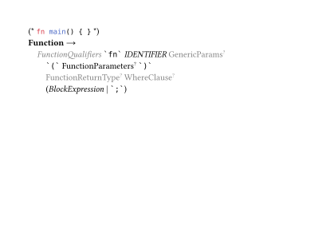

# nutthead-ebnf

A Typst package for rendering Extended Backus-Naur Form (EBNF) grammars.

Faithful to the [ISO 14977 (PDF)](https://www.cl.cam.ac.uk/~mgk25/iso-14977.pdf) standard, albeit with a few judicious departures where deemed necessary.

## Rust Function Example



## Usage

```typ
#import "@preview/nutthead-ebnf:0.3.0": *

#context [
  #ebnf[
    #[
      #syntax-rule(
        meta-id: [Function],
        example: [`fn main() { }`],
        definition-list: (
          (indent: 1),
          [
            #single-definition(illumination: "dimmed")[FunctionQualifiers]
            #terminal[fn]
            #single-definition[IDENTIFIER]
            #single-definition(illumination: "dimmed", qualifier: "opt")[GenericParams]
          ],
          (indent: 2),
          [
            #terminal[(]
            #single-definition(qualifier: "opt")[FunctionParameters]
            #terminal[)]
          ],
          [
            #single-definition(illumination: "dimmed", qualifier: "opt")[FunctionReturnType]
            #single-definition(illumination: "dimmed", qualifier: "opt")[WhereClause]
          ],
          [
            #grouped-sequence[
              #single-definition[BlockExpression]
              #terminal(illumination: "dimmed")[;]
            ]
          ],
        ),
      )
    ]
  ]
]
```

## API Reference

### `ebnf()`

Container function that configures the EBNF rendering context.

| Parameter                     | Type   | Default              | Description                      |
| ----------------------------- | ------ | -------------------- | -------------------------------- |
| `body`                        | `content` | —                 | Content to render                |
| `definition-separator-symbol` | `str`  | `"\|"`               | Symbol for separating alternatives |
| `delimiter-symbol`            | `str`  | `` "`" ``            | Delimiter for terminal symbols   |
| `default-font`                | `dict` | Libertinus Serif 1em | Default text font                |
| `monospaced-font`             | `dict` | DejaVu Sans Mono 0.887em | Monospace font for terminals |

```typ
#context [
  #ebnf[
    #syntax-rule(...)
  ]
]
```

### `syntax-rule()`

Defines a production rule with a meta-identifier, example, and definition list.

| Parameter         | Type      | Default | Description                          |
| ----------------- | --------- | ------- | ------------------------------------ |
| `meta-id`         | `content` | `none`  | Left-hand side identifier            |
| `example`         | `content` | `none`  | Code example shown as comment        |
| `definition-list` | `array`   | `none`  | Array of definitions and indent controls |

```typ
#syntax-rule(
  meta-id: [Function],
  example: [`fn main() { }`],
  definition-list: (
    (indent: 1),
    [#terminal[fn] #single-definition[IDENTIFIER]],
    (indent: 2),
    [#terminal[(] #single-definition(qualifier: "opt")[Params] #terminal[)]],
  ),
)
```

### `single-definition()`

Renders a non-terminal reference in italic.

| Parameter      | Type   | Default | Description                                |
| -------------- | ------ | ------- | ------------------------------------------ |
| `body`         | `content` | —    | The non-terminal name                      |
| `illumination` | `str`  | `none`  | `"dimmed"` or `"highlighted"`              |
| `qualifier`    | `str`  | `none`  | `"opt"` (?), `"some"` (+), or `"any"` (\*) |

```typ
#single-definition[IDENTIFIER]
#single-definition(illumination: "dimmed")[FunctionQualifiers]
#single-definition(qualifier: "opt")[GenericParams]
```

### `terminal()`

Renders a terminal symbol in monospace font with delimiters.

| Parameter      | Type      | Default | Description                   |
| -------------- | --------- | ------- | ----------------------------- |
| `body`         | `content` | —       | The terminal text             |
| `illumination` | `str`     | `none`  | `"dimmed"` or `"highlighted"` |

```typ
#terminal[fn]
#terminal(illumination: "dimmed")[;]
```

### `meta-identifier()`

Renders a meta-identifier (left-hand side of a production) in bold with a production arrow.

```typ
#meta-identifier[Function]
```

### `grouped-sequence()`

Renders content in parentheses `( ... )` for grouping alternatives.

| Parameter      | Type      | Default | Description                                |
| -------------- | --------- | ------- | ------------------------------------------ |
| `body`         | `content` | —       | Content to group                           |
| `illumination` | `str`     | `none`  | `"dimmed"` or `"highlighted"`              |
| `qualifier`    | `str`     | `none`  | `"opt"` (?), `"some"` (+), or `"any"` (\*) |

```typ
#grouped-sequence[
  #single-definition[BlockExpression]
  #terminal(illumination: "dimmed")[;]
]
```

### `optional-sequence()`

Renders content in square brackets `[ ... ]` for optional elements.

| Parameter      | Type      | Default | Description                                |
| -------------- | --------- | ------- | ------------------------------------------ |
| `body`         | `content` | —       | Optional content                           |
| `illumination` | `str`     | `none`  | `"dimmed"` or `"highlighted"`              |
| `qualifier`    | `str`     | `none`  | `"opt"` (?), `"some"` (+), or `"any"` (\*) |

```typ
#optional-sequence[#terminal[else] #single-definition[Block]]
```

### `repeated-sequence()`

Renders content in curly braces `{ ... }` for repetition (zero or more).

| Parameter      | Type      | Default | Description                                |
| -------------- | --------- | ------- | ------------------------------------------ |
| `body`         | `content` | —       | Content to repeat                          |
| `illumination` | `str`     | `none`  | `"dimmed"` or `"highlighted"`              |
| `qualifier`    | `str`     | `none`  | `"opt"` (?), `"some"` (+), or `"any"` (\*) |

```typ
#repeated-sequence[#single-definition[Statement]]
```

### `special-sequence()`

Renders content in question marks `? ... ?` for special sequences.

| Parameter      | Type      | Default | Description                                |
| -------------- | --------- | ------- | ------------------------------------------ |
| `body`         | `content` | —       | Special sequence description               |
| `illumination` | `str`     | `none`  | `"dimmed"` or `"highlighted"`              |
| `qualifier`    | `str`     | `none`  | `"opt"` (?), `"some"` (+), or `"any"` (\*) |

```typ
#special-sequence[any Unicode character]
```

## License

MIT
