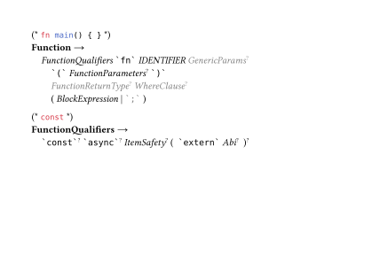

# nutthead-ebnf

A Typst package for rendering Extended Backus-Naur Form (EBNF) grammars.

Faithful to the [ISO 14977 (PDF)](https://www.cl.cam.ac.uk/~mgk25/iso-14977.pdf) standard, albeit with a few judicious departures where deemed necessary.

## Rust Function Example



## Usage

````typ
#import "@preview/nutthead-ebnf:0.3.1": *

#context [
  #ebnf[
    #[
      #syntax-rule(
        meta-id: [CHAR],
        definition-list: (
          [
            #special-sequence[a Unicode scalar value]
          ],
        )
      )

      #syntax-rule(
        meta-id: [NUL],
        definition-list: (
          [
            #terminal[U+0000]
          ],
        )
      )

      #syntax-rule(
        meta-id: [Function],
        rule-comment: [some comment],
        rule-example: [```rust fn main() { }```],
        definition-list: (
          [
            #single-definition(illumination: "dimmed")[FunctionQualifiers]
            #terminal[fn]
            #single-definition[IDENTIFIER]
            #single-definition(illumination: "dimmed", qualifier: "opt")[GenericParams]
          ],
          (indent: 2),
          [
            #terminal[(]
            #single-definition(qualifier: "opt")[FunctionParameters]
            #terminal[)]
          ],
          [
            #single-definition(illumination: "dimmed", qualifier: "opt")[FunctionReturnType]
            #single-definition(illumination: "dimmed", qualifier: "opt")[WhereClause]
          ],
          [
            #grouped-sequence(
              single-definition[BlockExpression],
              terminal(illumination: "dimmed")[;]
            )
          ],
        ),
      )
    ]
  ]
]
````

## API Reference

### `ebnf()`

Container function that configures the EBNF rendering context.

| Parameter                     | Type      | Default                  | Description                        |
| ----------------------------- | --------- | ------------------------ | ---------------------------------- |
| `body`                        | `content` | —                        | Content to render                  |
| `definition-separator-symbol` | `str`     | `"\|"`                   | Symbol for separating alternatives |
| `delimiter-symbol`            | `str`     | ``"`"``                  | Delimiter for terminal symbols     |
| `default-font`                | `dict`    | Libertinus Serif 1em     | Default text font                  |
| `monospaced-font`             | `dict`    | DejaVu Sans Mono 0.887em | Monospace font for terminals       |

```typ
#context [
  #ebnf[
    #syntax-rule(
      meta-id: [FunctionQualifiers],
      rule-example: [```rust const```],
      definition-list: (
        (indent: 1),
        [
          #terminal(qualifier: "opt")[const]
          #terminal(qualifier: "opt")[async]
          #single-definition(qualifier: "opt")[ItemSafety]
          #grouped-sequence(
            qualifier: "opt",
            [
              #terminal[extern]
              #single-definition(qualifier: "opt")[Abi]
            ],
          )
        ],
      ),
    )
  ]
]
```

### `syntax-rule()`

Defines a production rule with a meta-identifier, optional comment, optional code example, and definition list.

| Parameter         | Type      | Default | Description                                   |
| ----------------- | --------- | ------- | --------------------------------------------- |
| `meta-id`         | `content` | `none`  | Left-hand side identifier                     |
| `rule-comment`    | `content` | `none`  | Optional comment for the rule                 |
| `rule-example`    | `content` | `none`  | Optional code example (typically raw content) |
| `definition-list` | `array`   | `none`  | Array of definitions and indent controls      |

````typ
#syntax-rule(
  meta-id: [Function],
  rule-comment: [some comment],
  rule-example: [```rust fn main() { }```],
  definition-list: (
    (indent: 1),
    [#terminal[fn] #single-definition[IDENTIFIER]],
    (indent: 2),
    [#terminal[(] #single-definition(qualifier: "opt")[Params] #terminal[)]],
  ),
)
````

### `single-definition()`

Renders one or more non-terminal references or terminals as a sequence in italic. Accepts variadic positional arguments.

| Parameter      | Type      | Default | Description                                  |
| -------------- | --------- | ------- | -------------------------------------------- |
| `..body`       | `content` | —       | One or more elements to render as a sequence |
| `illumination` | `str`     | `none`  | `"dimmed"` or `"highlighted"`                |
| `qualifier`    | `str`     | `none`  | `"opt"` (?), `"some"` (+), or `"any"` (\*)   |

```typ
#single-definition[IDENTIFIER]
#single-definition(illumination: "dimmed")[FunctionQualifiers]
#single-definition(qualifier: "opt")[GenericParams]
// Multiple elements in a sequence
#single-definition(
  terminal[fn],
  [IDENTIFIER],
  terminal[(]
)
```

### `terminal()`

Renders a terminal symbol in monospace font with delimiters.

| Parameter      | Type      | Default | Description                                |
| -------------- | --------- | ------- | ------------------------------------------ |
| `body`         | `content` | —       | The terminal text                          |
| `illumination` | `str`     | `none`  | `"dimmed"` or `"highlighted"`              |
| `qualifier`    | `str`     | `none`  | `"opt"` (?), `"some"` (+), or `"any"` (\*) |

```typ
#terminal[fn]
#terminal(illumination: "dimmed")[;]
#terminal(qualifier: "opt")[const]
```

### `meta-identifier()`

Renders a meta-identifier (left-hand side of a production) in bold with a production arrow.

```typ
#meta-identifier[Function]
```

### `comment()`

Renders a comment enclosed in comment delimiters `(* ... *)`.

| Parameter | Type      | Default | Description     |
| --------- | --------- | ------- | --------------- |
| `body`    | `content` | —       | Comment content |

```typ
#comment[This is a comment about the grammar rule]
```

### `code-example()`

Renders a code example enclosed in comment delimiters `(* ... *)`. Typically used with raw content blocks.

| Parameter | Type      | Default | Description      |
| --------- | --------- | ------- | ---------------- |
| `raw`     | `content` | —       | Raw code example |

````typ
#code-example[```rust fn main() { }```]
````

### `grouped-sequence()`

Renders content in parentheses `( ... )` for grouping alternatives. Accepts variadic positional arguments separated by the definition separator symbol.

| Parameter      | Type      | Default | Description                                |
| -------------- | --------- | ------- | ------------------------------------------ |
| `..body`       | `content` | —       | One or more alternatives to group          |
| `illumination` | `str`     | `none`  | `"dimmed"` or `"highlighted"`              |
| `qualifier`    | `str`     | `none`  | `"opt"` (?), `"some"` (+), or `"any"` (\*) |

```typ
#grouped-sequence(
  single-definition[BlockExpression],
  terminal(illumination: "dimmed")[;]
)
```

### `optional-sequence()`

Renders content in square brackets `[ ... ]` for optional elements. Accepts variadic positional arguments separated by the definition separator symbol.

| Parameter      | Type      | Default | Description                                |
| -------------- | --------- | ------- | ------------------------------------------ |
| `..body`       | `content` | —       | One or more optional alternatives          |
| `illumination` | `str`     | `none`  | `"dimmed"` or `"highlighted"`              |
| `qualifier`    | `str`     | `none`  | `"opt"` (?), `"some"` (+), or `"any"` (\*) |

```typ
#optional-sequence(
  terminal[else],
  single-definition[Block]
)
```

### `repeated-sequence()`

Renders content in curly braces `{ ... }` for repetition (zero or more). Accepts variadic positional arguments separated by the definition separator symbol.

| Parameter      | Type      | Default | Description                                |
| -------------- | --------- | ------- | ------------------------------------------ |
| `..body`       | `content` | —       | One or more alternatives to repeat         |
| `illumination` | `str`     | `none`  | `"dimmed"` or `"highlighted"`              |
| `qualifier`    | `str`     | `none`  | `"opt"` (?), `"some"` (+), or `"any"` (\*) |

```typ
#repeated-sequence(single-definition[Statement])
```

### `special-sequence()`

Renders content in question marks `? ... ?` for special sequences. Accepts variadic positional arguments separated by the definition separator symbol.

| Parameter      | Type      | Default | Description                                |
| -------------- | --------- | ------- | ------------------------------------------ |
| `..body`       | `content` | —       | One or more special sequence descriptions  |
| `illumination` | `str`     | `none`  | `"dimmed"` or `"highlighted"`              |
| `qualifier`    | `str`     | `none`  | `"opt"` (?), `"some"` (+), or `"any"` (\*) |

```typ
#special-sequence[any Unicode character]
#special-sequence[a Unicode scalar value]
```

## License

MIT
