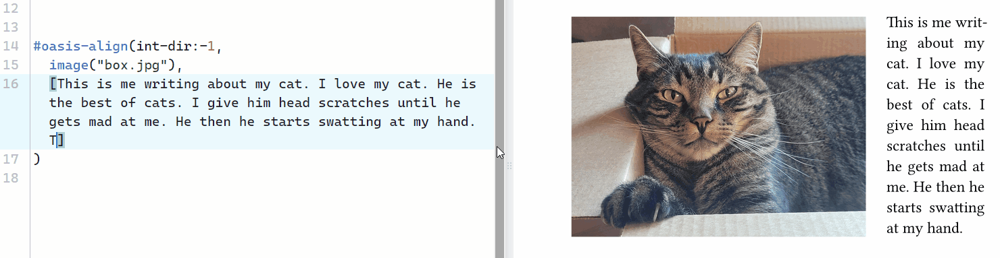
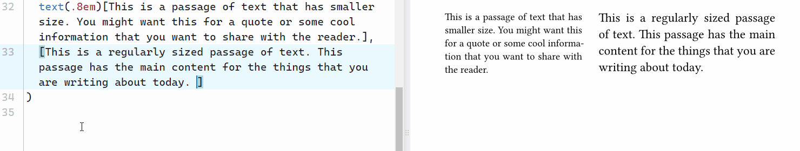
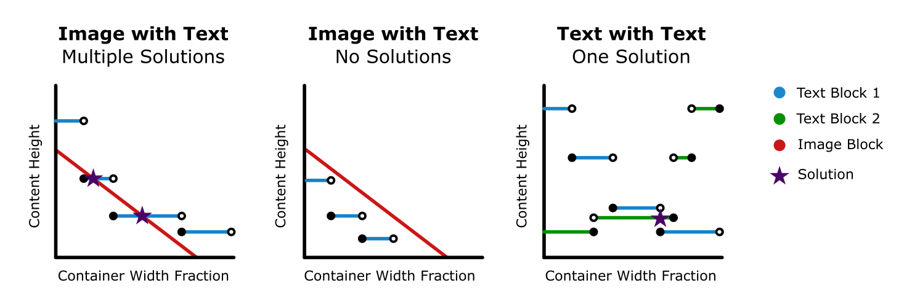

# oasis-align 
`oasis-align` is a package that automatically sizes your content so that their heights are equal, allowing you to cleanly place content side by side. 

To use `oasis-align` in your document, start by importing the package like this:
```typst
#import "@preview/oasis-align:0.1.0": *
```
This will give you access to the two functions found under [configurations](#configuration).

# Examples
## Image with Text

## Image with Image

## Text with Text


# Configuration
There are two functions associated with this package. The first is specifically targeted at [aligning images](#oasis-align-images), and the second is targeted at [content in general](#oasis-align-1).

> [!important]
> To change the size of the gutter in both functions, use `#set grid(column-gutter: length)`. This is necessary to allow for fixed rules that aren't possible with user-defined functions. 

## `oasis-align-images`
Use this function to align two images.

```typst
#oasis-align-images(
    "path/to/image1",
    "path/to/image2"
)
```

> [!tip]
> Whenever aligning **only** images, it's best to use this function instead of the default `oasis-align`. _To learn more about why, check out [how it works](#how-it-works)._

## `oasis-align`
Use this function to align content like text with other content like images or figures.

> [!tip]
> The parameters with defined values are the defaults and do not need to be included unless desired.

```typst
#oasis-align(
  int-frac: 0.5,        // decimal between 0 and 1
  tolerance: 0.001pt,   // length
  max-iterations: 50,   // integer greater than 0
  int-dir: 1,           // 1 or -1
  debug: false          // boolean
  item1,                // content
  item2,                // content
)
```
### `int-frac`
The starting point of the search process. Changing this value may reduce the total number of iterations of the function or find an [alternate solution](#oasis-align-2).

### `tolerance`
The allowable difference in heights between `item1` and `item2`. The function will run until it has reached either this `tolerance` or `max-iterations`. Making `tolerance` larger may reduce the total number of iterations but result in a larger height difference between pieces of content.  

> [!note]
> Two pieces of content may not always be able to achieve the desired `tolerance`. In that case, the function sizes the content to the iteration that had the least difference in height. _Check out [how it works](#oasis-align-2) to understand why the function may not be able achieve the desired `tolerance`._

### `max-iterations`
The maximum number of iterations the function is allowed to attempt before terminating. Increasing this number may allow you to achieve a smaller `tolerance`.

### `int-dir`
The initial direction that the dividing fraction is moved. Changing this value will change the initial direction.

> [!note]
> The program is hardcoded to switch directions if a solution is not found in the initial direction. This parameter mainly serves to let you easily choose between [multiple solutions](#oasis-align-2).

### `debug`
A toggle that lets you look inside the function to see what is happening. This is useful if you would like to understand why certain content may be incompatible and which of the parameters above could be changed to resolve the issue. 

<!-- # FAQ

## Why won't my image align nicely with my text -->


# How It Works
## `oasis-align-images`
The function begins by determining the width and height of the selected images. These values can then be used to solve a set of linear equations, the first of which states that the sum of the widths of the images (plus the gutter) should be equal to the available horizontal space, and the second which states that their heights should be equal.  

If $w_1$ and $h_1$ are the width and height of `image1` and $w_2$ and $h_2$ are the width and height of `image2`, then the final width $w_1'$ of `image1` and the final width $w_2'$ of `image2` are

$$w_1' = \left(\frac{h_1 w_2}{w_1 h_2} + 1 \right)^{-1} \qquad w_2' = \left(\frac{w_1 h_2}{h_1 w_2} + 1 \right)^{-1}$$

## `oasis-align`
Originally designed to allow for an image to be placed side-by-side with text, this function takes an iterative approach to aligning the content. When changing the width of a block of text, the height does not scale linearly, but instead behaves as a step function that follows an exponential trend (the graph below has a simplified visualization of this). This prevents the use of an analytical methodology similar to the one used in `oasis-align-images`, and thus must be solved using an iterative approach.

The function starts by taking the available space and then splitting it using the `int-frac`. The content is then placed in a block with the width as determined using the split from `int-frac` before measuring its height. Based on the `int-dir`, the split will be moved left or right using the bisection method until a solution within the `tolerance` has been found. In the case that a solution within the `tolerance` is not found with the `max-iterations`, the program terminates and uses the container width fraction that had the smallest difference in height. 



### Multiple Solutions (1st Graph)
Depending on the type of content, the function may find multiple solutions. The parameters `int-dir` and `int-frac` will allow you to choose between them by changing the direction in which it iterates and changing the starting container width fraction respectively. 

### No Solutions (2nd Graph)
There are cases in which the text size is incompatible with an image. This can be because there is not enough or too much text, and regardless of how the content is resized, their heights do not match.   

### Tolerance Not Reached (3rd Graph)
In the case of having texts of different sizes (as seen in [the examples](#text-with-text)), the spacing between lines prevents the function from finding a solution that meets the `tolerance`, and thus the closest solution is used.

<!-- # Nomenclature
"Oasis" as in a fertile spot in a desert, where water is found. -->

# Share With Me!
If you end up using this package, please feel free to share how you used it under "Discussions" on the [GitHub Repository](https://github.com/jdpieck/oasis-align) or on Discord with `@jdpieck`. 