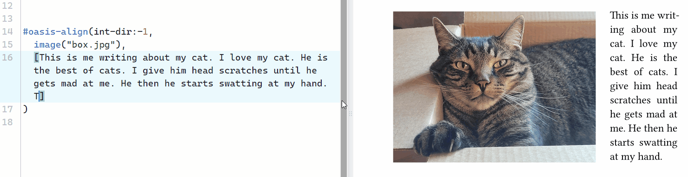
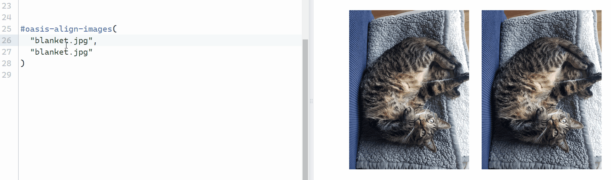
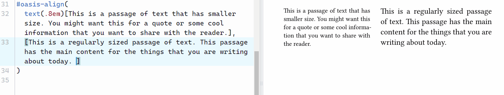
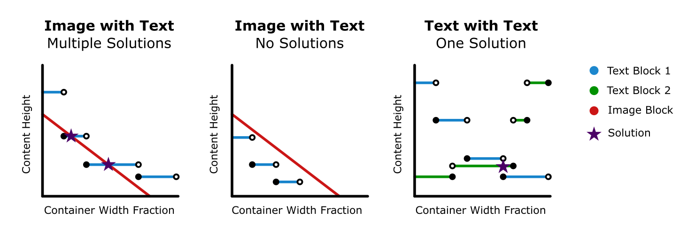

# oasis-align 
`oasis-align` is a package that automatically sizes your content so that their heights are equal, allowing you to cleanly place content side by side. 

To use `oasis-align` in your document, start by importing the package like this:
```typst
#import "@preview/oasis-align:0.3.0": *
```
and follow the instructions found under [configuration](#configuration).

## Examples
### Image with Text

### Image with Image

### Text with Text

### Full Document Implementation
To see how `oasis-align` can be used in practice, check out my [Onshape boat tutorial](https://github.com/jdpieck/Onshape-Boat-Tutorial) made using Typst!

## General Content Configuration

A large portion of the following parameters have been made user-accessible for edge case scenarios in which the baseline function is unable to determine a solution. The parameters with defined values are the defaults and should only be changed if you are unable to achieve your desired output.

```typst
#oasis-align(
  swap: false,          // boolean
  vertical: false,      // boolean
  ruler: false,         // boolean
  range: (0, 1),        // array of two decimals between 0 and 1
  int-frac: none,       // decimal between 0 and 1
  int-dir: 1,           // 1 or -1
  force-frac: none,    // decimal between 0 and 1
  min-frac: 0.05,       // decimal between 0 and 1
  frac-limit: 1e-5,     // decimal between 0 and 1
  tolerance: 0.001pt,   // length
  max-iterations: 30,   // integer greater than 0
  debug: false,         // boolean
  item1,                // content
  item2,                // content
)

// OR IF YOU ARE ALIGNING IMAGES //

#oasis-align-images(
  swap: false,          // boolean
  vertical: false,      // boolean
  item1,                // content
  item2,                // content
)
```

> [!IMPORTANT]
> To change the size of the grid gutter in both functions, use `#set grid(column-gutter: length)`. This is necessary to allow for fixed rules that aren't possible with user-defined functions. 

### `swap` (boolean)
Swap the positions of `item1` and `item2` on the grid. You can achieve an identical output by manually switching the content of `item1` and `item2`. Note that input parameters such as `forced-frac` and `int-frac` consider the content before it has been swapped.

### `vertical` (boolean)
Align the horizontal limits of the content when stacked vertically. This can be particularly useful when aligning images for presentations. 

### `ruler` (boolean)
Display a ruler overlay on top of the content. Useful for determining fractional values for other input parameters. 


### `range` (array of two decimals between 0 and 1)
Limits the solution-finding algorithm to a specific fractional range. Useful when you are only interested in finding alignments to fit a specific form factor. 

### `int-frac` (decimal between 0 and 1)
The starting point of the search process. Changing this value may reduce the total number of iterations of the function or find an [alternate solution](#oasis-align-2). By default, `int-frac` will be the midpoint of the specified `range`. For example, a `range` of `(0, 0.6)` will have an `int-frac` of `0.3`.  

### `int-dir` (-1 or 1)
The initial direction that the dividing fraction is moved. Changing this value will change the initial direction.

> [!NOTE]
> The program is hardcoded to switch directions if a solution is not found in the initial direction. This parameter mainly serves to let you easily choose between [multiple solutions](#oasis-align-2).

### `force-frac` (decimal between 0 and 1)
A last resort parameter that bypasses the `oasis-align` algorithm to use the specific fraction. Useful when the function is misbehaving and you just want to display a user-specified layout. 

### `min-frac` (decimal between 0 and 1)
The minimum fractional width the function will consider during its search. Useful if you do not want to consider solutions that result in very uneven content distribution.

### `frac-limit` (decimal between 0 and 1)
The minimum difference in fraction values between function iterations. Prevents the function from getting stuck on a discontinuity. 

### `tolerance` (length)
The maximum allowable difference in heights between `item1` and `item2`. The function will run until it has reached either this `tolerance` or `max-iterations`. Increasing `tolerance` may reduce the total number of iterations but result in a larger height difference between the pieces of content.  

> [!NOTE]
> Two pieces of content may not always be able to achieve the desired `tolerance`. In that case, the function sizes the content to the iteration that had the least difference in height. _Check out [how it works](#oasis-align-2) to understand why the function may not be able to achieve the desired `tolerance`._

### `max-iterations` (integer greater than 0)
The maximum number of iterations the function is allowed to attempt before terminating. Increasing this number may allow you to achieve a smaller `tolerance`.

### `debug` (boolean)
A toggle that lets you view internal function logs to see what is happening. Enable this if you would like to see a log of the function's process and suggestions for which parameters could be changed to resolve issues. 
<!-- 
### `item1` (content)
Content that is aligned to 
### `item2` (content) -->
<!-- # FAQ

## Why won't my image align nicely with my text -->


## How `oasis-align` Works
Originally designed to allow for an image to be placed side-by-side with text, this function takes an iterative approach to aligning the content. When changing the width of a block of text, the height does not scale linearly, but instead behaves as a step function that follows an exponential trend (the graph below has a simplified visualization of this). This prevents the use of an analytical methodology and thus must be solved using an iterative approach.

The function starts by taking the available space and then splitting it using the `int-frac`. The content is then placed in a block with the width as determined using the split from `int-frac` before measuring its height. Based on the `int-dir`, the split will be moved left or right using the bisection method until a solution within the `tolerance` has been found. In the case that a solution within the `tolerance` is not found within the `max-iterations`, the program terminates and uses the container width fraction that had the smallest difference in height. 



### Multiple Solutions (1st Graph)
Depending on the type of content, the function may find multiple solutions. The parameters `int-dir` and `int-frac` will allow you to choose between them by changing the direction in which it iterates and changing the starting container width fraction respectively. 

### No Solutions (2nd Graph)
There are cases in which the text size is incompatible with an image. This can be because there is not enough or too much text, and regardless of how the content is resized, their heights do not match.   

### Tolerance Not Reached (3rd Graph)
In the case of having texts of different sizes (as seen in [the examples](#text-with-text)), the spacing between lines prevents the function from finding a solution that meets the `tolerance` and thus the closest solution is used.

## How `oasis-align-images` Works
The function begins by determining the width and height of the selected images. These values can then be used to solve a set of linear equations, the first of which states that the sum of the widths of the images (plus the gutter) should be equal to the available horizontal space, and the second which states that their heights should be equal.  

If $w_1$ and $h_1$ are the width and height of `image1` and $w_2$ and $h_2$ are the width and height of `image2`, then the final width $w_1'$ of `image1` and the final width $w_2'$ of `image2` are

$$w_1' = \left(\frac{h_1 w_2}{w_1 h_2} + 1 \right)^{-1} \qquad w_2' = \left(\frac{w_1 h_2}{h_1 w_2} + 1 \right)^{-1}$$
<!-- # Nomenclature
"Oasis" as in a fertile spot in a desert, where water is found. -->

## Future Work
### Allow for Relative `grid.column-gutter` sizes
Presently, I am unable to make the `grid.column-gutter` absolute using the `.to-absolute()` method. Including a relative length in `#set grid(column-gutter)` will throw an error. 

### Skipping Close Approximations
Under certain conditions, the function may skip over near-solutions. This is a consequence of the bisection method, which is great for finding exact solutions, but not approximations. 

To address this, a large portion of the code would likely need to be rewritten using a different algorithm that searches outwards from `int-frac`. Further improvements could also likely be made by incrementally increasing the tolerance as the function struggles to find a solution.  

In the meantime, you can get around this by playing with `range` and `int-frac`.

### Possible Integration with [`wrap-it`](https://github.com/ntjess/wrap-it)
Seeing as the use cases for `oasis-align` and [`wrap-it`](https://github.com/ntjess/wrap-it) are very similar, a combined package could prove to be extremely useful. Implementation would allow for text content to overflow after a solution can no longer be found using `oasis-align`.

## Contributing and sharing
If you have suggestions or feedback, please feel free to create an [issue on GitHub](https://github.com/jdpieck/oasis-align/issues). I am particularly open to ideas for improving the solution-finding algorithm.

If you end up using this package, please feel free to share how you used it under [discussion on GitHub](https://github.com/jdpieck/oasis-align/discussions).

Thanks for reading!

\- Jason
