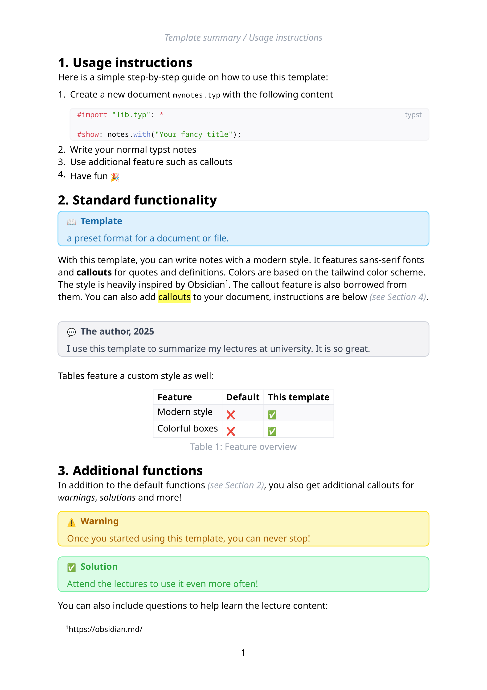

# Obsidius



Obsidius is a modern template for typst with a design inspired by [Obsidian](https://obsidian.md). 
It features utility functions to add Obsidians callouts to the document, for example to add warnings and solutions.

Get started by adding the following code to your document:

```typst
#import "@preview/obisidius:0.1.0": *

#show: notes.with("Your fancy title");
```

For more detailed information, see the sample document in this repo.
