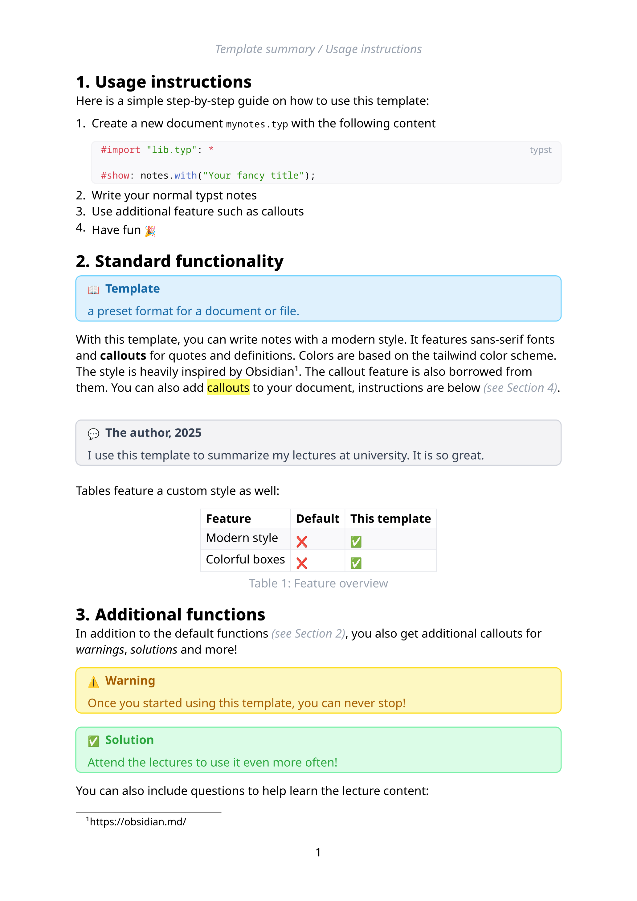

# Obsidius



Obsidius is a modern template for typst with a design inspired by [Obsidian](https://obsidian.md). 
It features utility functions to add Obsidians callouts to the document, for example to add warnings and solutions.

Get started by adding the following code to your document:

```typst
#import "@preview/obsidius:0.1.0": *

#show: notes.with("Your fancy title");
```

## Callouts

Callouts are colored blocks in your document with content outside the normal narrative flow.
For example, if you describe how to cook pasta, you can add a warning like this:

```typst
#warning[
Be careful with the water temperature. Foam can easily push your lid and rise out of your pot,
creating a mess on your stove.
]
```

There is also the `#solution[]` callout. 
You can also create your own custom callout, see the [sample document](sample/sample.typ) for more details.

This template package is licensed under [MIT](https://opensource.org/license/mit).
