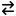
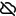
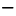
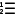
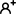
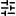
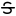

# typst-octique

GitHub [Octicons](https://primer.style/foundations/icons/) for Typst.

## Installation

```typst
#import "@preview/octique:0.1.0": *
```

## Usage

```typst
// Returns an image for the given name.
octique(name, color: rgb("#000000"), width: 1em, height: 1em)

// Returns a boxed image for the given name.
octique_inline(name, color: rgb("#000000"), width: 1em, height: 1em, baseline: 25%)

// Returns an SVG text for the given name.
octique_svg(name)
```

## List of Available Icons

See also [`sample/sample.pdf`](sample/sample.pdf).

| Code | Icon |
| ---- | :--: |
|`#octique("accessibility-inset")`|  |
|`#octique("accessibility")`|  |
|`#octique("alert-fill")`|  |
|`#octique("alert")`|  |
|`#octique("apps")`|  |
|`#octique("archive")`|  |
|`#octique("arrow-both")`|  |
|`#octique("arrow-down-left")`|  |
|`#octique("arrow-down-right")`|  |
|`#octique("arrow-down")`|  |
|`#octique("arrow-left")`|  |
|`#octique("arrow-right")`|  |
|`#octique("arrow-switch")`|  |
|`#octique("arrow-up-left")`|  |
|`#octique("arrow-up-right")`|  |
|`#octique("arrow-up")`|  |
|`#octique("beaker")`|  |
|`#octique("bell-fill")`|  |
|`#octique("bell-slash")`|  |
|`#octique("bell")`|  |
|`#octique("blocked")`|  |
|`#octique("bold")`|  |
|`#octique("book")`|  |
|`#octique("bookmark-slash")`|  |
|`#octique("bookmark")`|  |
|`#octique("briefcase")`|  |
|`#octique("broadcast")`|  |
|`#octique("browser")`|  |
|`#octique("bug")`|  |
|`#octique("cache")`|  |
|`#octique("calendar")`|  |
|`#octique("check-circle-fill")`|  |
|`#octique("check-circle")`|  |
|`#octique("check")`|  |
|`#octique("checkbox")`|  |
|`#octique("checklist")`|  |
|`#octique("chevron-down")`|  |
|`#octique("chevron-left")`|  |
|`#octique("chevron-right")`|  |
|`#octique("chevron-up")`|  |
|`#octique("circle-slash")`|  |
|`#octique("circle")`|  |
|`#octique("clock-fill")`|  |
|`#octique("clock")`|  |
|`#octique("cloud-offline")`|  |
|`#octique("cloud")`|  |
|`#octique("code-of-conduct")`|  |
|`#octique("code-review")`|  |
|`#octique("code")`|  |
|`#octique("code-square")`|  |
|`#octique("codescan-checkmark")`|  |
|`#octique("codescan")`|  |
|`#octique("codespaces")`|  |
|`#octique("columns")`|  |
|`#octique("command-palette")`|  |
|`#octique("comment-discussion")`|  |
|`#octique("comment")`|  |
|`#octique("container")`|  |
|`#octique("copilot-error")`|  |
|`#octique("copilot")`|  |
|`#octique("copilot-warning")`|  |
|`#octique("copy")`|  |
|`#octique("cpu")`|  |
|`#octique("credit-card")`|  |
|`#octique("cross-reference")`|  |
|`#octique("dash")`|  |
|`#octique("database")`|  |
|`#octique("dependabot")`|  |
|`#octique("desktop-download")`|  |
|`#octique("device-camera")`|  |
|`#octique("device-camera-video")`|  |
|`#octique("device-desktop")`|  |
|`#octique("device-mobile")`|  |
|`#octique("devices")`|  |
|`#octique("diamond")`|  |
|`#octique("diff-added")`|  |
|`#octique("diff-ignored")`|  |
|`#octique("diff-modified")`|  |
|`#octique("diff-removed")`|  |
|`#octique("diff-renamed")`|  |
|`#octique("diff")`|  |
|`#octique("discussion-closed")`|  |
|`#octique("discussion-duplicate")`|  |
|`#octique("discussion-outdated")`|  |
|`#octique("dot-fill")`|  |
|`#octique("dot")`|  |
|`#octique("download")`|  |
|`#octique("duplicate")`|  |
|`#octique("ellipsis")`|  |
|`#octique("eye-closed")`|  |
|`#octique("eye")`|  |
|`#octique("feed-discussion")`|  |
|`#octique("feed-forked")`|  |
|`#octique("feed-heart")`|  |
|`#octique("feed-issue-closed")`|  |
|`#octique("feed-issue-draft")`|  |
|`#octique("feed-issue-open")`|  |
|`#octique("feed-issue-reopen")`|  |
|`#octique("feed-merged")`|  |
|`#octique("feed-person")`|  |
|`#octique("feed-plus")`|  |
|`#octique("feed-public")`|  |
|`#octique("feed-pull-request-closed")`|  |
|`#octique("feed-pull-request-draft")`|  |
|`#octique("feed-pull-request-open")`|  |
|`#octique("feed-repo")`|  |
|`#octique("feed-rocket")`|  |
|`#octique("feed-star")`|  |
|`#octique("feed-tag")`|  |
|`#octique("feed-trophy")`|  |
|`#octique("file-added")`|  |
|`#octique("file-badge")`|  |
|`#octique("file-binary")`|  |
|`#octique("file-code")`|  |
|`#octique("file-diff")`|  |
|`#octique("file-directory-fill")`|  |
|`#octique("file-directory-open-fill")`|  |
|`#octique("file-directory")`|  |
|`#octique("file-directory-symlink")`|  |
|`#octique("file-moved")`|  |
|`#octique("file-removed")`|  |
|`#octique("file")`|  |
|`#octique("file-submodule")`|  |
|`#octique("file-symlink-file")`|  |
|`#octique("file-zip")`|  |
|`#octique("filter")`|  |
|`#octique("fiscal-host")`|  |
|`#octique("flame")`|  |
|`#octique("fold-down")`|  |
|`#octique("fold")`|  |
|`#octique("fold-up")`|  |
|`#octique("gear")`|  |
|`#octique("gift")`|  |
|`#octique("git-branch")`|  |
|`#octique("git-commit")`|  |
|`#octique("git-compare")`|  |
|`#octique("git-merge-queue")`|  |
|`#octique("git-merge")`|  |
|`#octique("git-pull-request-closed")`|  |
|`#octique("git-pull-request-draft")`|  |
|`#octique("git-pull-request")`|  |
|`#octique("globe")`|  |
|`#octique("goal")`|  |
|`#octique("grabber")`|  |
|`#octique("graph")`|  |
|`#octique("hash")`|  |
|`#octique("heading")`|  |
|`#octique("heart-fill")`|  |
|`#octique("heart")`|  |
|`#octique("history")`|  |
|`#octique("home")`|  |
|`#octique("horizontal-rule")`|  |
|`#octique("hourglass")`|  |
|`#octique("hubot")`|  |
|`#octique("id-badge")`|  |
|`#octique("image")`|  |
|`#octique("inbox")`|  |
|`#octique("infinity")`|  |
|`#octique("info")`|  |
|`#octique("issue-closed")`|  |
|`#octique("issue-draft")`|  |
|`#octique("issue-opened")`|  |
|`#octique("issue-reopened")`|  |
|`#octique("issue-tracked-by")`|  |
|`#octique("issue-tracks")`|  |
|`#octique("italic")`|  |
|`#octique("iterations")`|  |
|`#octique("kebab-horizontal")`|  |
|`#octique("key-asterisk")`|  |
|`#octique("key")`|  |
|`#octique("law")`|  |
|`#octique("light-bulb")`|  |
|`#octique("link-external")`|  |
|`#octique("link")`|  |
|`#octique("list-ordered")`|  |
|`#octique("list-unordered")`|  |
|`#octique("location")`|  |
|`#octique("lock")`|  |
|`#octique("log")`|  |
|`#octique("logo-gist")`|  |
|`#octique("logo-github")`|  |
|`#octique("mail")`|  |
|`#octique("mark-github")`|  |
|`#octique("markdown")`|  |
|`#octique("megaphone")`|  |
|`#octique("mention")`|  |
|`#octique("meter")`|  |
|`#octique("milestone")`|  |
|`#octique("mirror")`|  |
|`#octique("moon")`|  |
|`#octique("mortar-board")`|  |
|`#octique("move-to-bottom")`|  |
|`#octique("move-to-end")`|  |
|`#octique("move-to-start")`|  |
|`#octique("move-to-top")`|  |
|`#octique("multi-select")`|  |
|`#octique("mute")`|  |
|`#octique("no-entry")`|  |
|`#octique("north-star")`|  |
|`#octique("note")`|  |
|`#octique("number")`|  |
|`#octique("organization")`|  |
|`#octique("package-dependencies")`|  |
|`#octique("package-dependents")`|  |
|`#octique("package")`|  |
|`#octique("paintbrush")`|  |
|`#octique("paper-airplane")`|  |
|`#octique("paperclip")`|  |
|`#octique("passkey-fill")`|  |
|`#octique("paste")`|  |
|`#octique("pencil")`|  |
|`#octique("people")`|  |
|`#octique("person-add")`|  |
|`#octique("person-fill")`|  |
|`#octique("person")`|  |
|`#octique("pin-slash")`|  |
|`#octique("pin")`|  |
|`#octique("pivot-column")`|  |
|`#octique("play")`|  |
|`#octique("plug")`|  |
|`#octique("plus-circle")`|  |
|`#octique("plus")`|  |
|`#octique("project-roadmap")`|  |
|`#octique("project")`|  |
|`#octique("project-symlink")`|  |
|`#octique("project-template")`|  |
|`#octique("pulse")`|  |
|`#octique("question")`|  |
|`#octique("quote")`|  |
|`#octique("read")`|  |
|`#octique("redo")`|  |
|`#octique("rel-file-path")`|  |
|`#octique("reply")`|  |
|`#octique("repo-clone")`|  |
|`#octique("repo-deleted")`|  |
|`#octique("repo-forked")`|  |
|`#octique("repo-locked")`|  |
|`#octique("repo-pull")`|  |
|`#octique("repo-push")`|  |
|`#octique("repo")`|  |
|`#octique("repo-template")`|  |
|`#octique("report")`|  |
|`#octique("rocket")`|  |
|`#octique("rows")`|  |
|`#octique("rss")`|  |
|`#octique("ruby")`|  |
|`#octique("screen-full")`|  |
|`#octique("screen-normal")`|  |
|`#octique("search")`|  |
|`#octique("server")`|  |
|`#octique("share-android")`|  |
|`#octique("share")`|  |
|`#octique("shield-check")`|  |
|`#octique("shield-lock")`|  |
|`#octique("shield-slash")`|  |
|`#octique("shield")`|  |
|`#octique("shield-x")`|  |
|`#octique("sidebar-collapse")`|  |
|`#octique("sidebar-expand")`|  |
|`#octique("sign-in")`|  |
|`#octique("sign-out")`|  |
|`#octique("single-select")`|  |
|`#octique("skip-fill")`|  |
|`#octique("skip")`|  |
|`#octique("sliders")`|  |
|`#octique("smiley")`|  |
|`#octique("sort-asc")`|  |
|`#octique("sort-desc")`|  |
|`#octique("sparkle-fill")`|  |
|`#octique("sponsor-tiers")`|  |
|`#octique("square-fill")`|  |
|`#octique("square")`|  |
|`#octique("squirrel")`|  |
|`#octique("stack")`|  |
|`#octique("star-fill")`|  |
|`#octique("star")`|  |
|`#octique("stop")`|  |
|`#octique("stopwatch")`|  |
|`#octique("strikethrough")`|  |
|`#octique("sun")`|  |
|`#octique("sync")`|  |
|`#octique("tab-external")`|  |
|`#octique("table")`|  |
|`#octique("tag")`|  |
|`#octique("tasklist")`|  |
|`#octique("telescope-fill")`|  |
|`#octique("telescope")`|  |
|`#octique("terminal")`|  |
|`#octique("three-bars")`|  |
|`#octique("thumbsdown")`|  |
|`#octique("thumbsup")`|  |
|`#octique("tools")`|  |
|`#octique("tracked-by-closed-completed")`|  |
|`#octique("tracked-by-closed-not-planned")`|  |
|`#octique("trash")`|  |
|`#octique("triangle-down")`|  |
|`#octique("triangle-left")`|  |
|`#octique("triangle-right")`|  |
|`#octique("triangle-up")`|  |
|`#octique("trophy")`|  |
|`#octique("typography")`|  |
|`#octique("undo")`|  |
|`#octique("unfold")`|  |
|`#octique("unlink")`|  |
|`#octique("unlock")`|  |
|`#octique("unmute")`|  |
|`#octique("unread")`|  |
|`#octique("unverified")`|  |
|`#octique("upload")`|  |
|`#octique("verified")`|  |
|`#octique("versions")`|  |
|`#octique("video")`|  |
|`#octique("webhook")`|  |
|`#octique("workflow")`|  |
|`#octique("x-circle-fill")`|  |
|`#octique("x-circle")`|  |
|`#octique("x")`|  |
|`#octique("zap")`|  |
|`#octique("zoom-in")`|  |
|`#octique("zoom-out")`|  |


## License

MIT. See [LICENSE](LICENSE) for detail.

Octicons are (c) GitHub, Inc. When using the GitHub logos, you should follow the [GitHub logo guidelines](https://github.com/logos).
