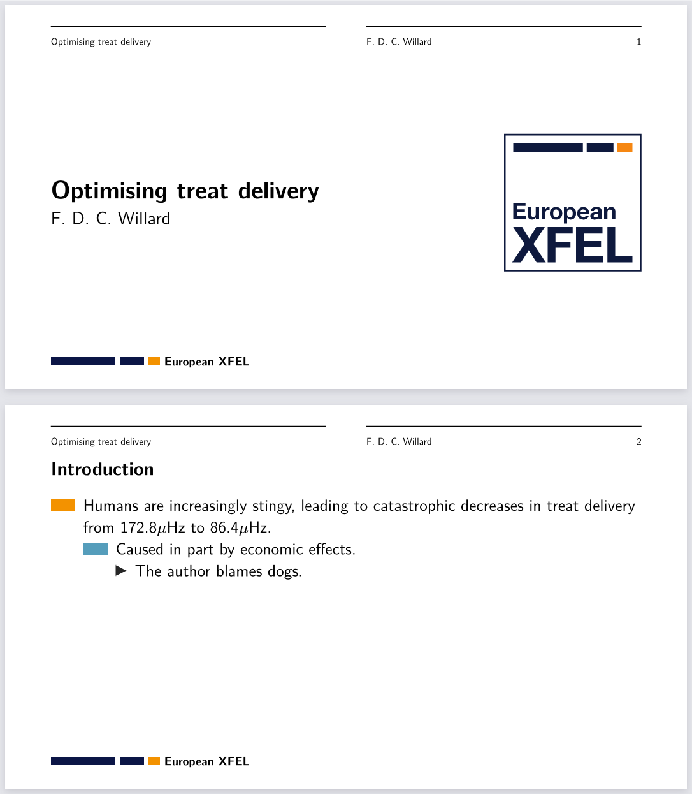

# An XFEL Polylux theme

This is a [Polylux](https://polylux.dev/book/) theme for [European
XFEL](https://xfel.eu) presentations.

Here's a quick demo:
```typst
#import "@preview/oh-my-euxfel:1.0.0": *

// Default options are shown commented out
#show: euxfel-theme.with(
  title: "Optimising treat delivery",
  author: "F. D. C. Willard",
  // title-page-header: true,
  // font: "New Computer Modern Sans"
)

#slide("Introduction")[
  - Humans are increasingly stingy, leading to catastrophic decreases in treat delivery from 172.8$mu$Hz to 86.4$mu$Hz.
    - Caused in part by economic effects.
      - The author blames dogs.
]
```

Producing:


## Acknowledgements

Many thanks to the original authors of XFEL's Beamer template, from which I took
both inspiration and some SVG files.
