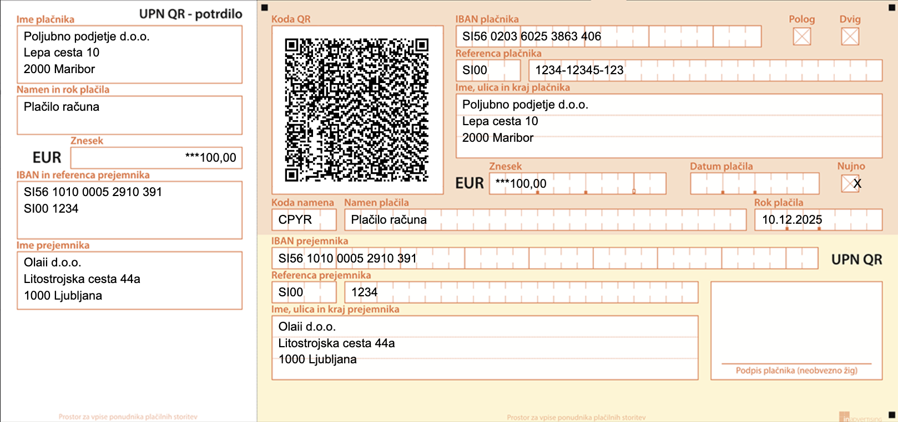

# Olaii UPN QR typst template

Univerzalni plačilni nalog UPN QR (Obrazec UPN QR) template for [typst](https://typst.app/docs/)



## Example

```typ
#import "@preview/olaii-upn-qr:0.0.2": olaii-upn-qr

// Page setup
#set page(
  paper: "a4",
  margin: 0pt,
)

// Font
#set text(
  font: "Arial",
  size: 8pt,
  fill: black,
)

// UPN QR
#olaii-upn-qr(
  ime-placnika: "Poljubno podjetje d.o.o.",
  naslov-placnika: "Lepa cesta 10",
  kraj-placnika: "2000 Maribor",
  iban-placnika: "SI56 0203 6025 3863 406",
  referenca-placnika-1: "SI00",
  referenca-placnika-2: "1234-12345-123",
  namen-placila: "Plačilo računa",
  rok-placila: "10.12.2025",
  koda-namena: "CPYR",
  datum-placila: none,
  nujno: true,
  ime-prejemnika: "Olaii d.o.o.",
  naslov-prejemnika: "Litostrojska cesta 44a",
  kraj-prejemnika: "1000 Ljubljana",
  iban-prejemnika: "SI56 1010 0005 2910 391",
  referenca-prejemnika-1: "SI00",
  referenca-prejemnika-2: "1234",
  znesek: "***100,00",
  qr-content: "Generated qr code",
  debug: false,
  debug-with-background: false
)
```

## How to run examples

```bash
typst watch examples/main.typ --root ../
typst watch examples/bottom.typ --root ../
typst watch examples/multiple.typ --root ../
```

## License

Download the [MIT License](https://github.com/Olaii/olaii-upn-qr-typst-template/blob/main/LICENSE)

## Changelog

### **v0.0.2** - 5.8.2025

- fixed qr code to use utf-8 input,
- added support for base64 ar image,
- moved font outside the template,
- updated upn-qr background image

### **v0.0.1** - 28.7.2025

Initial Release
