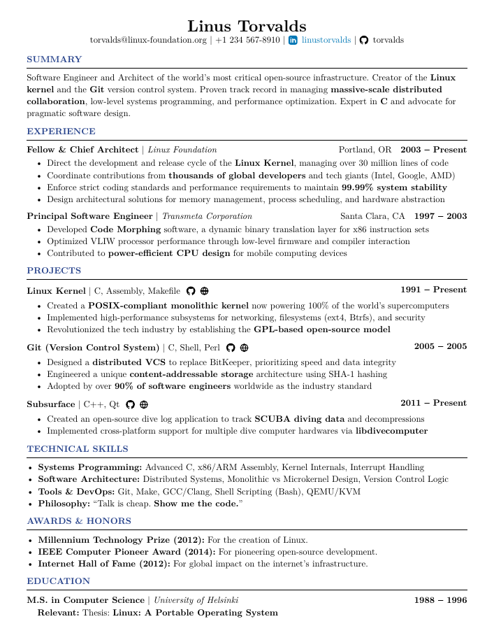

# Optimal Resume

**Optimal Resume** is a programmatic, high-performance resume template built with **Typst**. 

This template was made to be able to use reusable functions. You focus on the content; the code handles the typography and alignment.
Optimized to be compact, easy to maintain and compatible with ATS systems.

## Project Structure

1. **`src/`**: Contains the design logic and layout functions.
2. **`main.typ`**: An example file showing how to use the template.

## Sample 


## Quick Start

A simple example to get you started with the structure of each section ! 

```typst

/* * FUNCTION REFERENCE
* ------------------
* #cv-header(name: "", email: "", phone: "", linkedin: "", github: "")
* #cv-section("Title")
* #cv-edu(school: "", degree: "", start: "", end: "", relevant: [])
* #cv-work(company: "", title: "", location: "", start: "", end: "", points: ())
* #cv-project(name: "", tech: "", github: "", url: "", start: "", end: "", points: ())
*/

#import "@preview/optimal-resume:0.1.2": *

#show: project

#cv-header(
  name: "Your Name",
  email: "your.email@provider.com",
  phone: "+33 6 00 00 00 00",
  linkedin: "username",
  github: "username"
)

#cv-section("Education")
#cv-edu(
  school: "University Name",
  degree: "Master of Science",
  start: "2022",
  end: "2024",
  relevant: [Course A, Course B, Course C]
)

#cv-section("Experience")
#cv-work(
  company: "Company Name",
  title: "Software Engineer",
  location: "City, Country",
  start: "2023",
  end: "Present",
  points: (
    [Accomplishment *key result* one],
    [Accomplishment *key result* two],
  )
)

#cv-section("Projects")
#cv-project(
  name: "Project Name",
  tech: "Tech 1, Tech 2",
  github: "username/repo", 
  url: "https://demo.com",  
  start: "2024",
  end: "2024",
  points: (
    [Developed *feature X* using Y],
  )
)

#cv-section("Technical Skills")
- *Languages:* Python, C, SQL
- *Tools:* Docker, Git, AWS

```

