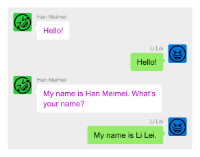
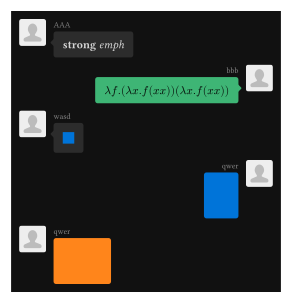

# Ourchat

Let's forge chat messages!




## Usage and Examples

More examples can be found in `examples/*.typ`.

```typst
#import "@preview/ourchat:0.1.0" as oc: default-profile

// You can set global styles here.
#set page(width: auto, height: auto, margin: 1em, fill: none)
#set text(font: "Arial")

#let left-profile = box(width: 27pt, height: 27pt, fill: green, scale(200%, move(dx: 3pt, dy: 5pt)[🤣]))
#let right-profile = box(width: 27pt, height: 27pt, fill: blue, scale(200%, move(dx: 3pt, dy: 5pt)[😆]))

#oc.chat(
  theme: (left-text-color: purple), // custom theme
  oc.message(left, name: [Han Meimei], profile: left-profile)[
    Hello!
  ],
  oc.message(right, name: [Li Lei], profile: right-profile)[
    Hello!
  ],
  oc.message(left, name: [Han Meimei], profile: left-profile)[
    My name is Han Meimei. What's your name?
  ],
  oc.message(right, name: [Li Lei], profile: right-profile)[
    My name is Li Lei.
  ],
)
```

You can use any image (or something else) as the user profile.

We provide `light` and `dark` themes (the default is `light`). You can provide a custom theme by passing a dictionary to the `chat` function.
