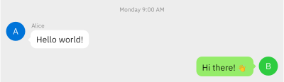

<h1>Ourchat</h1>

<a href="https://typst.app/universe/package/ourchat"></a> <a href="https://github.com/QuadnucYard/ourchat-typ"></a>

_Create chat interfaces in Typst with ease_

Ourchat is a [Typst](https://typst.app/) package for building chat UI mockups. It helps you document software features, create presentations, or prototype chat interfaces with themes for popular platforms like WeChat, Discord, and QQ.

## Features

- **Out-of-the-box themes**: WeChat, Discord, QQNT theme support
- **Simple API**: Easy-to-use, declarative interface
- **Customizable styling**: Colors, avatars, layouts, and typography
- **Just do it**: Write anything inside messages—Code blocks, tables, mathematical equations…

## Quick Start

First, import the package in your Typst document:

```typst
#import "@preview/ourchat:0.2.0" as oc
#import oc.themes: *
```

Then create your first chat:

```typst
#let alice = wechat.user(name: [Alice], avatar: circle(fill: blue, text(white)[A]))
#let bob = wechat.user(name: [Bob], avatar: circle(fill: green, text(white)[B]))

#wechat.chat(
  oc.time[Today 14:30],

  oc.message(left, alice)[
    Hey! How's the new project going?
  ],

  oc.message(right, bob)[
    Great! Just finished the API integration.
    The performance improvements are impressive! 🚀
  ],
)
```


## Builtin Themes

### WeChat Theme

```typst
#let user1 = wechat.user(name: [Alice], avatar: circle(fill: blue, text(white)[A]))
#let user2 = wechat.user(name: [Bob], avatar: circle(fill: green, text(white)[B]))

#wechat.chat(
  theme: "light",  // or "dark"
  layout: (
    bubble-radius: 8pt,
  ),
  width: 400pt,

  oc.time[Monday 9:00 AM],
  oc.message(left, user1)[Hello world!],
  oc.message(right, user2)[Hi there! 👋],
)
```



### Discord Theme

````typst
#set text(font: ("gg sans", "IBM Plex Sans SC"))

#let developer = discord.user(
  name: [Dev],
  avatar: circle(fill: purple, text(white)[D])
)
#let admin = discord.user(
  name: [Admin],
  avatar: circle(fill: red, text(white)[A])
)

#discord.chat(
  oc.time[Today at 2:14 PM],

  oc.message(left, developer)[
```python
def optimize_query():
    return cache_strategy.redis_cluster()
```
    What do you think about this approach? @admin
  ],

  oc.message(right, admin)[
    @developer Looks good! The Redis cluster should handle the load well.
  ],
)
````


### QQNT Theme

```typst
#let student = qqnt.user(
  name: [Student],
  avatar: circle(fill: orange, text(white)[S])
)
#let expert = qqnt.user(
  name: [Expert],
  avatar: circle(fill: teal, text(white)[E])
)

#qqnt.chat(
  theme: (
    inherit: "light",
    bubble-left: rgb("#F0F8FF"),
    bubble-right: rgb("#E8F5E8"),
    text-right: rgb("#111111"),
  ),

  oc.message(left, student)[
    Can someone explain Rust ownership?
  ],

  oc.message(right, expert)[
    Sure! Ownership prevents data races at compile time...
  ],
)
```


## Advanced Usage

### Convenience Functions

For multiple messages from the same user, use `with-side-user` to avoid repetition:

```typst
#set text(font: ("gg sans", "IBM Plex Sans SC"))

#let admin = oc.user(
  name: [System Admin],
  avatar: circle(fill: red.darken(20%), text(white, weight: "bold")[⚡])
)

#discord.chat(
  oc.time[Today at 3:45 PM],

  // Instead of repeating the user for each message:
  // oc.message(left, admin)[Server maintenance scheduled],
  // oc.message(left, admin)[Downtime: 30 minutes max],
  // oc.message(left, admin)[Please save your work],

  // Use with-side-user for cleaner code:
  ..oc.with-side-user(
    left,
    admin,
    oc.free-message[🚨 *URGENT: Server Maintenance Alert*],
    oc.free-message[Scheduled downtime: Tonight 11 PM - 11:30 PM],
    oc.free-message[All services will be temporarily unavailable],
    oc.free-message[Please save your work and plan accordingly],
  ),
)
```


### Custom User Avatars

Create distinctive user profiles:

```typst
#let ceo = oc.user(
  name: [Sarah Chen],
  badge: qqnt.badge(text-color: purple, bg-color: purple.transparentize(80%))[#text(stroke: 0.05em + purple)[CEO]],
  avatar: rect(
    fill: blue.darken(20%),
    radius: 4pt,
    inset: 6pt,
    text(white, weight: "bold")[SC]
  )
)

#qqnt.chat(
  oc.message(left, ceo)[
    Hi team! Ready for the quarterly review?
  ],
)
```


### Rich Content Support

Include tables, code blocks, and visual elements:

```typst
#let analyst = wechat.user(
  name: [Data Analyst],
  avatar: circle(fill: green.darken(10%), text(white)[📊])
)

#wechat.chat(
  oc.message(left, analyst)[
    Here's our performance analysis:

    #table(
      columns: (auto, auto, auto),
      [*Metric*], [*Before*], [*After*],
      [Response Time], [250ms], [120ms],
      [Throughput], [1000 RPS], [2500 RPS],
    )

    The optimization yielded 58% improvement! 📊
  ]
)
```


### Theme Customization

Modify existing themes or create your own:

```typst
#let custom_theme = (
  inherit: "light",
  background: rgb("#F5F5F5"),
  bubble-left: rgb("#E3F2FD"),
  bubble-right: rgb("#C8E6C9"),
  text-primary: rgb("#212121"),
  text-secondary: rgb("#757575"),
)

#wechat.chat(theme: custom_theme, ...)
```

### Layout Control

Fine-tune spacing and dimensions:

```typst
#wechat.chat(
  layout: (
    content-width: 350pt,
    message-spacing: 0.8em,
    avatar-size: 32pt,
    bubble-padding: 12pt,
  ),
  ...
)
```

## Examples Gallery

Explore our comprehensive example collection: [https://quadnucyard.github.io/ourchat-typ](https://quadnucyard.github.io/ourchat-typ)

The source codes for these example are located at `./examples`.

## Architecture & Design

### API Design Philosophy

Ourchat follows a unified component architecture where `oc` provides the core building blocks:

- `oc.message()`, `oc.user()`, `oc.time()` - Universal components that work across all themes
- Built-in themes (`wechat`, `discord`, `qqnt`) import all common components but may override them for platform-specific features
  - For example, `qqnt.user()` extends the base user component with `badge` support for role badges
- Uses `chat` as the rendering function of messages, which is defined in individual themes. Styling is decided here.

```typst
// Universal approach - works with any theme
#let user = oc.user(name: [Alice])

// Theme-specific approach - leverages extended features
#let qqnt_user = qqnt.user(
  name: [Alice],
  badge: qqnt.badge()[Admin]  // QQNT specific feature
)
```

### Theme Customization Scope

Built-in themes provide a solid foundation but don't cover every possible customization. You're encouraged to:

- Extend existing themes for minor modifications using `theme` and `layout` parameters.
- Create entirely new themes for different platforms or unique designs with basic blocks. Refer to the source code of built-in themes as implementation guides

## API Reference

Here only lists exported functions and variables. Please refer to the documentation comments of each function for details

### Common Components

- `oc.user(name, avatar, badge)`: Create universal user profiles
- `oc.message(side, user, body, time, merge)`: Add chat messages (`left` or `right`)
- `oc.time(body)`: Insert timestamp dividers
- `oc.with-side-user(side, user, ..messages)`: Convenience for multiple messages from same user
- `oc.free-message(body, time, merge)`: Create message without specific user or side
- `oc.plain(side, user, body)`: Create plain item without padding

Note: These are just helper functions for data wrapping. You can directly create data structures if you like.

### Theme Collections

#### `oc.themes.wechat`

WeChat layout and color schemes (`light`, `dark`)

- `wechat.chat(theme, layout, width, validate, ..messages)`: WeChat-style interface
- `wechat.default-user`: Pre-configured user with WeChat avatar

#### `oc.themes.qqnt`

QQNT layout and color schemes (`light`, `dark`)

- `qqnt.chat(theme, layout, width, validate, ..messages)`: QQNT-style interface
- `qqnt.user` (uses `oc.user` with badge support): QQNT user with role support
- `qqnt.badge(body, text-color, bg-color)`: Create role badges

#### `oc.themes.discord`

Discord layout and color schemes

- `discord.newbie-user`: Pre-configured user with newbie badge
- `discord.mention(body)`: Create Discord-style mention element
- `discord.chat(theme, layout, width, validate, auto-mention, ..messages)`: Discord-style interface

### Utilities (`oc.utils`)

- `validate-theme(theme, reference, field-type)`: Validate theme dictionary fields
- `validate-layout(layout, reference)`: Validate layout dictionary fields
- `resolve-theme(themes, theme, default, validate)`: Resolve theme with inheritance support
- `resolve-layout(layout, default-layout, validate)`: Merge and validate layout settings
- `stretch-cover(item)`: Scale content to cover its container
- `auto-mention-rule(auto-mention, styler)`: Create show rule for automatic mention styling

## Contributing

We welcome contributions! Please check our GitHub repository for:

- Bug reports and feature requests
- Code contributions and improvements
- Documentation updates
- New theme proposals and existing theme improvements

## License

MIT License - see [LICENSE](LICENSE) file for details.
