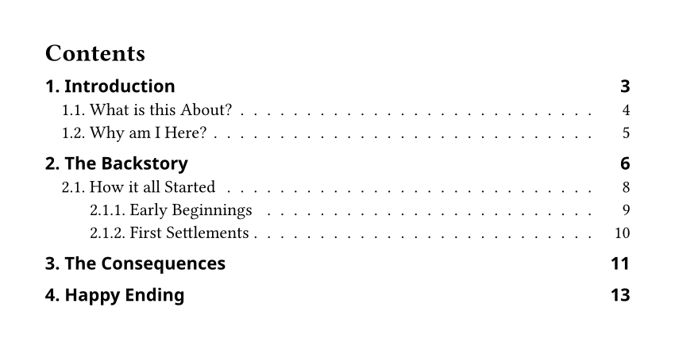

# Outrageous

Easier customization of outline entries.

## Examples

For the full source see [`examples/basic.typ`](./examples/basic.typ) and for
more examples see the [`examples` directory](./examples).

### Default Style



```typ
#import "@preview/outrageous:0.1.0"
#show outline.entry: outrageous.show-entry
```

### Custom Settings


```typ
#import "@preview/outrageous:0.1.0"
#show outline.entry: outrageous.show-entry.with(
  // the typst preset retains the normal Typst appearance
  ..outrageous.presets.typst,
  // we only override a few things:
  // level-1 entries are italic, all others keep their font style
  font-style: ("italic", auto),
  // no fill for level-1 entries, a thin gray line for all deeper levels
  fill: (none, line(length: 100%, stroke: gray + .5pt)),
)
```

## Usage

### `show-entry`

Show the given outline entry with the provided styling. Should be used in a show
rule like `#show outline.entry: outrageous.show-entry`.

```typ
#let show-entry(
  entry,
  font-weight: presets.outrageous-toc.font-weight,
  font-style: presets.outrageous-toc.font-style,
  vspace: presets.outrageous-toc.vspace,
  font: presets.outrageous-toc.font,
  fill: presets.outrageous-toc.fill,
  fill-right-pad: presets.outrageous-toc.fill-right-pad,
  fill-align: presets.outrageous-toc.fill-align,
  body-transform: presets.outrageous-toc.body-transform,
  label: <outrageous-modified-entry>,
  state-key: "outline-page-number-max-width",
) = { .. }
```

**Arguments:**

For all the arguments that take arrays, the array's first item specifies the
value for all level-one entries, the second item for level-two, and so on. The
array's last item will be used for all deeper/following levels as well.

- `entry`: [`content`] &mdash; The
  [`outline.entry`](https://typst.app/docs/reference/meta/outline/#definitions-entry)
  element from the show rule.
- `font-weight`: [`array`] of ([`str`] or [`int`] or `auto` or `none`) &mdash;
  The entry's font weight. Setting to `auto` or `none` keeps the context's
  current style.
- `font-style`: [`array`] of ([`str`] or `auto` or `none`) &mdash; The entry's
  font style. Setting to `auto` or `none` keeps the context's current style.
- `vspace`: [`array`] of ([`relative`] or [`fraction`] or `none`) &mdash;
  Vertical spacing to add above the entry. Setting to `none` adds no space.
- `font`: [`array`] of ([`str`] or [`array`] or `auto` or `none`) &mdash; The
  entry's font. Setting to `auto` or `none` keeps the context's current font.
- `fill`: [`array`] of ([`content`] or `auto` or `none`) &mdash; The entry's
  fill. Setting to `auto` keeps the context's current setting.
- `fill-right-pad`: [`relative`] or `none` &mdash; Horizontal space to put
  between the fill and page number.
- `fill-align`: [`bool`] &mdash; Whether `fill-right-pad` should be relative to
  the current page number or the widest page number. Setting this to `true` has
  the effect of all fills ending on the same vertical line.
- `body-transform`: [`function`] or `none` &mdash; Callback for custom edits to
  the entry's body. It gets passed the entry's level ([`int`]) and body
  ([`content`]) and should return [`content`] or `none`. If `none` is returned,
  no modifications are made.
- `page-transform`: [`function`] or `none` &mdash; Callback for custom edits to
  the entry's page number. It gets passed the entry's level ([`int`]) and page
  number ([`content`]) and should return [`content`] or `none`. If `none` is
  returned, no modifications are made.
- `label`: [`label`] &mdash; The label to internally use for tracking recursion.
  This should not need to be modified.
- `state-key`: [`str`] &mdash; The key to use for the internal state which
  tracks the maximum page number width. The state is global for the entire
  document and thus applies to all outlines. If you wish to re-calculate the max
  page number width for `fill-align`, then you must provide a different key for
  each outline.

**Returns:** [`content`]

### `presets`

Presets for the arguments for [`show-entry()`](#show-entry). You can use them in
your show rule with
`#show outline.entry: outrageous.show-entry.with(..outrageous.presets.outrageous-figures)`.

```typ
#let presets = (
  // outrageous preset for a Table of Contents
  outrageous-toc: (
    // ...
  ),
  // outrageous preset for List of Figures/Tables/Listings
  outrageous-figures: (
    // ...
  ),
  // preset without any style changes
  typst: (
    // ...
  ),
)
```

### `repeat`

Utility function to repeat content to fill space with a fixed size gap.

```typ
#let repeat(gap: none, justify: false, body) = { .. }
```

**Arguments:**

- `gap`: [`length`] or `none` &mdash; The gap between repeated items.
- `justify`: [`bool`] &mdash; Whether to increase the gap to justify the items.
- `body`: [`content`] &mdash; The content to repeat.

**Returns:** [`content`]

### `align-helper`

Utility function to help with aligning multiple items.

```typ
#let align-helper(state-key, what-to-measure, display) = { .. }
```

**Arguments:**

- `state-key`: [`str`] &mdash; The key to use for the [`state`] that keeps track
  of the maximum encountered width.
- `what-to-measure`: [`content`] &mdash; The content to measure at this call.
- `display`: [`function`] &mdash; A callback which gets passed the maximum
  encountered width and the width of the current item (what was given to
  `what-to-measure`), both as [`length`], and should return [`content`] which
  can make use of these widths for alignment.

**Returns:** [`content`]

[`str`]: https://typst.app/docs/reference/foundations/str/
[`int`]: https://typst.app/docs/reference/foundations/int/
[`bool`]: https://typst.app/docs/reference/foundations/bool/
[`content`]: https://typst.app/docs/reference/foundations/content/
[`label`]: https://typst.app/docs/reference/meta/label/
[`function`]: https://typst.app/docs/reference/foundations/function/
[`array`]: https://typst.app/docs/reference/foundations/array/
[`relative`]: https://typst.app/docs/reference/layout/relative/
[`fraction`]: https://typst.app/docs/reference/layout/fraction/
[`state`]: https://typst.app/docs/reference/meta/state/
[`length`]: https://typst.app/docs/reference/layout/length/
