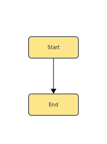
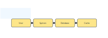
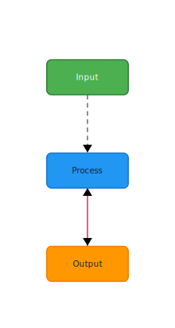

# 🐂 typst-oxdraw

A Typst plugin for visualizing Mermaid diagrams, built on top of [oxdraw](https://github.com/RohanAdwankar/oxdraw).

## Usage

### Basic Usage

Get started with typst-oxdraw in these lines:

```typst
#import "@preview/oxdraw:0.1.0": *

#oxdraw("
graph TD
    A[Start] --> B[End]
")
```



The first argument of the `oxdraw` function supports either `string` or `raw` input for the Mermaid source definition.

````typst
#oxdraw(```mermaid
graph LR
  User --> System
  System --> Database
  Database --> Cache
```, background: "#f0f8ff")
````



### Custom Styling

Oxdraw supports extensive customization through the `background` and `overrides` parameters.

- **`background`**: Sets the diagram background color. Accepts color values (e.g., `white`, `rgb(240, 248, 255)`) or hex strings (e.g., `"#f0f8ff"`).

- **`overrides`**: A dictionary for customizing node and edge styles:
  - `node_styles`: Customize individual nodes by ID
    - `fill`: Background color (e.g., `"#4CAF50"`)
    - `stroke`: Border color (e.g., `"#2E7D32"`)
    - `text`: Text color (e.g., `"white"`)
  - `edge_styles`: Customize individual edges by ID
    - `color`: Edge color (e.g., `"#666"`)
    - `line`: Line style (`"solid"` or `"dashed"`)
    - `arrow`: Arrow direction (`"forward"`, `"backward"`, `"both"`, or `"none"`)

Edge IDs follow the format `"A --> B"` (for solid lines) or `"A -.-> B"` (for dashed lines), where A and B are node IDs.

````typst
#oxdraw(
```
graph TD
A[Input] --> B[Process]
B --> C[Output]
```,
  background: white,
  overrides: (
    node_styles: (
      A: (fill: "#4CAF50", stroke: "#2E7D32", text: "white"),
      B: (fill: "#2196F3", stroke: "#1976D2"),
      C: (fill: "#FF9800", stroke: "#F57C00")
    ),
    edge_styles: (
      "A --> B": (color: "#666", line: "dashed"),
      "B --> C": (color: "#E91E63", arrow: "both")
    )
  )
)
````



This example customizes node colors and applies different edge styles - dashed gray line for the first edge and a pink double-headed arrow for the second.

If styles not applied, please ensure edge IDs exactly match your diagram definition (e.g., `"A --> B"` vs `"A->B"`).

## License

This project is licensed under the MIT License - see the LICENSE file for details.

## Acknowledgments

This package is built on top of [oxdraw](https://github.com/RohanAdwankar/oxdraw) by RohanAdwankar.
