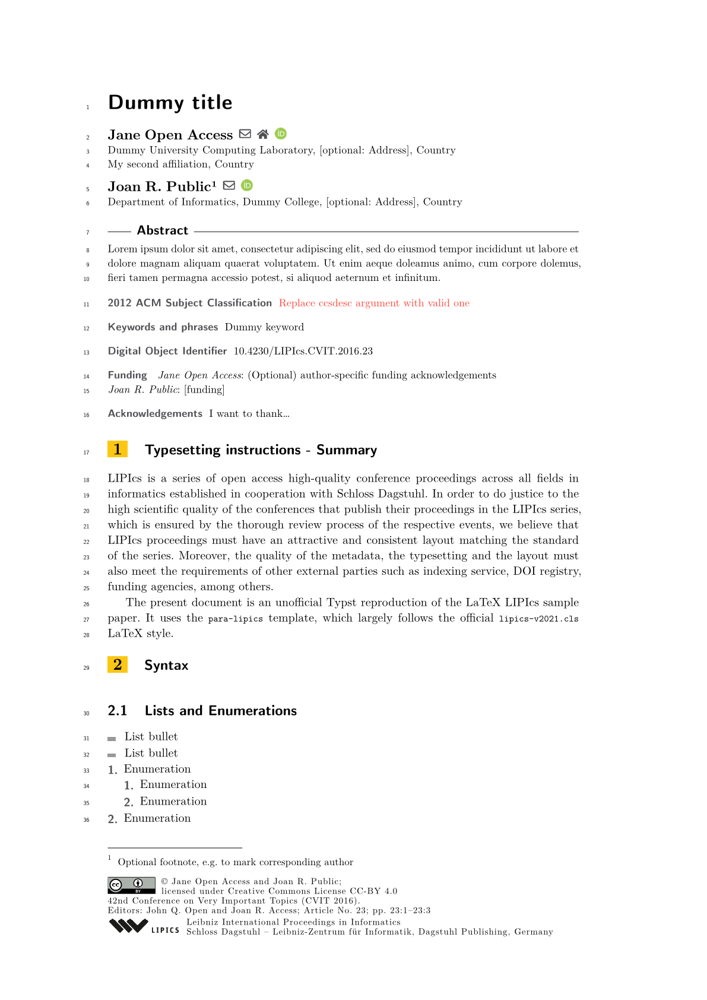

# para-lipics: A LIPIcs-style Template for Typst

A community-maintained Typst reproduction of the official LaTeX `lipics-v2021.cls` template.

See [`sample-article.typ`](https://github.com/para-lipics/para-lipics/blob/main/template/sample-article.typ) for a complete setup with placeholder content:



Found a bug or want to improve the template?
Open an issue or submit a pull request, contributions are welcome!

⚠️ **Note:** For best results, install the required font manually, see [Requirements](#requirements).

## Basic usage

Import the template in your project with:

```typ
#import "@preview/para-lipics:0.1.2": *

#show: para-lipics.with(...)

// body of the paper

#bibliography("bibliography.bib")
```

The template parameters are listed in the following.

<details>
<summary>✒️ Author parameters</summary>

- `title` (`content`): the paper's title
- `title-running` (optional, `content`): the paper's short title displayed in headers (if not provided, `title` is used)
- `authors` (`array`): an array of authors, each author being a dictionary of the form:
    - `name` (`content`): the author's full name
    - `email` (optional, `string`): the author's email
    - `website` (optional, `string`): the author's website
    - `orcid` (optional, `string`): the author's ORCID
    - `affiliations` (`content`): the author's affiliations (use line breaks for multiple affiliations)
- `author-running` (`content`): the list of abbreviated author names, displayed in headers
- `abstract` (`content`): the paper's abstract
- `keywords` (`content`): comma-separated list of keywords
- `category` (optional, `content`): category of the paper (_e.g._, invited paper)
- `related-version` (optional, `content`): link to full version hosted on open-access repos (arXiv, HAL...)
- `supplement` (optional, `content`): link to supplementary material (_e.g._, related research data, source code...)
- `funding` (optional, `content`): paper's funding statement
- `acknowledgements` (optional, `content`): other acknowledgments
- `copyright` (optional, `content`): author's full names
- `ccs-desc` (`content`): [ACM 2012 classification](https://dl.acm.org/ccs/ccs_flat.cfm) of the form `[Category $->$ Sub-category]`
- `line-numbers` (`bool`, default: `false`): whether to enable line numbering
- `anonymous` (`bool`, default: `false`): whether to anonymize authors (_e.g._, for double-blind review)
- `hide-lipics` (`bool`, default: `false`): whether to hide references to LIPIcs series (logo, DOI...), _e.g._, when preparing a arXiv/HAL version
</details>

<!--
- `author-columns` (`bool`, default: `false`): whether to enable a two-column layout for the author/affilation part (only applicable for >6 authors)
-->

<details>
<summary>📚 Editor-only parameters (do not modify as an author)</summary>

- `event-editors` (`content`): full name of editor(s)
- `event-no-eds` (`int`): number of editor(s)
- `event-long-title` (`content`): long title of the event
- `event-short-title` (`content`): short title of the event
- `event-acronym` (`string`): acronym of the event
- `event-year` (`int`): year of the event
- `event-date` (`content`): date of the event (`{month} {start day}--{end day}, {year}` format)
- `event-location` (`content`): location of the event (`{city}, {country}` format)
- `event-logo` (optional, `string`): path the the logo of the event
- `series-volume` (`int`): volume in the series
- `article-no` (`int`): number of the article in the volume
</details>

## Requirements

This template requires **Typst ≥ 0.13.1**.

Due to current limitations in Typst's font handling, the _Computer Modern Sans_ font must be installed manually.
Note that this is **not** _New_ Computer Modern, it's the original Knuth-designed version.
If this font is missing, the _New Computer Modern Sans_ fallback font will be used instead (which may alter the visual fidelity of the result).

- If you're using the **web app**, upload the `.ttf` or `.otf` file directly into your project.
- If you're using the **CLI**, either install the fonts on your system or specify them using the `--font-path` option.

## Theorem handling

The `para-lipics` template relies on the [ctheorems package (v1.1.3)](https://typst.app/universe/package/ctheorems/) to handle theorem-related content.
Several common environments are already provided by the template: `theorem`, `definition`, `lemma`, `observation`, `corollary`, and `proof`.

The user can define custom theorem-like and proof-like environments by reusing the `thm-base()` and `proof-base()` functions as follows.

```typst
#import "@preview/para-lipics:0.1.3": *

#let remark = thm-base("remark", "Remark")
#let proof-sketch = thm-base("proof-sketch", "Proof sketch")
...
```

## Caveats

This template is **unofficial**, and **Dagstuhl Publishing does not currently accept Typst documents**.

Most conferences using the LIPIcs format accept **PDF submissions**, so _in theory_, you can submit a paper typeset with Typst.
However, we strongly discourage using this template for official submissions: your paper may be desk rejected if the publisher's formatting requirements are not strictly followed.

If your paper is accepted, you will still need to **convert your Typst source to LaTeX** to submit it to the publisher.
This may be feasible via tools like [**Pandoc**](https://pandoc.org/) or even LLMs.

Note that PDFs generated with Typst can be submitted to most open-access e-print repositories (arXiv, HAL...).

For now, this template is best suited for authors who:
- enjoy working in Typst
- want a LIPIcs-like preview during drafting
- are comfortable converting to LaTeX later if needed

Once Typst reaches version 1.0.0, this template may also serve as a lobbying tool to encourage Dagstuhl to officially support Typst.

**Note:** This template is a work in progress.
Perfect fidelity with the official LIPIcs format is not guaranteed (yet).