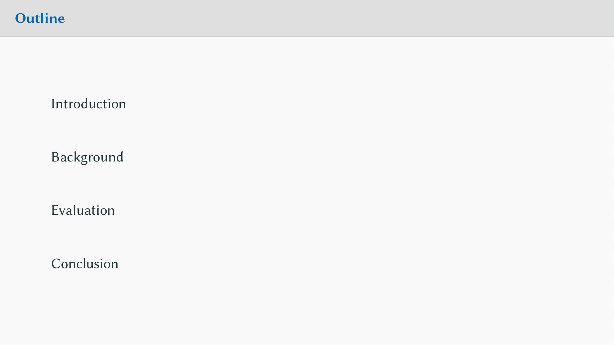
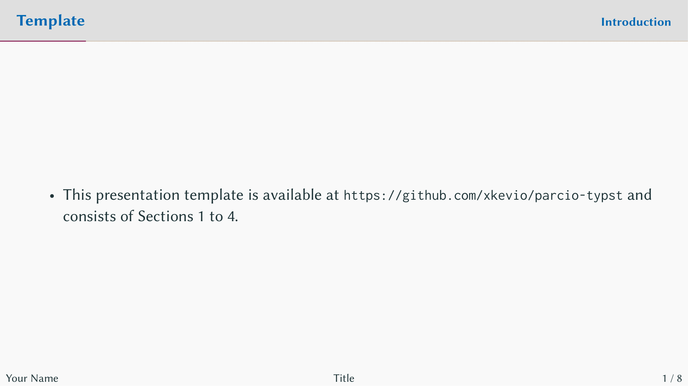

# The `parcio-slides` Polylux Template

<p align="center">
    
    <br/>
    
    
</p>

<p align="center">
A simple <a href="https://typst.app/universe/package/polylux/">polylux</a> slides template based on the ParCIO working group at Otto-von-Guericke University Magdeburg.
</p>

## Getting Started

To use this template, simply import it as shown below and define a `title-slide` with the following possible options:

```typ
#import "@preview/parcio-slides:0.1.0": *

#show parcio-slides.with(
  aspect-ratio: "16-9", // "16-9" and "4-3" are the only possible options.
  text-size: 20pt, // We recommend around this text size, as it fits nicely.
)

#title-slide(
  title: [],
  author: (name: "Your Name", mail: "example@ovgu.de"),
  subtitle: none,
  short-title: none,
  logo: none,
  date: datetime.today().display(),
  extra: none
)
```

These are the default options. We recommend leaving the show-rule as-is, such that you can just do `#show parcio-theme`, and
using the provided OvGU logo for your title slide (if you initialized with `typst init`) by specifying `logo: image("ovgu.svg", width: 9.8cm)`
on your title slide.

The `short-title` is useful for specifying a shorter title which is displayed in the footer of each slide.
Additionally, `extra` can be used for specifying your lecture, institute or faculty. See `template/main.typ` for a full example!

### Slides

Creating slides is done via the `#slide()`-function with the following default arguments:

```typ
#slide(
  title: none, // title of your current slide
  new-section: none, // marks a new topic, add it to the outline and is displayed in the top-right 
  show-current-section: true, // whether to display the current section in the top-right
  show-footer: true, // whether to display the footer (disabled for `bib-slide` and `outline-slide`)
  skip: false, // whether to skip the page counter for this slide
  body,
)
```

Most often, you will use `#slide` like this: `#slide(title: "Introduction")[...]`—setting a title is important for the header bar to properly work!

### Local Installation

Following these steps will make the template available locally under the `@local` namespace. Requires ["Just - A Command Runner"](https://github.com/casey/just).

```sh
git clone git@github.com:xkevio/parcio-typst.git 
cd parcio-typst/parcio-slides/
just install
```

## Fonts and OvGU Corporate Design

This template requires these two fonts to be installed on your system:

* Libertinus Sans (https://github.com/alerque/libertinus)
* Inconsolata (https://github.com/googlefonts/Inconsolata)

We bundle the default "Faculty of Computer Science" head banner and use it as the `logo`. You can find yours at: https://www.cd.ovgu.de/Fakult%C3%A4ten.html.

