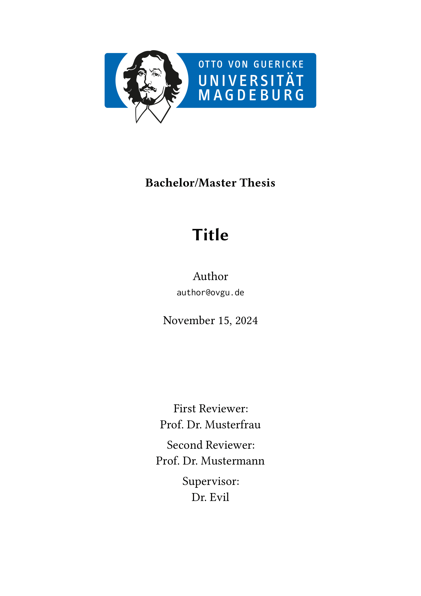
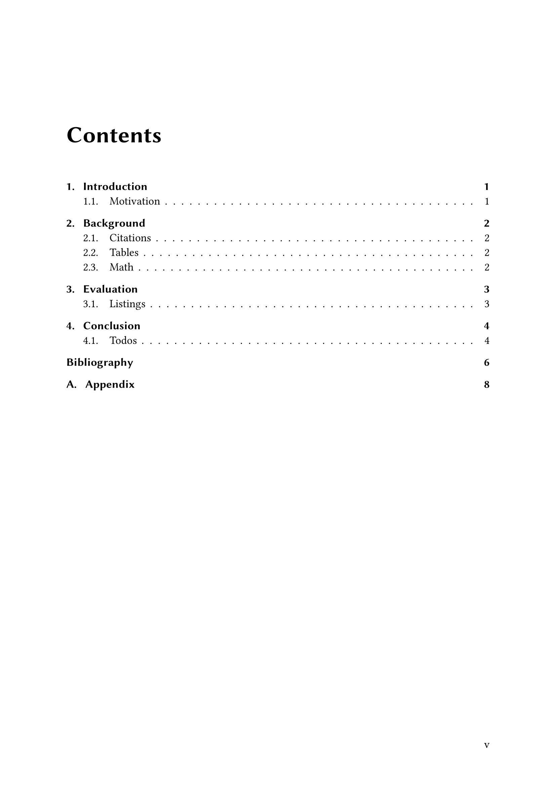
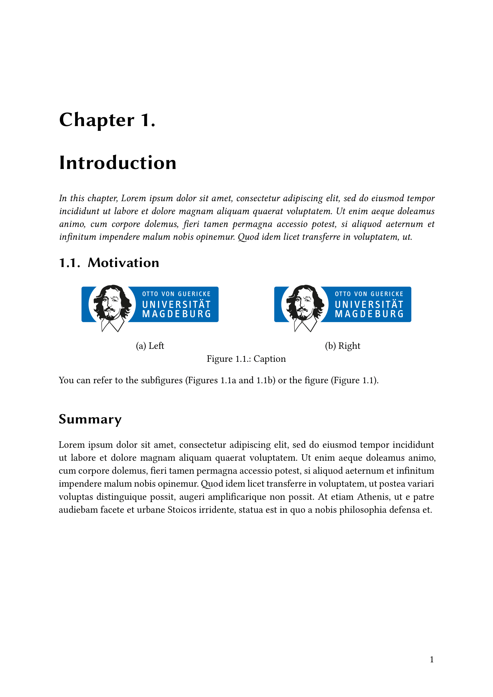

# The `parcio-thesis` Template

<p align="center">
    &nbsp;
    &nbsp;
    
</p>

<p align="center">A simple thesis template based on the ParCIO working group at Otto-von-Guericke University Magdeburg.</p>

## Getting Started

To use this template, simply import it as shown below (more options under `Usage`):

```typ
#import "@preview/parcio-thesis:0.2.3": *

#show: parcio.with(
  title: "My great thesis",
  author: (
    name: "Author",
    mail: "author@ovgu.de"
  ),
  abstract: [My abstract begins here.],
)
```

### Local Installation

Following these steps will make the template available locally under the `@local` namespace. Requires ["Just - A Command Runner"](https://github.com/casey/just).

```sh
git clone git@github.com:xkevio/parcio-typst.git 
cd parcio-typst/parcio-thesis/
just install
```

## Usage

See here for **all** possible arguments (and their default values) and utility functions:

```typ
#import "@preview/parcio-thesis:0.2.3": *

#show: parcio.with(
  title: "Title",
  author: (name: "Author", mail: "author@ovgu.de"),
  abstract: [],
  thesis-type: "Bachelor/Master",
  reviewers: (),
  date: datetime.today(),
  heading-numbering: "1.1.",
  lang: "en",
  header-logo: none,
  translations: none,
)

// Use these to *enable* or *change* page numbering for your frontmatter and mainmatter respectively.
// (By default, this template hides the page numbering!)
#show: roman-numbering.with(reset: true, alternate: true)
#show: arabic-numbering.with(reset: true, alternate: true)
```

### Utility Functions

These could be useful while writing your thesis!

```typ
// A TODO marker. (inline: false -> margin note, inline: true -> box).
#let todo(inline: false, body) = {}

// Like \section* in LaTeX. (unnumbered level 2 heading, not in ToC).
#let section = heading.with(level: 2, outlined: false, numbering: none)

// A neat inline-section in smallcaps and sans font.
#let inline-section(title) = smallcaps[*#text(font: "Libertinus Sans", title)*] 

// Fully empty page, no page numbering.
#let empty-page = page([], footer: [])

// Subfigures (see chapters/introduction for syntax).
#let subfigure() = {}

// A ParCIO-like table with a design taken from the LaTeX template.
#let parcio-table(max-rows, ..args)

// Nicer handling of (multiple) appendices. Specify `reset: true` with your first appendix to reset the heading counter!
#let appendix(reset: false, label: none, body)
```

### Translations

If you wish, you can provide custom translations for things like "Section", "Contents", etc. by providing a custom `translations.toml` (this template already comes with translations for English and German) with the following schema:

```toml
# Top-level dict name should follow ISO 639 language codes!
default-lang = "en"

[de]
contents = "Inhaltsverzeichnis"
chapter = "Kapitel"
section = "Abschnitt"
thesis = { value = "Arbeit", compound = true }

[de.title-page]
first-reviewer = "Erstgutachter"
second-reviewer = "Zweitgutachter"
supervisor = "Betreuer"

[de.bibliography]
bibliography = "Quellenverzeichnis"
cited-on-page = "Zitiert auf Seite"
cited-on-pages = "Zitiert auf Seiten"
join = "und"

[de.date]
date-format = "[day]. [month repr:long] [year]"
months = ["Januar", "Februar", "März", "April", "Mai", "Juni", "Juli", "August", "September", "Oktober", "November", "Dezember"]
```

## Fonts and OvGU Corporate Design

This template requires these three fonts to be installed on your system[^1]:

* Libertinus Serif (https://github.com/alerque/libertinus)
* Libertinus Sans (https://github.com/alerque/libertinus)
* Inconsolata (https://github.com/googlefonts/Inconsolata)

We bundle the default "Faculty of Computer Science" head banner and use it as the `header-logo`. You can find yours at: https://www.cd.ovgu.de/Fakult%C3%A4ten.html.

[^1]: Typst should already provide the Libertinus font family by default as it is their standard font.
