The `parize` package provides an experimental feature that allows any block-level element in Typst (except `par` and `align`) to be treated as part of a paragraph.

- **Paragraph Indentation**: If a paragraph follows a block-level element without an empty line (i.e., no `parbreak()`) between them, the paragraph will not be indented. Otherwise, it will be indented according to the `par.first-line-indent` setting.
  
  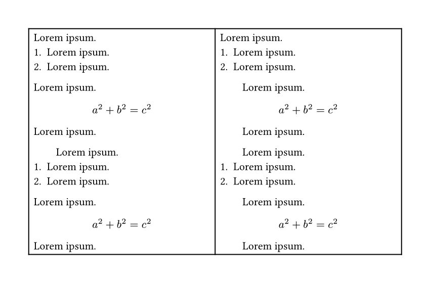
  
  <details>
  <summary>Code:</summary>

  ```typst
    #import "@preview/parize:0.1.0": par-indent
    #set page(width: 15cm, margin: 1cm, height: auto)
    #show: par-indent.with(include-elem: (list, enum, terms, math.equation))
    #let test-unindent = [
      #lorem(2)
      + #lorem(2)
      + #lorem(2)
      #lorem(2)

      $
        a^2 + b^2 = c^2
      $
      #lorem(2)
    ]
    #let test-indent = [
      #lorem(2)
      + #lorem(2)
      + #lorem(2)

      #lorem(2)

      $
        a^2 + b^2 = c^2
      $

      #lorem(2)
    ]
    #table(
      columns: (1fr, 1fr),
      [
        #set par(first-line-indent: (amount: 2em, all: false))
        #test-unindent

        #set par(first-line-indent: (amount: 2em, all: true))
        #test-unindent
      ],
      [
        #set par(first-line-indent: (amount: 2em, all: false))
        #test-indent

        #set par(first-line-indent: (amount: 2em, all: true))
        #test-indent
      ],
    )
  ```
  </details>

- **Paragraph Spacing**: If there is no empty line between a paragraph (or block-level element) and a block-level element, `parize` allows using `par.leading` to control the spacing between them.
  
  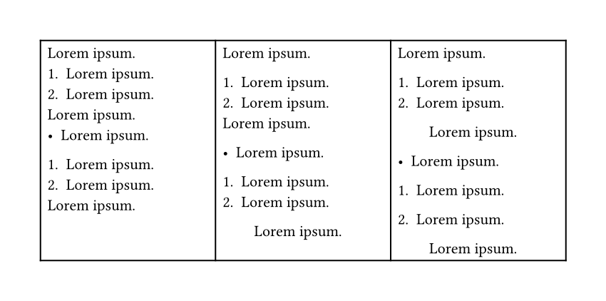
  
  <details>
  <summary>Code:</summary>

  ```typst
  #import "@preview/parize:0.1.0": par-indent
  #set page(width: 15cm, margin: 1cm, height: auto)
  #show: par-indent.with(
    include-elem: (list, enum, terms, math.equation),
    use-par-leading: true,
  )
  #table(
    columns: (1fr,) * 3,
    [
      #lorem(2)
      + #lorem(2)
      + #lorem(2)
      #lorem(2)
      - #lorem(2)
      + #lorem(2)
      + #lorem(2)
      #lorem(2)
    ],
    [
      #lorem(2)

      + #lorem(2)
      + #lorem(2)
      #lorem(2)

      - #lorem(2)
      + #lorem(2)
      + #lorem(2)
      #lorem(2)
    ],
    [
      #lorem(2)

      + #lorem(2)
      + #lorem(2)

      #lorem(2)

      - #lorem(2)

      + #lorem(2)

      + #lorem(2)
      #lorem(2)
    ],
  )
  ```
  </details>

## Why This Package?

- **Experimental Solution**: The `parize` package serves as an experimental implementation of the concept discussed in [issue #3206](https://github.com/typst/typst/issues/3206), offering more flexible control over block-level elements and exploring how this paragraph model affects Typst typesetting.

- **Native Typst Limitations**: Typst's native `set par(first-line-indent: (amount: 2em, all: true))` can be insufficient in certain scenarios. For instance, in theorem environments, lists, enums, and similar contexts, we often want the first line unindented while allowing indentation in subsequent paragraphs. `parize` provides a cleaner solution.

```typst
#set par(first-line-indent: 2em)
#show: par-indent.with(exclude-elem: (...)) // `exclude-elem` excludes specific block-level elements
```

This approach ensures that the first line of paragraphs within a container remains unindented, while subsequent paragraphs (containing `parbreak()`) are indented according to user expectations. It also accommodates different regional typesetting conventions. 

```typst
#import "@preview/parize:0.1.0": par-indent, parize-par-above-flag
#set par(first-line-indent: (amount: 2em, all: false))
#show: par-indent
#set page(width: 12cm, margin: 1cm, height: auto)
#set block(stroke: red) // debug
= Heading

Paragraph content // indented
= Heading
Paragraph content // unindented

#block([
  #lorem(12) // unindented (for lists, theorem environments, etc.)

  #lorem(5)
])

// In slide presentations, such as proof steps across multiple slides,
// you might want the first slide's paragraph unindented but subsequent ones indented:
#block([
  #parize-par-above-flag
  Proof. #lorem(12) // unindented

  #lorem(5)
])

#block([
  #parize-par-above-flag

  Following #lorem(12) // indented

  #lorem(5)
])
```
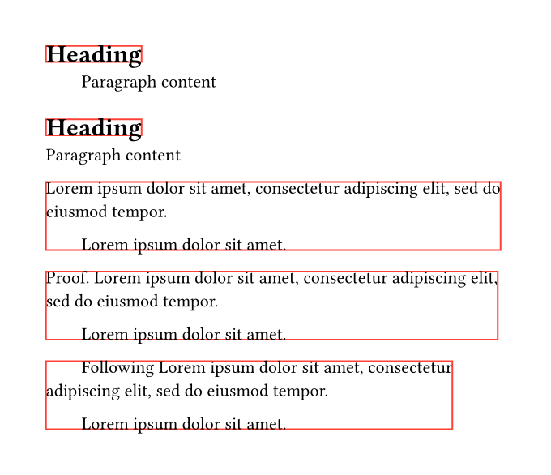

<details>
<summary>Example with Touying:</summary>

In `touying`, you can define a custom `par-indent-slide` method:

```typst
  #import "@preview/touying:0.7.3": *
  #import themes.university: *
  #import "@preview/parize:0.1.0": par-indent, parize-par-above-flag
  #show: university-theme.with(config-page(margin: 1cm, width: 15cm, height: auto))
  #set par(first-line-indent: (amount: 2em, all: false))
  #let par-indent-slide(body, ..args) = {
    slide(
      {
        show: par-indent
        parize-par-above-flag
        body
      },
      ..args,
    )
  }

  #par-indent-slide[
    *Proof*. #lorem(6) // unindented

    StepI.  #lorem(5) .... // indented
  ]

  #par-indent-slide[
    // Note: a `parbreak()` is required here

    StepN. #lorem(5) .... // indented

    Final. #lorem(5) .... // indented
  ]
```

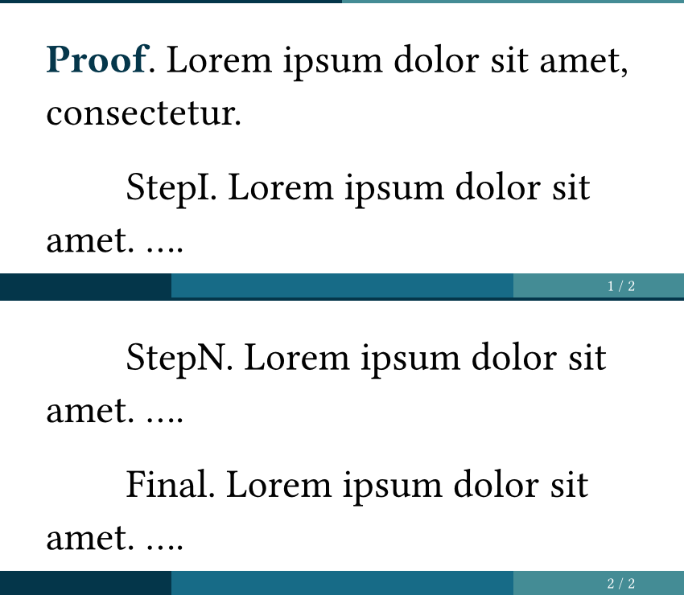
</details>

<details>
<summary>Theorem Example:</summary>

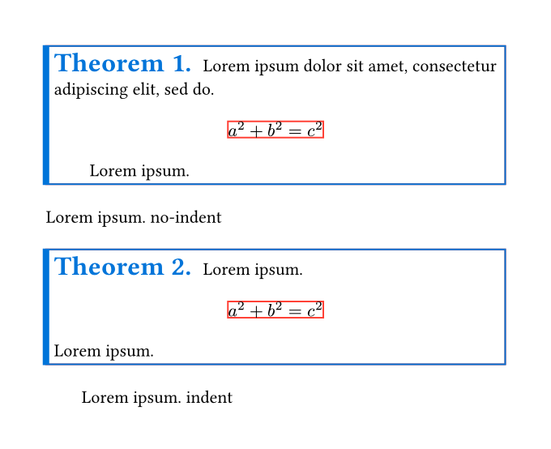

```typst
#import "@preview/parize:0.1.0": par-indent, parize-par-above-flag
#set page(width: 12cm, margin: 1cm, height: auto)
#set par(first-line-indent: (amount: 2em, all: true), spacing: 1.5em)
#[
  #set block(stroke: red) // debug
  #show: par-indent
  #let theorem(doc) = {
    let number = context counter(figure.where(kind: "thm")).display("1.")
    figure(
      kind: "thm",
      supplement: "Theorem",
      block(
        stroke: (left: 4pt + blue, rest: 1pt + blue),
        inset: 5pt,
        width: 100%,
        {
          parize-par-above-flag // `parize-par-above-flag` is used to prevent the first paragraph from being indented.
          set align(left)
          [
            #set text(size: 1.5em, fill: blue)
            #strong[Theorem #number]
          ]
          h(.65em, weak: true)
          doc
        },
      ),
    )
  }

  #theorem[
    #lorem(10)
    $
      a^2 + b^2 = c^2
    $

    #lorem(2)
  ]
  #lorem(2) no-indent // Here, paragraph is not indented due to `par-indent` applying to the element `figure`.

  #theorem[
    #lorem(2)
    $
      a^2 + b^2 = c^2
    $
    #lorem(2)
  ]

  #lorem(2) indent
]
```

</details>

<details>
<summary>More Remarks:</summary>

While `context h(-par.first-line-indent.amount)` might seem like an alternative, it is not always correct. For example:

```typst
#set par(first-line-indent: (amount: 2em, all: true))
#set page(width: 15cm, margin: 1cm, height: auto)
#block(stroke: red)[
  #lorem(5)

  #[
    #set text(size: 2em)
    #context (h(-par.first-line-indent.amount))#lorem(5)
  ]
  #lorem(6)
]

#block(stroke: red)[
  #lorem(5)
  
  #[
    #set text(size: 2em)
    #context (h(-par.first-line-indent.amount))#lorem(5)
  ]

  #lorem(6) 
]
```
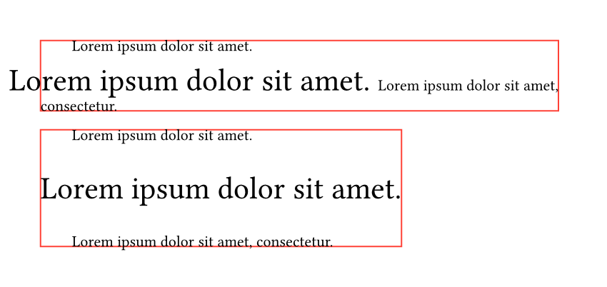
</details>

## Usage

Import the `parize` package:

```typst
#import "@preview/parize:0.1.0": *
```

Then apply the `par-indent` method like:

```typst
#show: par-indent.with(
  include-elem: (list, enum, terms, math.equation), 
  use-par-leading: true
)
```

### Parameters

- `exclude-elem` and `include-elem`: `array`
  - Default: `()`
- `use-par-leading`: `bool` or `dictionary`
  - Default: `false`

### Paragraph Indentation

The `include-elem` parameter specifies which block-level elements should trigger indentation in following paragraphs: if no empty line (i.e., no `parbreak()`) separates them, the text remains unindented; otherwise, it follows the `par.first-line-indent` setting.

When `include-elem` is `()`, **all** block-level elements are processed (excluding `par`, `align`, and `v` to maintain compatibility with Typst's native paragraph model). You can then use `exclude-elem` to exclude specific elements.

Default values for `include-elem` and `exclude-elem` are `()` (processing all block-level elements).

Supported block-level elements:
- `block`, `pad`, `figure`, `layout`
- `list`, `enum`, `terms`
- `heading`, `title`, `outline`, `repeat`
- `table`, `grid`, `stack`, `columns`
- `move`, `rotate`, `scale`, `skew`
- `circle`, `ellipse`, `rect`, `square`
- `curve`, `image`, `line`, `polygon`
- `math.equation`, `raw`, `quote`

Example:
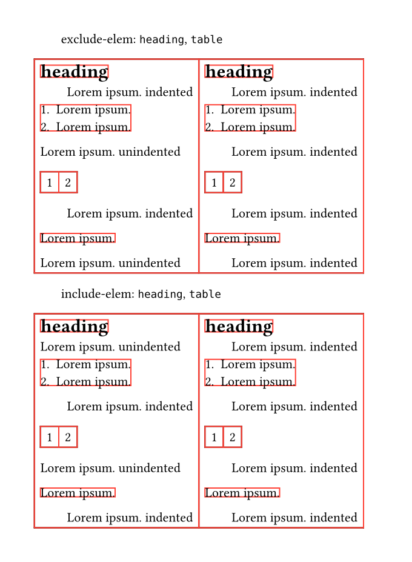

<details>
<summary>Code:</summary>

```typst
#import "@preview/parize:0.1.0": par-indent
#set page(width: 12cm, margin: 1cm, height: auto)
#set par(first-line-indent: (amount: 2em, all: true))
#set block(stroke: red) // debug
#[
  #show: par-indent.with(exclude-elem: (heading, table))
  
  exclude-elem: `heading`, `table`

  #table(
    columns: 2,
    [
      = heading
      #lorem(2) indented
      + #lorem(2)
      + #lorem(2)
      #lorem(2) unindented
      #table(
        columns: 2,
        [1], [2],
      )
      #lorem(2) indented
      #block()[#lorem(2)]
      #lorem(2) unindented
    ],
    [
      = heading

      #lorem(2) indented
      + #lorem(2)
      + #lorem(2)

      #lorem(2) indented
      #table(
        columns: 2,
        [1], [2],
      )

      #lorem(2) indented
      #block()[#lorem(2)]

      #lorem(2) indented
    ],
  )
]

#[
  #show: par-indent.with(include-elem: (heading, table))
  
  include-elem: `heading`, `table`
  
  #table(
    columns: 2,
    [
      = heading
      #lorem(2) unindented
      + #lorem(2)
      + #lorem(2)
      #lorem(2) indented
      #table(
        columns: 2,
        [1], [2],
      )
      #lorem(2) unindented
      #block()[#lorem(2)]
      #lorem(2) indented
    ],
    [
      = heading
      
      #lorem(2) indented
      + #lorem(2)
      + #lorem(2)
      
      #lorem(2) indented
      #table(
        columns: 2,
        [1], [2],
      )
      
      #lorem(2) indented
      #block()[#lorem(2)]
      #lorem(2) indented
    ],
  )
]
```
</details>

### Paragraph Spacing

The `use-par-leading` parameter configures whether `par.leading` controls spacing when no empty line exists between a paragraph (or block-level element) and a block-level element, similar to how lists (`list`, `enum`, `terms`) behave in Typst.

Example: When `use-par-leading` is `true`, elements `list`, `enum`, `terms` are processed. If a paragraph follows **tight** lists without an intervening empty line (`parbreak()`), the spacing between them becomes `par.leading`.

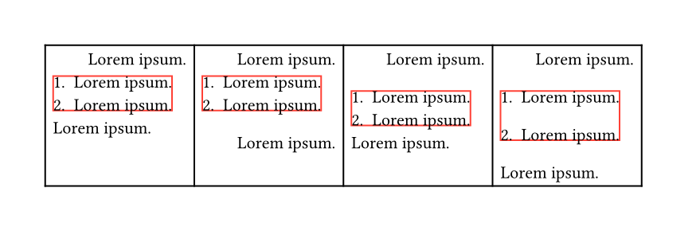

<details>
<summary>Code:</summary>

```typst
#import "@preview/parize:0.1.0": par-indent
#set page(width: 15.5cm, margin: 1cm, height: auto)
#set par(first-line-indent: (amount: 2em, all: true), spacing: 1.5em)
#show enum: set block(stroke: red) // debug

#show: par-indent.with(use-par-leading: true)
#table(
  columns: 4,
  [
    #lorem(2)
    + #lorem(2)
    + #lorem(2)
    #lorem(2)
  ],
  [
    #lorem(2)
    + #lorem(2)
    + #lorem(2)
    
    #lorem(2)
  ],
  [
    #lorem(2)

    + #lorem(2)
    + #lorem(2)
    #lorem(2)
  ],
  [
    #lorem(2)
    + #lorem(2)
    
    + #lorem(2)
    #lorem(2)
  ],
)
```
</details>

The `use-par-leading` parameter accepts a dictionary with the following keys:

- `apply-elem`: specifies which block-level elements to process, affecting `block-text-leading`, `text-block-leading`, and `block-block-leading`
- `block-text-leading`: specifies which block-level elements to process when there's no empty line between them and the following paragraph
- `text-block-leading`: specifies which block-level elements to process when there's no empty line between them and the preceding paragraph
- `block-block-leading`: specifies which block-level elements to process when there's no empty line between them and **above** block-level elements (excluding `par`, `align`, `v`)

Values for these keys can be:
- `array` whose elements are the following block-level elements:
  - `figure`, `layout`
  - `list`, `enum`, `terms`
  - `heading`, `title`, `outline`, `repeat`
  - `table`, `columns`
  - `move`, `rotate`, `scale`, `skew`
  - `circle`, `ellipse`, `rect`, `square`
  - `curve`, `image`, `line`, `polygon`
  - `math.equation`, `raw`, `quote`
  - `block` (for `parize`'s `parize-block`)
- `"all"`: applies to all block-level elements listed above

Default: `false` (feature disabled). Setting `use-par-leading: true` is equivalent to `use-par-leading: (block-text-leading: (list, enum, terms))`.

<details>
<summary>Example:</summary>

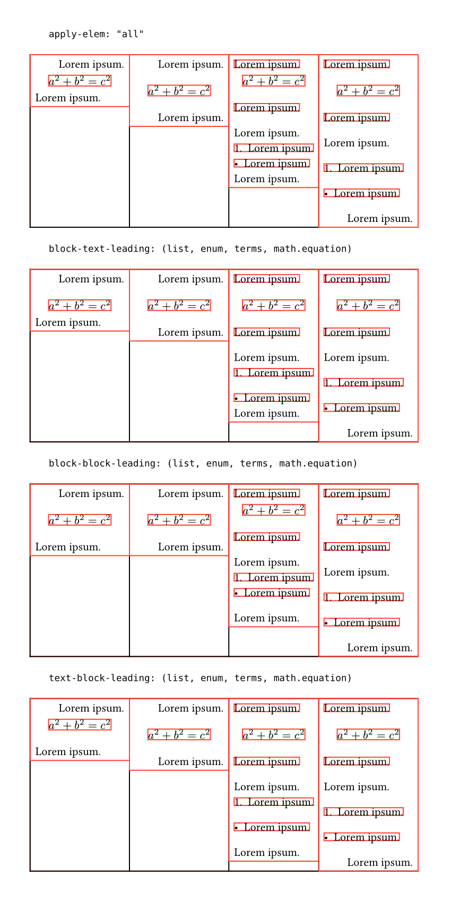

```typst
#import "@preview/parize:0.1.0": par-indent
#set page(width: 15cm, margin: 1cm, height: auto)
#set par(first-line-indent: (amount: 2em, all: true), spacing: 1.5em)

#set block(stroke: red)// debug
#let test = [
  #table(
    columns: 4,
    [
      #lorem(2)
      $
        a^2 + b^2 = c^2
      $
      #lorem(2)
    ],
    [
      #lorem(2)

      $
        a^2 + b^2 = c^2
      $

      #lorem(2)],
    [
      #block[#lorem(2)]
      $
        a^2 + b^2 = c^2
      $
      #block[#lorem(2)] // not processed
      #lorem(2)
      + #lorem(2)
      - #lorem(2)
      #lorem(2)
    ],
    [
      #block[#lorem(2)]

      $
        a^2 + b^2 = c^2
      $
      #block[#lorem(2)]
      #lorem(2)

      + #lorem(2)

      - #lorem(2)

      #lorem(2)
    ],
  )
]

#[
  `apply-elem: ("all")`
  #show: par-indent.with(use-par-leading: (apply-elem: "all"))

  #test
]

#[
  `block-text-leading: (list, enum, terms, math.equation)`
  #show: par-indent.with(use-par-leading: (block-text-leading: (list, enum, terms, math.equation)))

  #test
]

#[
  `block-block-leading: (list, enum, terms, math.equation)`
  #show: par-indent.with(use-par-leading: (block-block-leading: (list, enum, terms, math.equation)))

  #test
]

#[
  `text-block-leading: (list, enum, terms, math.equation)`
  #show: par-indent.with(use-par-leading: (text-block-leading: (list, enum, terms, math.equation)))

  #test
]
```
</details>

### Notes

- **Native Typst Behavior**: For block-level elements, if `block.above` is `auto` and the preceding line is text or another block-level element with `block.below: auto`, Typst inserts `par.spacing`. `parize` allows using `par.leading` instead when no empty line exists. Otherwise, spacing follows the minimum of `block.above` and the previous element's `block.below` (`auto` treated as `0pt`), and `parize` does not intervene.
- **Special Elements**: For `heading`, `title`, `quote`, default `block.above` and `block.below` are not `auto`, so `parize` doesn't affect their spacing by default. To include them, use:
  ```typst
  #show quote.where(block: true): set block(spacing: auto)
  #show heading: set block(spacing: auto)
  #show title: set block(spacing: auto)
  // ...
  #show : par-indent.with(
    use-par-leading: (
      apply-elem: (quote, heading, title, /*other elements*/)
    )
  )
  ```
- **Caution**: Avoid `use-par-leading: (apply-elem: "all")`, which may disrupt packages relying on Typst's existing paragraph model.
- **Basic Elements**: `block`, `pad`, `grid`, `stack` are not supported directly; wrap them in `parize-block`.
  
  <details>
  <summary>Example:</summary>
  
  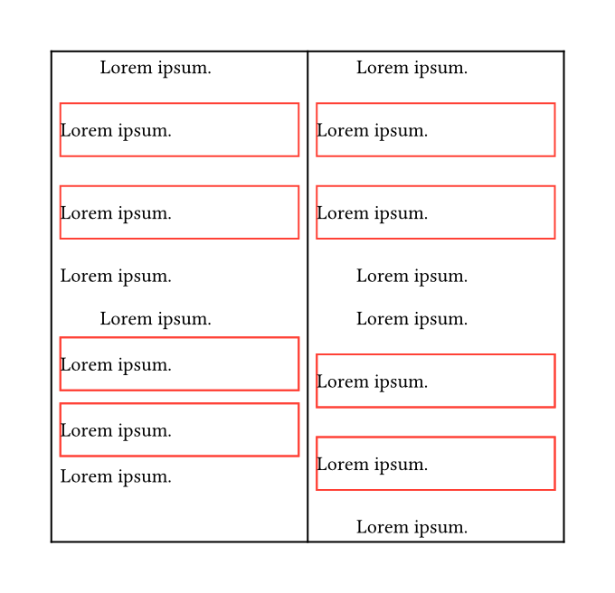
  
  ```typst
  #import "@preview/parize:0.1.0": par-indent, parize-block
  #set page(width: 12cm, margin: 1cm, height: auto)
  #set par(first-line-indent: (amount: 2em, all: true), spacing: 1.5em)

  #[
    #show: par-indent.with(use-par-leading: (apply-elem: (block, /*other block-level elements*/)))
    #let pad-wrapper = pad(y: 1em, lorem(2))
    #table(
      columns: (1fr,) * 2,
      [
        #set block(stroke: red) // debug
        #lorem(2)
        #pad-wrapper
        #pad-wrapper
        #lorem(2)

        #lorem(2)
        
        #parize-block(width: 100%, [#pad-wrapper])
        #lorem(2)
      ],
      [
        #set block(stroke: red) // debug
        #lorem(2)

        #pad-wrapper

        #pad-wrapper

        #lorem(2)

        #lorem(2)

        #parize-block(width: 100%, [#pad-wrapper])
        
        #parize-block(width: 100%, [#pad-wrapper])

        #lorem(2)
      ],
    )
  ]
  ```
  </details>
  
  - `parize-block` accepts the same arguments as `block`.

- **List Elements**: When using `block-block-leading` for lists (e.g., `use-par-leading: (block-block-leading: (list, enum, terms, ))`), we ignore Typst's [PR#6242](https://github.com/typst/typst/pull/6242) to maintain consistent paragraph semantics (i.e., compatible with <0.14, not ≥0.14). This ensures the `spacing` parameter in lists controls only inter-item spacing, not spacing between the list and preceding text.
  - The native list model is limited, with only one `spacing` parameter for both top and bottom margins.
  - Consider using the `itemize` package for enhanced list/enum functionality.

## Limitations

- **Version Compatibility**: Supports Typst 0.13.0–0.14.2 only; may be incompatible with future versions (particularly [PR#7931](https://github.com/typst/typst/pull/7931)).
- **Limitations for `context`, `ref`, `cite`**: Due to Typst limitations, `context`, `ref`, and `cite` are not processed correctly and remain unchanged, especially in formats like:
  ```typst
  block 
  #context [text ...]
  ```
  and
  ```typst
  #context [... block] 
  text
  ```
  - However, `context` content is often inline-level and usually unaffected. If it appears at a paragraph start, precede it with `#parize-blank`.
    
    <details>
    <summary>Example:</summary>
    
    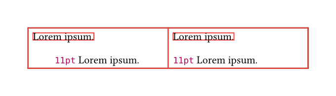
    
    ```typst
    #import "@preview/parize:0.1.0": par-indent, parize-blank
    #set page(width: 12cm, margin: 1cm, height: auto)
    #set par(first-line-indent: (amount: 2em, all: true), spacing: 1.5em)

    #[
      #set block(stroke: red) // debug
      #show: par-indent

      #table(
        columns: (1fr,) * 2,
        [
          #block(lorem(2))
          #context [#text.size] // incorrect
          #lorem(2)

        ],
        [
          #block(lorem(2))
          #parize-blank #context [#text.size] // correct
          #lorem(2)
        ],
      )
    ]
    ```
    </details>
  - Alternatively, wrap `context` in `parize-block` if it forms a complete paragraph.
  - For correct processing, place `parize-par-above-flag` and `parize-par-below-flag` above and below problematic sections.
    
    <details>
    <summary>Illustration:</summary>
    
    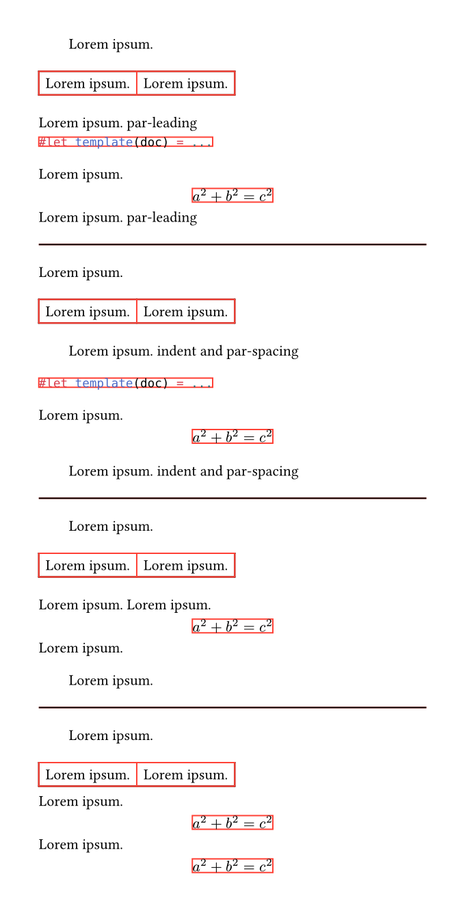
    
    ```typst
    #import "@preview/parize:0.1.0": par-indent, parize-par-above-flag, parize-par-below-flag
    #set page(width: 12cm, margin: 1cm, height: auto)
    #set par(first-line-indent: (amount: 2em, all: true), spacing: 1.5em)
    #set block(stroke: red)
    #show: par-indent.with(use-par-leading: (apply-elem: (block, math.equation)))
    #[
      #lorem(2)
      #table(
        columns: 2,
        [#lorem(2)], [#lorem(2)],
      )
      #lorem(2) par-leading // uses `par-leading` below
      #parize-par-above-flag // if a block-level element in `context` requires `par-leading`, add `parize-par-above-flag` and include `block` in `apply-elem` (or `block-block-leading`, `text-block-leading`)
      #context [
        #parize-par-above-flag
        ```typst
        #let template(doc) = ...
        ```
        #lorem(2)
        $
          a^2 + b^2 = c^2
        $
      ]
      #parize-par-below-flag // if the last element in `context` is block-level, add `parize-par-below-flag`; include `block` in `apply-elem` (`block-text-leading`) for `par-leading` between it and next paragraph
      #lorem(2) par-leading // uses `par-leading` above
    ]
    #line(length: 100%)
    #[
      #lorem(2)
      #table(
        columns: 2,
        [#lorem(2)], [#lorem(2)],
      )

      #lorem(2) indent and par-spacing

      #parize-par-above-flag
      #context [
        #parize-par-above-flag
        ```typst
        #let template(doc) = ...
        ```
        #lorem(2)
        $
          a^2 + b^2 = c^2
        $
      ]
      #parize-par-below-flag

      #lorem(2) indent and par-spacing
    ]

    #line(length: 100%)

    #[
      #lorem(2)
      #table(
        columns: 2,
        [#lorem(2)], [#lorem(2)],
      )
      #lorem(2)
      #context [
        #lorem(2) // if the first element in `context` is inline-level and preceded by inline-level, this is fine; usually no `parize-par-above-flag` needed
        $
          a^2 + b^2 = c^2
        $
        #lorem(2) // if the last element in `context` is inline-level, this is fine; usually no `parize-par-below-flag` needed
      ]

      #lorem(2)
    ]

    #line(length: 100%)

    #[
      #lorem(2)
      #table(
        columns: 2,
        [#lorem(2)], [#lorem(2)],
      )
      #parize-par-above-flag
      #context [
        #parize-par-above-flag
        #lorem(2)
        $
          a^2 + b^2 = c^2
        $
        #lorem(2) // this case is fine
      ]
      $
        a^2 + b^2 = c^2
      $
    ]
    ```
    </details>

- **Element Overrides**: If your document overrides native Typst element behavior, apply `parize` after those overrides:
  ```typst
  #show elem: override-elem-func
  ...
  #show: par-indent.with(...)
  ```
  - Compatibility with `itemize` (≥0.3.0):
    ```typst
    #import "@preview/itemize:0.3.0" as el
    #show: el.default-enum-list
    ...
    #show: par-indent.with(...)
    ```
  - Recommended approach: apply `parize` last in your template:
    ```typst
    #let template(doc) = {
      show *** : ...
      set ...
      ...
      show: par-indent.with(...)
      doc
    }
    ```
    
    Example of an unhandled case:
    ```typst 
    #show: par-indent.with(use-par-leading: (apply-elem: "all"))
    #show quote.where(block: true): set block(spacing: auto)
    #set quote(block: true)
    #lorem(2)
    #quote([...])
    #lorem(2)
    ```
    - Solutions:
      ```typst
      #quote(block: true, [...])
      ```
      - Or wrap in `parize-block` or `block`.
      - Or apply `set quote(block: true)` before `par-indent`:
        ```typst
        #set quote(block: true)

        #show: par-indent.with(...)
        ...
        #quote([...])
        ...
        ```
- **Convergence Behavior**: Paragraph Indentation typically requires 2-3 iterations (2 without style changes). Paragraph Spacing needs at least 4 iterations to converge fully.