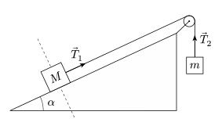
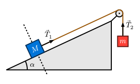
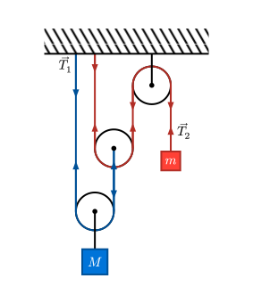

# patatrac
With this [Typst](https://typst.app) package drawing physics diagrams is faster than ever! No cumbersome trigonometry required! Get started with the introductory tutorial inside the [manual](https://github.com/ZaninDavide/patatrac/blob/main/manual.pdf).

```typ
#import "@preview/patatrac:0.5.0"

#patatrac.cetz.canvas({
  import patatrac: *
  let draw = cetz.standard()

  // You're ready to go!
})
```

## Gallery
With patatrac you are free to choose your style. Here are a few examples of what you can do.

<table>
<tr>
    <td colspan="2">
        <b>Gallery: some examples to take inspiration from</b>
    </td>
</tr>
<tr>
    <td><code><a href="gallery/incline.typ">gallery/incline.typ</code></td>
    <td><code><a href="gallery/incline-playful.typ">gallery/incline-playful.typ</code></td>
</tr>
<tr>
    <td>
    <a href="gallery/incline.svg"></a>
    </td>
    <td>
    <a href="gallery/incline-playful.svg"></a>
    </td>
</tr>
<tr>
    <td><code><a href="gallery/smooth-step.typ">gallery/smooth-step.typ</code></td>
    <td><code><a href="gallery/pulleys.typ">gallery/pulleys.typ</code></td>
</tr>
<tr>
    <td>
    <a href="gallery/smooth-step.svg"></a>
    </td>
    <td>
    <a href="gallery/pulleys.svg"></a>
    </td>
</tr>
</table>
