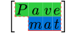
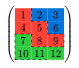
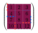
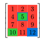
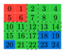

# Pavemat



repo: <https://github.com/QuadnucYard/pavemat>

## Introduction

The *pavemat* is a tool for creating styled matrices with custom paths, strokes, and fills. It allows users to define how paths should be drawn through the matrix, apply different strokes to these paths, and fill specific cells with various colors. This function is particularly useful for visualizing complex data structures, mathematical matrices, and creating custom grid layouts.

## Examples

The logo example:

```typst
#{
  set math.mat(row-gap: 0.25em, column-gap: 0.1em)
  set text(size: 2em)

  pavemat(
    pave: (
      "SDS(dash: 'solid')DDD]WW",
      (path: "sdDDD", stroke: aqua.darken(30%))
    ),
    stroke: (dash: "dashed", thickness: 1pt, paint: yellow),
    fills: (
      "0-0": green.transparentize(80%),
      "1-1": blue.transparentize(80%),
      "[0-0]": green.transparentize(60%),
      "[1-1]": blue.transparentize(60%),
    ),
    delim: "[",
  )[$mat(P, a, v, e; "", m, a, t)$]
}
```

Code of examples can be found in [`examples/examples.typ`](https://github.com/QuadnucYard/pavemat/tree/main/examples).






## Manual

See [`docs/manual.typ`](https://github.com/QuadnucYard/pavemat/tree/main/docs).
