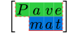

# Pavemat


[](https://typst.app/universe/package/pavemat)
[](https://github.com/QuadnucYard/pavemat)
[](https://github.com/QuadnucYard/pavemat/releases/download/v0.2.0/manual.pdf)

<div align="center">
  
  <p><strong> <u>pave</u>ment + <u>mat</u>rix </strong></p>
</div>

## Introduction

Pavemat provides a simple function `pavemat` for creating styled matrices with customizable paths, strokes, and fills. It allows users to define how paths should be drawn through the matrix, apply different strokes to these paths, and fill specific cells with various colors. This can be used for visualizing data structures and matrices, and creating custom grid layouts.

## Key Features

- **Custom Paths**: Easily define matrix paths using directional characters.
- **Stroke Styles**: Customize the appearance of path lines with different dash patterns, thicknesses, and colors.
- **Cell Fills**: Highlight specific cells (even connected blocks) with chosen colors.
- **Custom Direction Characters**: Override default directional characters when needed.
- **Debug Mode**: Visualize hidden lines to assist with troubleshooting.
- **Style Inheritance**: Contextual styles (e.g., gaps and alignment) are automatically applied to pavemat, though you can explicitly set them if desired.

> [!NOTE]
> Pavemat uses a slightly different layout model than `math.mat` when handling gaps. Extra row gaps are added as cell insets above the first row and below the last row. On the other hand, this meets the needs of cell filling.

## How it works

Since `math.mat` lacks support for cell fills and strokes, pavemat rebuilds the layout using a grid. Each matrix element becomes an individual cell with its own fill, and delimiters are provided by a `math.vec` wrapper.

To prevent overlapping just as `math.mat` and make elements in each row align with baselines, pavemat measures the bounds of each row, inserts zero-width boxes to adjust text top edges, and sets row heights based on bounding box dimensions. This approach works reliably in many cases, though it may not be perfect for every display style.

## Examples

The logo example:

```typst
#import "@preview/pavemat:0.2.0": pavemat

#set math.mat(row-gap: 0.25em, column-gap: 0.1em)
#set text(size: 2em)

#pavemat(
  pave: (
    "SDS(dash: 'solid')DDD]WW",
    (path: "sdDDD", stroke: aqua.darken(30%))
  ),
  stroke: (dash: "dashed", thickness: 1pt, paint: yellow),
  fills: (
    "0-0": green.transparentize(80%),
    "1-1": blue.transparentize(80%),
    "[0-0]": green.transparentize(60%),
    "[1-1]": blue.transparentize(60%),
  ),
  delim: "[",
)[$mat(P, a, v, e; "", m, a, t)$]
```

More examples can be found in `examples/examples.typ`:

---


```typst
#pavemat(
  a,
  pave: "dSDSDSLLAAWASSDD",
  fills: (
    "1-1": red.transparentize(80%),
    "1-2": blue.transparentize(80%),
    "3-0": green.transparentize(80%),
  ),
)
```

---


```typst
#pavemat(
  a,
  pave: (
    path: "AA(paint: red, thickness: 2pt)WdD(paint: blue)Ww(thickness: 1pt, dash: 'dotted')AaS]Aw]W]D",
    from: "bottom-right",
  ),
  fills: maroon.transparentize(90%),
)
```

---


```typst
#pavemat(
  a,
  pave: (
    (path: "WASD", from: (2, 2)),
    (path: "WDSA", from: "bottom-left", stroke: red + 0.5pt),
    (path: "DSAW", from: (3, 2)),
  ),
  stroke: blue + 1pt,
  fills: (
    "": green.transparentize(80%),
    "0-0": red.transparentize(80%),
    "3-2": blue.transparentize(80%),
  ),
  delim: "[",
)
```

---


```typst
#pavemat(
  math.mat(..range(5).map(i => range(5).map(j => i * 5 + j)), align: right),
  pave: (
    (path: "DDDDDRUUUUU", from: (0, 2)),
    (path: "RRRRRDLLLLL", from: (2, 0)),
  ),
  fills: (
    "": green.transparentize(80%),
    "top-left": red.transparentize(80%),
    "3-right": blue.transparentize(80%),
    "[bottom-left]": blue.transparentize(80%),
  ),
  dir-chars: (up: "U", down: "D", left: "L", right: "R"),
  block: true,
  delim: none,
)
```

## License

This project is licensed under the terms of the MIT License. See the [LICENSE](./LICENSE) file for details.
