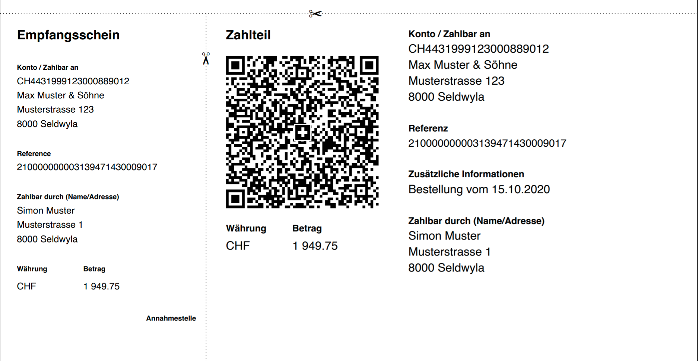

# Swiss QR Bill Generator for Typst

This package provides a simple way to generate Swiss QR bills in [Typst](https://typst.app/). The implementation follows the [Swiss Implementation Guidelines for the QR-bill (Version 2.3)](https://www.six-group.com/en/products-services/banking-services/payment-standardization/standards/qr-bill.html).

## Features

- Generate Swiss QR bills with full adherence to the official specifications
- Support for QR-IBAN and regular IBAN
- Support for structured references (QR reference or Creditor Reference)
- Automatic formatting of currency amounts
- Proper styling according to Swiss QR bill guidelines
- Cross in the QR code center as per specifications

## Installation

Add this package to your Typst project:

```
#import "@preview/payqr-swiss:0.3.0": swiss-qr-bill
```

## Usage

```typst
#import "@preview/payqr-swiss:0.3.0": swiss-qr-bill

#swiss-qr-bill(
  account: "CH4431999123000889012",
  creditor-name: "Max Muster & Söhne",
  creditor-street: "Musterstrasse",
  creditor-building: "123",
  creditor-postal-code: "8000",
  creditor-city: "Seldwyla",
  creditor-country: "CH",
  amount: 1949.75,
  currency: "CHF",
  debtor-name: "Simon Muster",
  debtor-street: "Musterstrasse",
  debtor-building: "1",
  debtor-postal-code: "8000",
  debtor-city: "Seldwyla",
  debtor-country: "CH",
  reference-type: "QRR",  // QRR, SCOR, or NON
  reference: "210000000003139471430009017",
  additional-info: "Bestellung vom 15.10.2020"
)
```

### Output



## Language Support

This package supports all Swiss national languages incl. English as specified in the official Swiss QR Bill specification:

- German (de)
- French (fr)
- Italian (it)
- English (en)

You can specify your preferred language using the `language` parameter:

```typst
#swiss-qr-bill(
  language: "fr",  // Options: "de", "fr", "it", "en"
  account: "CH4431999123000889012",
  // ... other parameters
)
```

The default language is German ("de") if not specified.

## Parameters

| Parameter              | Description                                      | Required    |
| ---------------------- | ------------------------------------------------ | ----------- |
| `account`              | IBAN or QR-IBAN of the creditor                  | Yes         |
| `creditor-name`        | Name of the creditor                             | Yes         |
| `creditor-street`      | Street of the creditor                           | Yes         |
| `creditor-building`    | Building number of the creditor                  | No          |
| `creditor-postal-code` | Postal code of the creditor                      | Yes         |
| `creditor-city`        | City of the creditor                             | Yes         |
| `creditor-country`     | Country code of the creditor (CH or LI)          | Yes         |
| `amount`               | Payment amount                                   | No          |
| `currency`             | Currency code (CHF or EUR)                       | Yes         |
| `debtor-name`          | Name of the debtor                               | No          |
| `debtor-street`        | Street of the debtor                             | No          |
| `debtor-building`      | Building number of the debtor                    | No          |
| `debtor-postal-code`   | Postal code of the debtor                        | No\*        |
| `debtor-city`          | City of the debtor                               | No\*        |
| `debtor-country`       | Country code of the debtor                       | No\*        |
| `reference-type`       | Type of reference (QRR, SCOR, or NON)            | Yes         |
| `reference`            | Payment reference                                | Depends\*\* |
| `additional-info`      | Additional information for the invoice recipient | No          |
| `billing-info`         | Structured billing information                   | No          |
| `language`             | Language code (de, fr, it, en)                   | No (de)     |
| `standalone`           | Layout mode (false: floating, true: new page)    | No (false)  |

\* Required if debtor information is provided  
\*\* Required for QRR and SCOR reference types, must be omitted for NON

## Reference Type Rules

- When using a QR-IBAN, you must use reference type `QRR` with a valid QR reference (27 characters)
- When using a regular IBAN, you must use either `SCOR` with a valid Creditor Reference (ISO 11649) or `NON` with no reference

## Layout Modes

The QR bill generator supports two layout modes controlled by the `standalone` parameter:

### Floating Mode (default: `standalone: false`)

- QR bill becomes a floating element with fixed Swiss standard dimensions (210mm width, 105mm height)
- You control positioning using Typst's `place()`, `align()`, or other layout functions
- Full control over where and how the QR bill appears on your page
- Perfect for invoices with company headers, custom layouts, and precise positioning

**Note on Typst's `float` parameter**: When using `#place()` to position the QR bill, avoid using `float: true` as it may force the QR bill to a new page even when there's sufficient space. This happens because the QR bill has a large fixed height (105mm), and Typst's float system seems to be conservative with large elements. Use `#place()` without the `float` parameter for better control over positioning.

### Standalone Mode (`standalone: true`)

- Forces a new page with specific page settings (A4, no margins)
- QR bill is placed at the bottom of the page
- Ideal for standalone QR bills or when you don't need custom page content

## Examples

### Example 1: Basic QR bill with QR-IBAN

```typst
#swiss-qr-bill(
  account: "CH4431999123000889012",
  creditor-name: "Max Muster & Söhne",
  creditor-street: "Musterstrasse",
  creditor-building: "123",
  creditor-postal-code: "8000",
  creditor-city: "Seldwyla",
  creditor-country: "CH",
  amount: 1949.75,
  currency: "CHF",
  debtor-name: "Simon Muster",
  debtor-street: "Musterstrasse",
  debtor-building: "1",
  debtor-postal-code: "8000",
  debtor-city: "Seldwyla",
  debtor-country: "CH",
  reference-type: "QRR",
  reference: "210000000003139471430009017",
  additional-info: "Order from 15.10.2020"
)
```

### Example 2: QR bill with Creditor Reference

```typst
#swiss-qr-bill(
  account: "CH5800791123000889012",
  creditor-name: "Muster Krankenkasse",
  creditor-street: "Musterstrasse",
  creditor-building: "12",
  creditor-postal-code: "8000",
  creditor-city: "Seldwyla",
  creditor-country: "CH",
  amount: 211.00,
  currency: "CHF",
  debtor-name: "Sarah Beispiel",
  debtor-street: "Musterstrasse",
  debtor-building: "1",
  debtor-postal-code: "8000",
  debtor-city: "Seldwyla",
  debtor-country: "CH",
  reference-type: "SCOR",
  reference: "RF720191230100405JSH0438"
)
```

### Example 3: QR bill without amount (e.g., for donations)

```typst
#swiss-qr-bill(
  account: "CH5204835012345671000",
  creditor-name: "Muster Stiftung",
  creditor-street: "P.O. Box",
  creditor-postal-code: "3001",
  creditor-city: "Bern",
  creditor-country: "CH",
  currency: "CHF",
  reference-type: "NON"
)
```

### Example 4: Floating QR bill positioned at page bottom (default)

```typst
#set page(paper: "a4", margin: 2.5cm)

// Your invoice content here...
#text(size: 18pt, weight: "bold")[TechConsult AG - Invoice]
// ... invoice details, tables, etc ...

// Position floating QR bill at bottom, extending to paper edges
#place(
  bottom,
  dx: -2.5cm,  // Extend beyond left margin
  dy: 2.5cm,   // Extend beyond bottom margin
  swiss-qr-bill(
    // floating is the default behavior
    account: "CH4431999123000889012",
    creditor-name: "TechConsult AG",
    // ... other parameters
  )
)
```

### Example 5: Centered floating QR bill

```typst
#set page(margin: 2cm)

// Invoice content
#text(size: 16pt)[Simple Invoice]
#table(
  columns: (1fr, auto),
  [Service], [CHF 500.00],
  [*Total*], [*CHF 500.00*]
)

// Center the QR bill on the page
#align(center)[
  #swiss-qr-bill(
    // floating is the default behavior
    account: "CH5800791123000889012",
    creditor-name: "Freelancer Name",
    amount: 500.00,
    currency: "CHF",
    reference-type: "NON"
  )
]
```

### Example 6: Standalone QR bill (forces new page)

```typst
// Traditional standalone QR bill
#swiss-qr-bill(
  standalone: true,  // Force new page
  account: "CH4431999123000889012",
  creditor-name: "Donation Foundation",
  // ... parameters
)
```

## Changelog

See the [Changelog](CHANGELOG.md) for release notes for each version.

## Disclaimer

This package is provided "as is", without warranty of any kind. It is not affiliated with, endorsed by, or connected to SIX Interbank Clearing Ltd or any financial institution. Users of this package are responsible for ensuring that the generated QR bills conform to their specific requirements and the latest standards published by SIX Interbank Clearing Ltd.

## License

[GNU LGPLv3 License](LICENSE)
