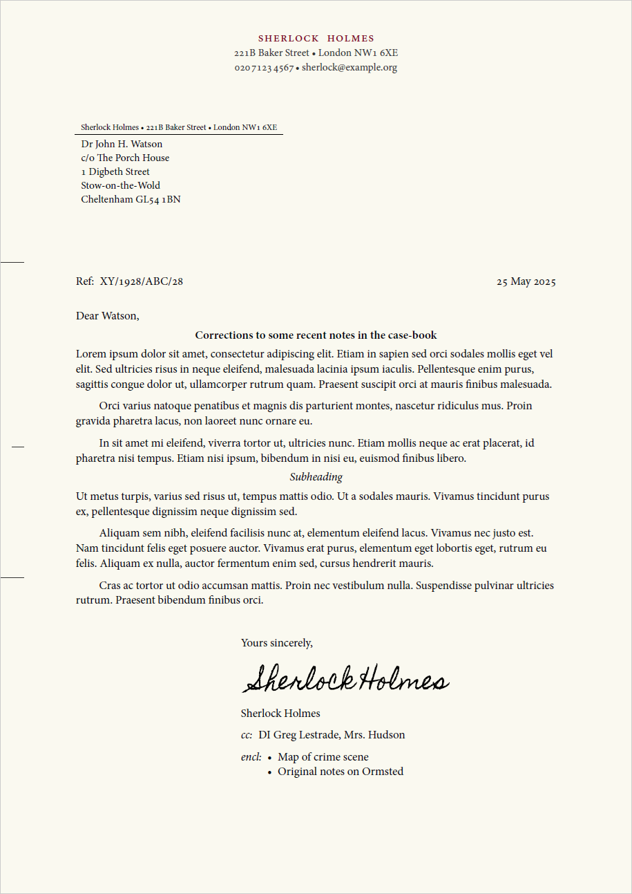

# `pc-letter`: A simple letter template for personal correspondence.

The `pc-letter` template allows you to effortlessly write letters for personal correspondence in Typst that will have a classic feel about them yet largely follow contemporary format guidance (e.g. compatible with DIN 5008's recommendations for personal correspondence).

## Features

- **Localisation options**: Comes with built-in localisation options for various languages and regions which trigger auto-adjustment of many layout option.
- **Adjustable style**: `pc-letter` provides numerous options to tweak fonts, font-sizes, colours etc. to your liking.
- **Optional fields when you need them**: The template provides optional fields for a reference number, listing enclosed documents, and carbon copy recipients.
- **Context aware page numbering**: No need to manually configure, `pc-letter` will add page numbering for you if your content flows over a single page.
- **Print vs digital variants**: Easily switch between variants tweaked for printing or sending out digital-only correspondence.

<a href="./thumbnail.png"></a>

## Usage

To use the `pc-letter` template, just import it, initialise it, and add your content. Here's a minimal working example:

```typst
#import "@preview/pc-letter:0.1.0"

#let letter = pc-letter.init(
    author: (
        name: "Jane Smith",
        address: ("Tiny House", "12 Eagle Lane", "New Quay SA45 4FH"),
        phone: "015 4523 4567",
        email: "jane.smith@example.com",
    )
)

#show: letter.letter-style

#(letter.address-field)[
    Mr Reed A. Lott\
    Sunnyhill Cottage\
    St Davids\
    Haverfordwest SA62 9QB
]

Dear Reed,

I have recently come across a nice letter template for _Typst_ called `pc-letter`. Since I know that you have a penchant for physical letters, I thought I would use that as an excuse to send a few words your way.

#(letter.valediction)[So long,]
```

For more examples, see the Repo's [`examples/`](./examples/) folder

## Arguments

The `pc-letter.init()` function takes the following arguments:

- `author` (required): A dictionary with the fields `name` (str), `address` (array[str] of address components), `phone` (str, with spaces to group digits), and `email` (str).
- `title` (optional): A string that will be used as a document title (in the document metadata only, it will not appear anywhere on the letter), or `none`. Default: `none`.
- `date` (optional): A `datetime` object with the date of the letter. Defaults to the current date if not provided or set to `auto`.
- `place-name` (optional): A place name, usually the town or city where the letter was written.
- `style` (optional): A dictionary with various style options you can modify. The dictionary may have the following fields:
  - `locale.lang`: The two-letter language code of the language the letter is (mainly) written in. Default: `"en"`.
  - `locale.region`: The two-letter region code of the letter's locale. Default: `"GB"`.
  - `medium`: One of the two options `"print"` or `"digital"`. If `"print"` is selected, the page will be optimised for printing out, while the `"digital"` option makes some adjustments to make the letter appear more pleasant if it is only to be distributed digitally (e.g. via email), such as making the page background fill a slightly warm off-white.
  - `text.font`: The typeface that should be used for the letter. The template has mainly been designed to work well with serif fonts and expects the chosen font to support font features such as true smallcaps. By default, `pc-letter` will use the first available of the fonts *Minion Pro*, *Gentium*, *Libertinus Serif*, *Vollkorn* and as a last resort *Times New Roman*.
  - `text.size.normal`: The font-size to be used for normal text. Default: 11pt.
  - `text.size.small`: The font-size to be used for areas where it should be
    just slightly smaller than normal-size. Default: 10pt.
  - `text.size.tiny`: The smallest font-size used by the template. Default: 8pt.
  - `text.fill.headline`: The colour to be used for the author's name on the letterhead. Default #800022, a deep burgundy.
  - `text.fill.faded`: The colour to be used for text (and some lines) that should appear slightly less prominent compared to adjacent text. Default: 80% gray.
  - `alignment.address-field`: Whether to align the address field `left` or `right`. Default: `auto`.
  - `alignment.date-field`: How to align the date field. Horizontally `left`, `center` or `right`, and vertically `top`, `bottom` or `horizon` (`horizon` aligns it just above the first falzmarke). Default: `auto`.
  - `alignment.headings`: Whether to align headings (first and second level) flush `left` or `center`-ed. Default: `auto`.
  - `alignment.reference-field`: How to align the reference field. Horizontally `left` or `right`, and vertically `top`, `bottom` or `horizon` (`horizon` aligns it just above the first falzmarke). Default: `auto`.
  - `alignment.valediction`: Whether the valediction at the end of the letter should appear flush `left`, or indented to the `right` half of the page. Default: `auto`.
  - `page.fill`: A background fill colour for the page(s). If set to `auto` the value will be determined based on the value for `medium`: blank for print, #faf9f0 (a light, warm off-white) for digital. Default: `auto`.
  - `date.format`: A Typst date format string (e.g. `"[year]-[month pad:zero]-[day pad:zero]"`) or `auto`, in which case the template tries to pick something appropriate based on the `locale` setting. Default: `auto`.
  - `components.place-name.display`: Whether to display the place name next to the date (`true` or `false`). Note that even if this is set to `true`, a place name is only shown on the letter if it is specified as an argument to `pc-letter.init()`. Default: `auto`.
  - `components.place-name.pattern`: A pattern to format the place name, where `"[place-name]"` will be replaced with the place name. Default: `"[place-name],"`.
  - `components.return-address-field.display`: Whether to display the return address field immediately on top of the recipient's address or not (`true` or `false`). Default: `auto`.

## Localisations

Different languages and regions have different expectations for the layout of correspondence and use different labels for various fields (such as carbon-copy, attachments, reference, etc.).

`pc-letter` tries to be both versatile and helpful by auto-adjusting its default layout options and translating default labels depending on the specified locale (see the `style.locale.lang` and `style.locale.region` options above).

So for example, if you set `style.locale` to `(lang: "de", region: "AT")`, the recipient's address will be set on the left, dates in January will show "Jänner" for the month's name, headings will be left-aligned, and cc recipients preceded by "In Kopie:". Conversely, if you set it to `(lang: "fr", region: "FR")`, the recipient's address will be set to the right and without return address information, the date will be in French (e.g. "A Paris, le 2 juin 2025"), and attachments will be preceded by "pj:" (pièces jointes).

Currently supported localisations:
  - `cy`: Welsh
  - `de`: German
  - `de-AT`: German (Austria)
  - `en`: English
  - `en-GB`: English (UK) **[default]**
  - `es`: Spanish
  - `es-ES`: Spanish (Spain)
  - `fr`: French

For examples showing various localised versions, see the Repo's [`examples/`](./examples/) folder.

Contributions of further localisations &mdash; as well as corrections to any already included &mdash; are very welcome!

Please note that `pc-letter` currently only supports A4 paper, so is currently of limited use for those who use the US letter/ANSI A paper size. While I have no specific plans to do this yet, I might well implement this in the future, particularly if there is a use case.

## Fields and functions

As shown in the example above, `pc-letter.init()` returns a dictionary of functions that can be used to add various fields to your letter and help with formatting your text.

*Important:* To call any of these functions, you have to enclose them in parentheses. So it should be `#(letter.spaced-smallcaps)[My Text]`:heavy_check_mark: rather than `#letter.spaced-smallcaps[My Text]`:bomb:, the latter of which will produce an error. This is currently a limitation of Typst's module-model and might change in future.

Here's a list of the available fields and functions, assuming you have used `#let letter = pc-letter.init()` to collect them in the variable `letter`:

- `letter.spaced-smallcaps(content)`: Selects the font's true smallcaps option and spaces the letters slightly apart for a more prominent effect.
- `thin-space()`: A weak thin-space, narrower than a normal inter-word space, such as it is used to separate blocks of numbers in phone numbers.
- `en-space()`: A space of length 0.5em, slightly wider than a regular inter-word space. Used where a little extra space adds more visual clarity.
- `phone-number(number)`: Wraps the phone number as a clickable telephone-link (`tel:XXXXXXXXXXX`) and adjusts the inter-word spacing such that if regular spaces are used to group digits they look a little neater.
- `email-address(email)`: Wraps the email address as a clickable email-link (`mailto:someone@example.org`).
- `falzmarken()`: Can be optionally used at the start of the document to add folding marks to the left margin of the first page (two marks where you can fold the A4 paper to fit it into a DL, C5 or C6 envelope, which may be windowed). A third mark is added at the centre of the page, which can be used to centre-fold it but is principally meant to align a hole punch such that it is centred vertically.
- `address-field(recipient-address, return-address-field: auto)`: Used to set the recipient's address on the first page. The recipient's address should normally be no more than 6 lines (though it won't be clipped if it is longer) and you should include manual line-breaks. The optional `return-address-field` argument can be used to overwrite the content that appears in tiny text above the recipients address, normally used to provide a return address in case the letter cannot be delivered.
- `reference-field(reference, supplement: "Ref:")`: Can be used to optionally add a reference at the same height as the date. This can be useful when replying to correspondence from e.g. a business or the government, where the other party has given you a reference number to quote on future correspondence. The `supplement` argument can be used to optionally replace the standard text "Ref:" with something of your choice.
- `letter-style`: Encapsulates the main layout of the letter template. Should be used with a show rule (e.g. `#show: letter.letter-style` -- note the absence of the parentheses!) to activate the template after initialising it.
- `valediction(valediction, signature: none, name: auto)`: Adds a properly formatted valediction (a closing formula) at the end of the letter. The `valediction` parameter includes the acutal valediction (e.g. `(letter.valediction)[Yours faithfully,]` or `(letter.valediction)[Yours sincerely,]`) though you may of course also chose something a little more old-fashioned like `(letter.valediction)[I remain, Sir, your humble and obedient servant,]`. By default this is followed by a 3em space (a space in which you can add your signature) and then the author's name. You can use the `signature` parameter to insert some content, e.g. text or an image in place of the 3em space, and you can use the `name` parameter to use a name other than what has been set as the author's name here - or indeed to omit it altogether by setting it to `none`.
- `cc-field(..recipients)`: Add any number of names of additional recipients whom you have sent a (carbon)-copy of the letter. If these are fewer than 3, they will be set on a single line. 3 or more will be automatically set as a list.
- `enclosed-field(..enclosures)`: Add any number of strings refering to enclosed (attached) documents. If this is a single item it will be set without a bullet, if there are more than one they will be set as a bullet list.

## License

The `pc-letter` package is free and open-source, licensed under the MIT License. See the file [`LICENSE`](./LICENSE) for mor information.
