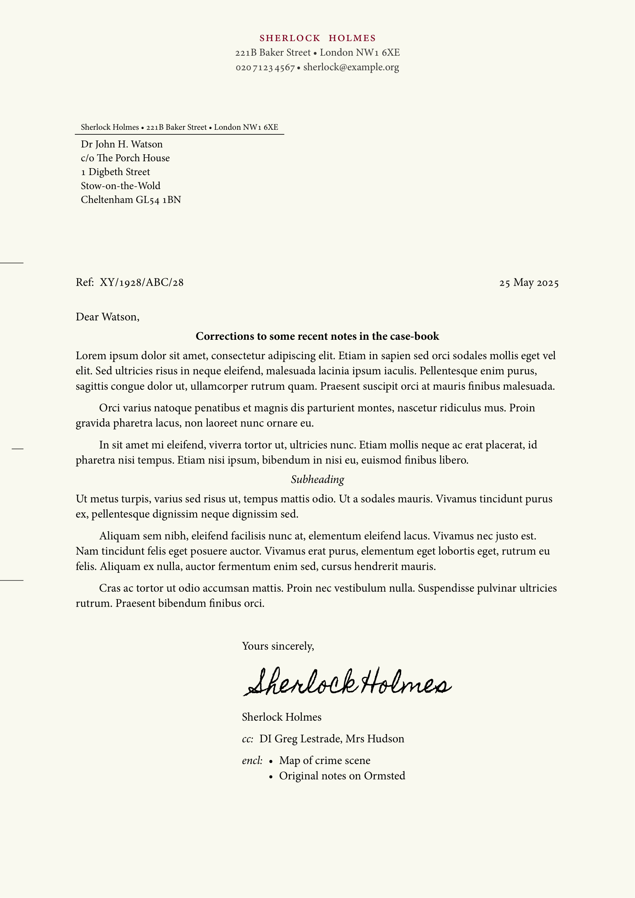

# `pc-letter`: A simple letter template for personal correspondence.

Use `pc-letter` to effortlessly write letters for personal correspondence that have a classic feel about them, yet largely follow contemporary format requirements (e.g. DIN 5008 compatibility).

## Contents
- [Feature overview](#featue-overview)
- [Usage](#usage)
  - [Initialising and custom options](#initialising-and-custom-options)
  - [Fields](#fields)
  - [Convenience functions](#convenience-functions)
- [Localisations](#localisations)
- [How do I ...?](#how-do-i-)
- [Contributing](#contributing)
- [Changelog](#changelog)
- [License](#license)

## Featue overview

- **Multilingual**: `pc-letter` features many built-in localisation options for different languages and countries, with even more to come in the future. Just set the language and country and `pc-letter` will adjust the default styling options to suit.
- **Customisable**: `pc-letter` provides numerous options to style your letters as you like: easily tweak fonts, font-sizes, colours, and many other parameters to your liking.
- **Optional fields when you need them**: The template provides optional fields for a reference number, listing enclosed documents, and carbon copy recipients.
- **Context-aware page numbering**: No need to manually configure, `pc-letter` will add page numbering for you if your content flows over a single page.
- **Variants for print and digital**: Easily switch between tweaked variants to produce traditional printed letters or digital-only correspondence.

<a href="./thumbnail.png"></a>

## Usage

### Basic usage

To use the `pc-letter` template, just import it, initialise it, and add your content. Here's a minimal working example:

```typst
#import "@preview/pc-letter:0.4.0"

#let letter = pc-letter.init(
    author: (
        name: "Jane Smith",
        address: ("Tiny House", "12 Eagle Lane", "New Quay SA45 4FH"),
        phone: "015 4523 4567",
        email: "jane.smith@example.com",
    )
)

#show: letter.letter-style

#(letter.address-field)[
    Mr Reed A. Lott\
    Sunnyhill Cottage\
    St Davids\
    Haverfordwest SA62 9QB
]

Dear Reed,

I have recently come across a nice letter template for _Typst_ called `pc-letter`. Since I know that you have a penchant for physical letters, I thought I would use that as an excuse to send a few words your way.

#(letter.valediction)[So long,]
```

For more examples, see the Repo's [`examples/`](./examples/) folder

### Initialising and custom options

The template is initialised by calling `pc-letter.init()` and assigning its output to a variable, for example `#let letter = pc-letter.init(...arguments)`. It is important to assign the output of `pc-letter.init()` to a variable because that is what lets you access the functions of the template later.

*Important*: Remember to activate the show rules with `#show: letter.letter-style` after initialising the template!

The `pc-letter.init()` function takes the following arguments:

- `author` (required): A dictionary with the fields `name` (str), `address` (array[str] of address components), `phone` (str, with spaces to group digits), and `email` (str).
- `title` (optional): A string that will be used as a document title (in the document metadata only, it will not appear anywhere on the letter), or `none`. Default: `none`.
- `date` (optional): A `datetime` object with the date of the letter. Defaults to the current date if not provided or set to `auto`.
- `place-name` (optional): A place name, usually the town or city where the letter was written.
- `logo` (optional): A `content` object (usually an `image`) forming a logo that should be displayed as part of the letterhead. The placement depends on `style.alignment.letterhead`: to the left of the letterhead if left-aligned, to the right of the letterhead if right-aligned, and on top of the letterhead if centre-aligned.
- `style` (optional): A dictionary with various style options you can modify. The dictionary may have the following fields:
  - `locale.lang`: The two-letter language code of the language the letter is (mainly) written in. Default: `"en"`.
  - `locale.region`: The two-letter region code of the letter's locale. Default: `"GB"`.
  - `medium`: One of the two options `"print"` or `"digital"`. If `"print"` is selected, the page will be optimised for printing out, while the `"digital"` option makes some adjustments to make the letter appear more pleasant if it is only to be distributed digitally (e.g. via email), such as making the page background fill a slightly warm off-white.
  - `text.font`: The typeface that should be used for the letter. The template has mainly been designed to work well with serif fonts and expects the chosen font to support font features such as true smallcaps. By default, `pc-letter` will use the first available of the fonts *Minion Pro*, *Gentium*, *Libertinus Serif*, *Vollkorn* and as a last resort *Times New Roman*.
  - `text.size.normal`: The font-size to be used for normal text. Default: 11pt.
  - `text.size.small`: The font-size to be used for areas where it should be
    just slightly smaller than normal-size. Default: 10pt.
  - `text.size.tiny`: The smallest font-size used by the template. Default: 8pt.
  - `text.fill.headline`: The colour to be used for the author's name on the letterhead. Default #800022, a deep burgundy.
  - `text.fill.faded`: The colour to be used for text (and some lines) that should appear slightly less prominent compared to adjacent text. Default: 80% gray.
  - `alignment.address-field`: How to align the address field. Horizontally `left` or `right`, and vertically `top`, `bottom` or `horizon` (`bottom` aligns it just above the first falzmarke, `horizon` in an intermediate position between `top` and `bottom`). Default: `auto`.
  - `alignment.date-field`: How to align the date field. Horizontally `left`, `center` or `right`, and vertically `top`, `bottom` or `horizon` (`horizon` aligns it just above the first falzmarke). Default: `auto`.
  - `alignment.headings`: Whether to align headings (first and second level) flush `left` or `center`-ed. Default: `auto`.
  - `alignment.letterhead`: Whether to align the letterhead to the `left`, `right` or `center` of the page. Default: `center`.
  - `alignment.reference-field`: How to align the reference field. Horizontally `left` or `right`, and vertically `top`, `bottom` or `horizon` (`horizon` aligns it just above the first falzmarke). Default: `auto`.
  - `alignment.valediction`: Whether the valediction at the end of the letter should appear flush `left`, or indented to the `right` half of the page. Default: `auto`.
  - `page.fill`: A background fill colour for the page(s). If set to `auto` the value will be determined based on the value for `medium`: blank for print, #faf9f0 (a light, warm off-white) for digital. Default: `auto`.
  - `date.format`: A Typst date format string (e.g. `"[year]-[month pad:zero]-[day pad:zero]"`) or `auto`, in which case the template tries to pick something appropriate based on the `locale` setting. Default: `auto`.
  - `components.letterhead.ascent`: The distance from the top of the address field to the bottom of the letterhead. If set to `auto` this will be `12mm` unless there is a logo placed on top of the letterhead above the name, in which case it will be reduced to `5mm`. Default: `auto`.
  - `components.place-name.display`: Whether to display the place name next to the date (`true` or `false`). Note that even if this is set to `true`, a place name is only shown on the letter if it is specified as an argument to `pc-letter.init()`. Default: `auto`.
  - `components.place-name.pattern`: A pattern to format the place name, where `"[place-name]"` will be replaced with the place name. Default: `"[place-name],"`.
  - `components.return-address-field.display`: Whether to display the return address field immediately on top of the recipient's address or not (`true` or `false`). Default: `auto`.

### Fields

The different elements of on the letter are known as *fields*. You can access the letter fields via the variable to which you assigned the initialisation function. For example if you called `#let letter = pc-letter.init(...)`, you can invoke the address field (recipient's address) with `#(letter.address-field)[Recipient's address goes here]`.

Note also how we've enclosed the reference to the field `(letter.address-field)` in parentheses here. This is important to help typst resolve the scope of content and arguments passed to these fields &mdash; so if you invoke a field or call a function from the template and it doesn't work, check that you've enclosed it in parentheses!

Each field should normally only be invoked once in your letter.


- `(letter.address-field)(recipient-address, return-address-field: auto)`: Used to set the recipient's address on the first page.

  For example, if you want to send a letter to King Charles, you would write something like
  ```typst
  #(letter.address-field)[
    His Majesty The King\
    Buckingham Palace\
    London SW1A 1AA\
    United Kingdom
  ]
  ```

  The recipient's address should normally be no more than 6 lines (though it won't be clipped if it is longer) and you should include manual line-breaks.
  
  The optional `return-address-field` argument can be used to overwrite the content that appears in tiny text above the recipient's address. This is used in many countries to provide a return address in case the letter cannot be delivered, though not all localisations make use of the field (see also the `component.return-address-field` style option).

- `(letter.reference-field)(reference, supplement: "Ref:")`: Can be used to optionally add a reference number.

  Quoting a reference number can be useful when replying to correspondence from e.g. a business or the government, where the other party has given you a reference number to quote on future correspondence. For example, if you're writing to a government department and have been given a reference number to quote, say "2026-01/hmrc/abc123", you would include the following after the address field: `#(letter.reference-field)("2026-01/hmrc/abc123)`.

  The `supplement` argument can be used to optionally replace the standard text "Ref:" (or the appropriate translation) with something of your choice, for example "Your reference:" or "Claim Ref:".

- `(letter.valediction)(valediction, signature: none, name: auto)`: Adds a properly formatted valediction (a closing formula) at the end of the letter.
  
  The `valediction` parameter includes the actual valediction (e.g. `#(letter.valediction)[Yours faithfully,]` or `#(letter.valediction)[Yours sincerely,]`) though you may of course also choose something a little more old-fashioned like `#(letter.valediction)[I remain, Sir, your humble and obedient servant,]`.
  
  By default the valediction is followed by a 3em space (a space in which you can add your signature) and then the author's name.
  
  You can use the `signature` parameter to insert some content, e.g. text or an image in place of the 3em space, and you can use the `name` parameter to use a name other than what has been set as the author's name here &mdash; or indeed to omit it altogether by setting it to `none`.

- `(letter.cc-field)(..recipients)`: Add any number of names of additional recipients whom you have sent a (carbon)-copy of the letter.

  For example, `#(letter.cc-field)("Jane Doe", "John Smith")` with set a line that says something like "cc: Jane Doe, John Smith" and is properly aligned with the valediction.

  If there are fewer than 3 carbon-copy recipients, they will be set on a single line. 3 or more will be automatically set as a list.

  The cc-field should normally be invoked after the valediction, but before the enclosed-field (if used).

- `(letter.enclosed-field)(..enclosures)`: Add any number of descriptions for enclosed (attached) documents.

  For example, `#(letter.enclosed-field)("Sample", "Copy of original", "Relevant terms")` will set a leading "encl.:" (or the translated version) followed by an indented list with the thre items (Sample, Copy of original, Relevant terms), all properly aligned with the valediction.

  If this is a single item it will be set without a bullet, if there are more than one they will be set as a bullet list.

  The enclosed-field should normally be invoked last, following both the valediction and, if used, the cc-field.

### Convenience functions

In addition to the fields above, the template also provides a number of convenience-functions for formatting certain elements. Again, these should be called in parenthetical form, e.g. `#(letter.spaced-smallcaps)[Hello, world!]`.

Note that the template automatically applies the appropriate formatting where it expects arguments to be of a certiain type, e.g. a phone number or an email address.

- `(letter.spaced-smallcaps)(content)`: Selects the font's true smallcaps option and spaces the letters slightly apart for a more prominent effect.

- `(letter.thin-space)()`: A weak thin-space, narrower than a normal inter-word space, such as it is used to separate blocks of numbers in phone numbers.

- `(letter.en-space)()`: A space of length 0.5em, slightly wider than a regular inter-word space. Used where a little extra space adds more visual clarity.

- `(letter.phone-number)(number)`: Wraps the phone number as a clickable telephone-link (`tel:XXXXXXXXXXX`) and adjusts the inter-word spacing such that if regular spaces are used to group digits they look a little neater.

- `(letter.email-address)(email)`: Wraps the email address as a clickable email-link (`mailto:someone@example.org`).

- `(letter.web-address)(dest, include-schema: true)`: Wraps a URL as a clickable link. If the optional `include-schema` argument is set to `false`, the link text will hide the initial schema element (e.g. `"https://"`).

- `(letter.falzmarken)()`: Can be optionally used at the start of the document to add folding marks to the left margin of the first page (two marks where you can fold the A4 paper to fit it into a DL, C5 or C6 envelope, which may be windowed). A third mark is added at the centre of the page, which can be used to centre-fold it but is principally meant to align a hole punch such that it is centred vertically.

- `(letter.letter-style)`: Encapsulates the main layout of the letter template. Should be used with a show rule (e.g. `#show: letter.letter-style` -- note the absence of the parentheses!) to activate the template after initialising it.


## Localisations

Different languages and regions have different expectations for the layout of correspondence and use different labels for various fields (such as carbon-copy, attachments, reference, etc.).

`pc-letter` tries to be both versatile and helpful by auto-adjusting its default layout options and translating default labels depending on the specified locale (see the `style.locale.lang` and `style.locale.region` options above).

So for example, if you set `style.locale` to `(lang: "de", region: "AT")`, the recipient's address will be set on the left, dates in January will show "Jänner" for the month's name, headings will be left-aligned, and cc recipients preceded by "In Kopie:". Conversely, if you set it to `(lang: "fr", region: "FR")`, the recipient's address will be set to the right and without return address information, the date will be in French (e.g. "A Paris, le 2 juin 2025"), and attachments will be preceded by "pj:" (pièces jointes).

Currently supported localisations:
  - `cy`: Welsh
  - `de`: German
  - `de-AT`: German (Austria)
  - `en`: English
  - `en-GB`: English (UK) **[default]**
  - `es`: Spanish
  - `es-ES`: Spanish (Spain)
  - `fr`: French
  - `it`: Italian
  - `ro`: Romanian

For examples showing various localised versions, see the Repo's [`examples/`](./examples/) folder.

Contributions of further localisations &mdash; as well as corrections to any already included &mdash; are very welcome!

Please note that `pc-letter` currently only supports A4 paper, so is currently of limited use for those who use the US letter/ANSI A paper size. While I have no specific plans to do this yet, I might well implement this in the future, particularly if there is a use case.

## How do I ...?

### ... use an image as my signature?

You can pass an `image` (or any other content, e.g. a CeTZ plot) as the `signature` parameter of the valediction. For example:

```typst
#(letter.valediction)(
  signature: image("my-signature.png")
)[Kind regards,]
```

### ... add a logo to the letterhead?

You can pass an `image` (or any other content, e.g. a CeTZ plot) as the `logo` parameter of `pc-letter.init()`. The logo will be positioned automatically, which by and large should work well out of the box as long as your logo does not contain much unnecessary padding. Example:

```typst
#let letter = pc-letter.init(
  name: "Jane Doe, Esq.",
  logo: image("my-logo.png")
)
```

By default, the logo has close-to-zero padding. You can wrap the `image(...)` inside a [`pad(...)`](https://typst.app/docs/reference/layout/pad/) element if you want to add some spacing around the logo, e.g. `pad(bottom: 1pt, image("my-logo.png"))` to add 1pt of padding at the bottom of the logo.

## Contributing

All contributions are welcome.

For feedback and feature requests, please [post a GitHub issue](https://github.com/thatfloflo/typst-pc-letter/issues).

For general questions and help with `pc-letter`, please [post to GitHub discussions](https://github.com/thatfloflo/typst-pc-letter/discussions/categories).

To contribute feature enhancements, bug fixes, and new localisations, please [make a pull request on GitHub](https://github.com/thatfloflo/typst-pc-letter/pulls).

All pull requests should include a short description of any changes made and their rationale.

For new localisations, please update the `locales.typ` using the appropriate [ISO 639 code](https://en.wikipedia.org/wiki/List_of_ISO_639_language_codes) for your language, and if applicable the two letter [ISO 3166 country code](https://en.wikipedia.org/wiki/List_of_ISO_3166_country_codes) (note the locales are sorted alphabetically). Please also include a new `example-xy.typ` and corresponding PDF in the `examples/` folder. If you know of any references for the format choices you made (e.g. published standards/recommendations for letter formatting in your language/country), or there are limitations you are aware of, please mention these in the pull request as they will be useful for reference.

If you are unable to use GitHub for some reason, you may also email me, but please note that this creates more work for me and might also be more easily overlooked.

## Changelog

### New in this version: v0.4.0

#### Added

- New Italian localisation and example (see [examples/example-it.typ](./examples/example-it.typ)) (thanks to Biagio and Giulia)
- New vertical alignment options (`top` \[default\], `horizon`, `bottom`) for the `address-field`.

#### Changes

- The implementation of vertical alignment for the `address-field` has changed subtly along with the implementation of new alignment options. This should normally not be noticeable when migrating, unless the template style was heavily customised beforehand.

**Full changelog:** [CHANGELOG.md](./CHANGELOG.md)

## License

The `pc-letter` package is free and open-source, licensed under the MIT License. See the file [`LICENSE`](./LICENSE) for more information.
