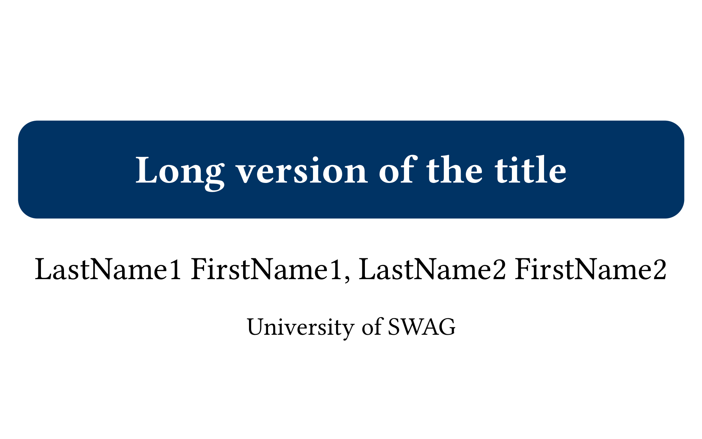
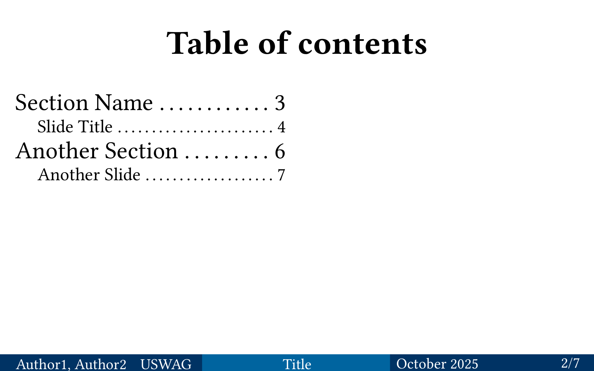
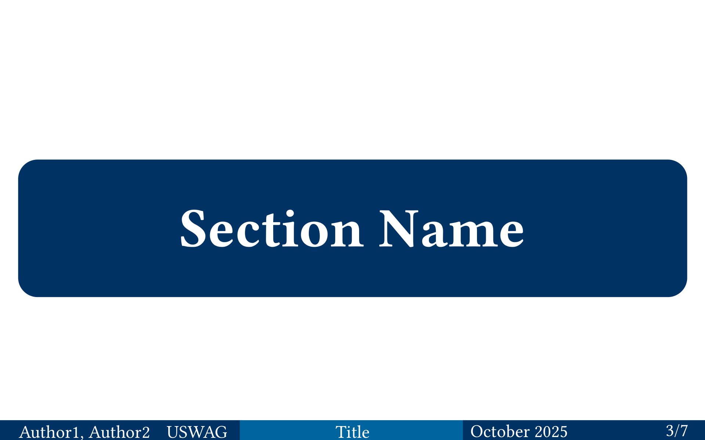
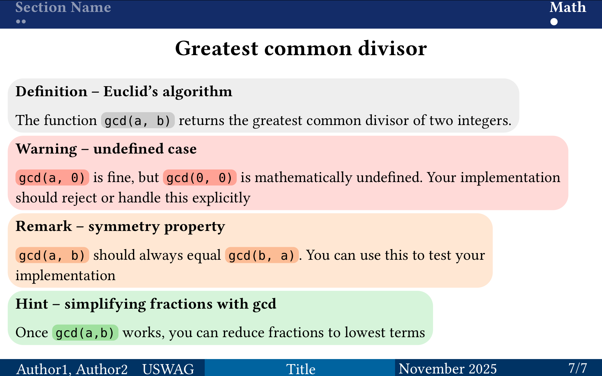

# Pepentation

*Simple slides for your university presentations*

**Pepentation** is a Typst template designed for clean, academic presentations.

**Features:**
- 🎨 **Comprehensive Theming:** Extensive theme system with preset themes and easy customization.
- 🧭 **Navigation:** Header with bullet-point progress tracker and interactive table of contents (Beamer-inspired). The header always occupies a bounded amount of space, no matter how long your deck is: section titles are fitted into at most two lines, and trackers are capped at three rows of dots.
- 🔢 **Smart Layout:** Automatic footer with 3-column layout (Authors, Title, Date/Page).
- 🧱 **Rich Content Blocks:** 9 styled block types for definitions, warnings, remarks, hints, info, examples, quotes, success, and failure messages.
- 🌈 **Theme Presets:** Multiple beautiful themes including light and dark variants.

| Title Slide | Table of Contents | Section Slide | Main Slide |
| - | - | - | - |
|  |  |  |  |

## Setup

### Using the Published Package

Simply import the package in your `.typ` file:

```typst
#import "@preview/pepentation:0.3.0": *
```

The package will be automatically downloaded on first use.

### Local Installation (Development)

If you want to install the package locally or modify it:

1.  **Clone or Download** this repository.
2.  **Place it** in your local Typst package directory:
    `{data-dir}/typst/packages/local/pepentation/0.3.0`

    Where `{data-dir}` is:
    - **Linux:** `$XDG_DATA_HOME` or `~/.local/share`
    - **macOS:** `~/Library/Application Support`
    - **Windows:** `%APPDATA%`
3.  **Import it** in your `.typ` file:
    ```typst
    #import "@local/pepentation:0.3.0": *
    ```
    
## Quick Start

Don't want to configure everything from scratch?

Check the **`template/`** folder in this repository. It contains a fully configured `main.typ` file. You can copy this file to your project folder and start editing immediately.

## Usage

Initialize the template at the top of your file using the `setup-presentation` rule:

```typst
#import "@preview/pepentation:0.3.0": *

#show: setup-presentation.with(
  title-slide: (
    enable: true,
    title: "Presentation Title",
    authors: ("Author One", "Author Two"),
    institute: "University of Typst",
  ),
  footer: (
    enable: true,
    title: "Short Title",
    institute: "Short Inst.",
    authors: ("A. One", "A. Two"),
  ),
  table-of-contents: "detailed", // Interactive: click to jump to section
  header: true,
  locale: "EN"
)

// Your content goes here...
```

### Structure
Use standard markdown-like headings to structure your slides:

- **`= Section`** (Level 1): Creates a dedicated **Section Title Slide**.
- **`== Slide Title`** (Level 2): Creates a new **Main Slide**.
- **`== `** (Empty Level 2): Creates a new slide *without* a title (excluded from ToC).
- **`=== Subsection`** (Level 3): Creates a new slide with a title, but *excluded* from the Table of Contents.

```typst
= Introduction

== Motivation
This is the first slide of the introduction.

== 
This slide has no title.

=== Detail View
This slide has a title, but won't appear in the outline.
```

A section heading can also carry `metadata`, which never shows up as text:
`metadata("…")` sets the subtitle of the section slide, and
`metadata((header: "…"))` additionally sets a shorter label for the header
(see [Header Behavior](#header-behavior)). The `header`, `subtitle` and
`section-slide` keys are read from such a dictionary; any other key is ignored.
The section slide and the table of contents use the full title, falling back to
the header label for a section that has no visible title.

```typst
= Cargo и компилятор #metadata((header: "Cargo", subtitle: "17 минут"))
```

A section that should be part of the header and the table of contents without
taking a slide of its own opts out with `section-slide: false`. Leaving the title
out of the heading keeps the visible title empty, so the header label is all the
reader sees:

```typst
= #metadata((header: "Владение", section-slide: false))
== Слайды раздела
```

## Table of Contents Styles

Pepentation offers two different styles for the table of contents:

- **`"detailed"`** (default): A compact 3-column layout that includes both section titles and subsections. This style displays level 1 headings with slide numbers and includes level 2 subheadings in a multi-column format for efficient space usage.

- **`"simple"`**: A clean 2-column grid layout displaying only section titles (level 1 headings) in styled boxes. This provides a simpler, more spacious overview of your presentation structure.

- **`"none"`**: Disables the table of contents entirely.

## Header Behavior

The header is a navigation aid, not a content area, so it never grows past a fixed budget. This keeps your slide body in the same place on every page:

- **Section titles** are typeset at the full header size and shrunk (down to `9pt`) until the title fits on at most two lines. Longer titles are truncated with an ellipsis, so a verbose section name never pushes the slide body down.
- **Progress trackers** show one dot per slide in the section, filled row by row up to three rows per section. A section that overflows those three rows is compacted: while at most a quarter of its slides are dropped, the shown dots are kept and a trailing `…` marks the remainder; beyond that, the slides are bucketed evenly, so each dot covers roughly the same number of slides.
- **Section titles are left-aligned**, one column per section, separated by a small gap, so the header reads as a single list from the left margin onwards.

A section can also replace the text the header shows for it, which is useful when
the real title is too long to fit the column:

```typst
= Владение и ссылки #metadata((header: "Владение"))
```

## Footer Behavior

The footer is a band of three blocks of unequal width, and it never cuts
information. Every label it is given is typeset in full: if the text does not
fit, the band grows instead of clipping, and if even a grown band is not enough
the build fails rather than silently dropping text.

```
+---------------------------------------------------------------------------+
| Плотников                 |    Что такое Rust     |  СПбГУ  September 2026  3/12 |
+---------------------------------------------------------------------------+
  40% of the page width      title, 9pt            institute, date and page, 7.5pt
  names left, institute right
```

- **The left block is the widest.** It carries two labels instead of one, so it
  takes `40%` of the page width; the title block takes `35%` and the date and
  number block `25%`.
- **Names and institute share the left block.** The authors sit at its left edge
  and the institute is flush right, each in a column measured to its own text, so
  neither can squeeze the other out. Both may use two rows: a spelled out
  institute that is wider than the block wraps beside the names, ragged left,
  instead of dropping below them.
- **Two size tiers.** The names and the title are set at `text-size` (`9pt`), the
  institute, the date and the page number at `secondary-size` (`7.5pt`), so the
  band does not read as one undifferentiated strip.
- **Text shrinks before it wraps.** Both tiers shrink in half-point steps down to
  `min-text-size` (`7pt`) while their labels fit, and only then may a label wrap,
  so a slightly too long title still gets a single tidy line.
- **The band grows with the rows it needs.** One row is `line-height` (`13pt`)
  plus `2pt` of padding above and below, so a single-row footer is a `17pt` band
  and a two-row footer `30pt`.
- **The page reserves the worst case.** Typst cannot measure text when it
  computes a page margin, so the bottom margin always reserves room for
  `max-lines` (`2`) rows. Every slide therefore keeps its content above the
  footer, whether this particular slide needs one row or two; on slides that use
  fewer rows the unused reservation simply shows as page background.
- **Overflowing `max-lines` is an error, not a truncation.** Compilation stops
  with a message naming the authors, title and date that did not fit and the
  three knobs to turn.

All of it is configurable per deck:

```typst
footer: (
  enable: true,
  text-size: 10pt,
  secondary-size: 8pt,
  min-text-size: 7pt,
  line-height: 14pt,
  max-lines: 3,
)
```

Decks whose footer always fits on one row can halve the reservation and get the
body height back with `max-lines: 1`; each row costs `line-height` of slide
height on every page.

## Content Blocks

The template provides 9 styled blocks for highlighting specific content:

- `#definition[content]` (Gray) - Definitions, theorems, important concepts
- `#warning[content]` (Red) - Warnings, cautions, important notices
- `#remark[content]` (Orange) - Remarks, notes, additional observations
- `#hint[content]` (Green) - Hints, tips, helpful suggestions
- `#info[content]` (Blue) - Informational content, facts, details
- `#example[content]` (Purple) - Examples, demonstrations, sample code
- `#quote[content]` (Neutral Gray) - Quotations, citations, referenced text
- `#success[content]` (Green) - Success messages, achievements, positive results
- `#failure[content]` (Red) - Failure messages, errors, issues

**Example:**
````typst
#definition[
  *Euclid's Algorithm*
  An efficient method for computing the GCD.
]

#info[
  *Information – Time Complexity*
  The algorithm runs in `O(n log n)` time.
]

#example[
  *Example – Usage*
  ```python
  result = gcd(48, 18)
  # Returns: 6
  ```
]

#success[
  *Success – Implementation Complete*
  All test cases pass!
]
````

## Theming System

Pepentation features a comprehensive theming system that allows you to customize colors for all elements, including blocks and inline code.

### Using Theme Presets

Import the themes module and use a preset theme:

```typst
#import "@preview/pepentation:0.3.0": *

#show: setup-presentation.with(
  theme: themes.theme-azure-breeze,
  // ... other options
)
```

### Available Theme Presets

- **`theme-azure-breeze`** / **`theme-azure-breeze-dark`** - Light blue theme with fresh, airy feel
- **`theme-crimson-dawn`** / **`theme-crimson-dawn-dark`** - Red-based theme with warm, energetic tones
- **`theme-forest-canopy`** / **`theme-forest-canopy-dark`** - Green-based theme with natural, calming tones
- **`theme-deep-ocean`** / **`theme-deep-ocean-dark`** - Blue-based theme (enhanced default)
- **`theme-twilight-violet`** / **`theme-twilight-violet-dark`** - Purple-based theme with elegant, mysterious tones
- **`theme-golden-hour`** / **`theme-golden-hour-dark`** - Warm, sunset-inspired theme with golden and amber tones
- **`theme-emerald-glow`** / **`theme-emerald-glow-dark`** - Vibrant green theme with emerald accents

### Customizing Themes

You can easily customize any theme by merging it with your own values:

```typst
#import "@preview/pepentation:0.3.0": *

#show: setup-presentation.with(
  theme: (
    ..themes.theme-azure-breeze,
    primary: rgb("#FF0000"),  // Override primary color
    blocks: (
      ..themes.theme-azure-breeze.blocks,
      definition-color: rgb("#888888"),  // Override block color
    ),
  ),
)
```

### Creating Custom Themes

You can create your own theme by defining a dictionary with all theme properties:

```typst
#import "@preview/pepentation:0.3.0": *

#let my-custom-theme = (
  primary: rgb("#003365"),
  secondary: rgb("#00649F"),
  background: rgb("#FFFFFF"),
  main-text: rgb("#000000"),
  sub-text: rgb("#FFFFFF"),
  sub-text-dimmed: rgb("#FFFFFF"),
  code-background: luma(240),
  code-text: none,
  blocks: (
    definition-color: gray,
    warning-color: red,
    remark-color: orange,
    hint-color: green,
    info-color: blue,
    example-color: purple,
    quote-color: luma(200),
    success-color: rgb("#22c55e"),
    failure-color: rgb("#ef4444"),
  ),
)

#show: setup-presentation.with(
  theme: my-custom-theme,
)
```

## Configuration Options

These are the parameters available in the `setup-presentation` function:

| Keyword | Description | Default |
| :--- | :--- | :--- |
| **`title-slide`** | Dictionary configuration for the title slide | `(enable: false)` |
| `title-slide.enable` | Whether to show title slide | `false` |
| `title-slide.title` | Full title displayed on title page | `none` |
| `title-slide.authors` | Array of author names | `()` |
| `title-slide.institute` | Institute name | `none` |
| **`footer`** | Dictionary configuration for the footer | `(enable: false)` |
| `footer.enable` | Whether to show footer | `false` |
| `footer.title` | Short title displayed in center of footer | `none` |
| `footer.authors` | Array of short author names (left side) | `()` |
| `footer.institute` | Short institute name (left side) | `none` |
| `footer.date` | Date displayed (right side) | `Today` |
| `footer.text-size` | Font size of the names and the title | `9pt` |
| `footer.secondary-size` | Font size of the institute, date and page number | `7.5pt` |
| `footer.min-text-size` | Smallest size the text is shrunk to before it wraps | `7pt` |
| `footer.line-height` | Height of one footer row | `13pt` |
| `footer.max-lines` | Rows the footer may use before the build fails (and the room reserved for it) | `2` |
| **`theme`** | Dictionary for colors | *(See Theme System above)* |
| `theme.primary` | Primary brand color (Header/Footer/Title) | `rgb("#003365")` |
| `theme.secondary` | Secondary accents | `rgb("#00649F")` |
| `theme.background` | Slide background color | `rgb("#FFFFFF")` |
| `theme.main-text` | Body text color | `rgb("#000000")` |
| `theme.sub-text` | Text color on dark backgrounds (headers) | `rgb("#FFFFFF")` |
| `theme.sub-text-dimmed` | Dimmed text color | `rgb("#FFFFFF")` |
| `theme.code-background` | Background color for inline code | `luma(240)` |
| `theme.code-text` | Text color for inline code (optional) | `none` |
| `theme.blocks` | Dictionary of block colors | *(See default-theme)* |
| `theme.blocks.definition-color` | Color for definition blocks | `gray` |
| `theme.blocks.warning-color` | Color for warning blocks | `red` |
| `theme.blocks.remark-color` | Color for remark blocks | `orange` |
| `theme.blocks.hint-color` | Color for hint blocks | `green` |
| `theme.blocks.info-color` | Color for info blocks | `blue` |
| `theme.blocks.example-color` | Color for example blocks | `purple` |
| `theme.blocks.quote-color` | Color for quote blocks | `luma(200)` |
| `theme.blocks.success-color` | Color for success blocks | `rgb("#22c55e")` |
| `theme.blocks.failure-color` | Color for failure blocks | `rgb("#ef4444")` |
| **`table-of-contents`** | Style for the table of contents (`"none"`, `"detailed"`, `"simple"`) | `"detailed"` |
| **`header`** | Show the navigation header | `true` |
| **`locale`** | Language ("EN" or "RU") | `"EN"` |
| **`height`** | Slide height (aspect ratio fixed at 16:10) | `12cm` |
