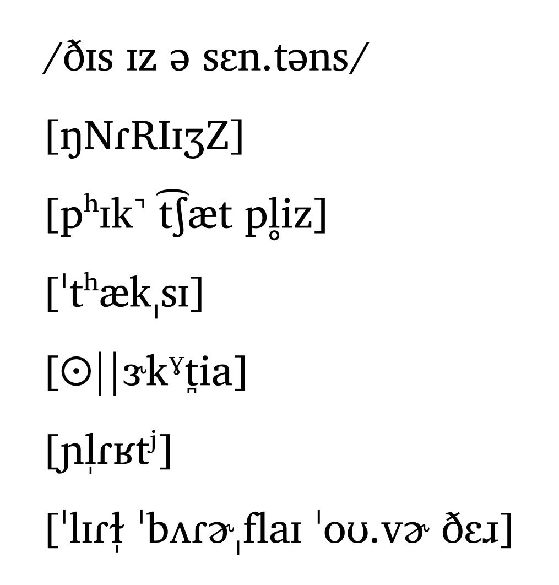
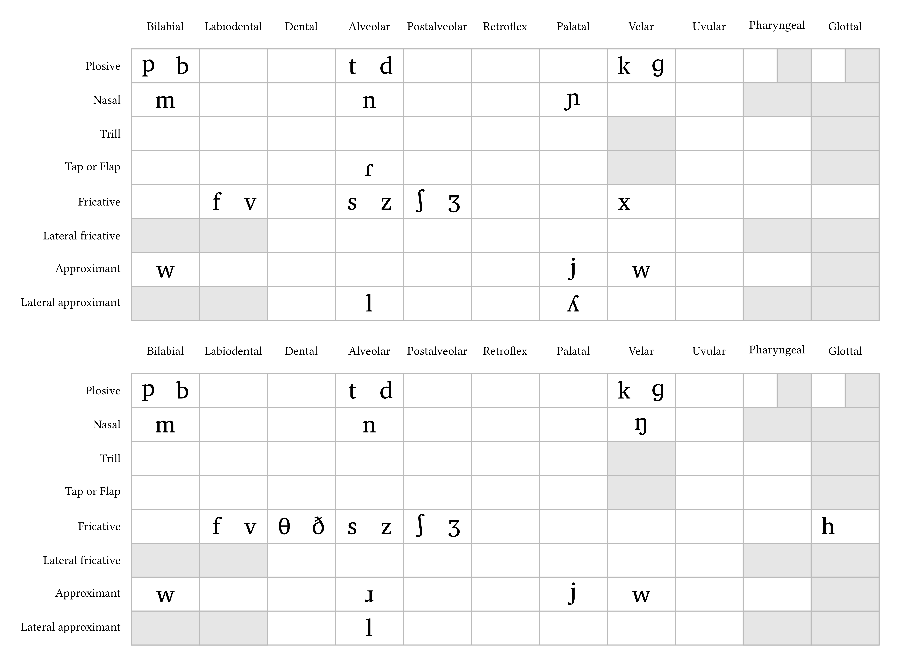
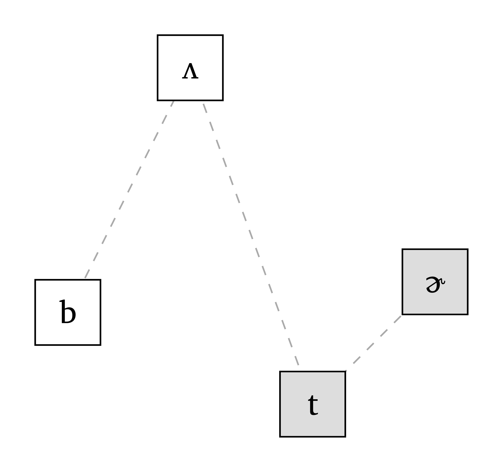
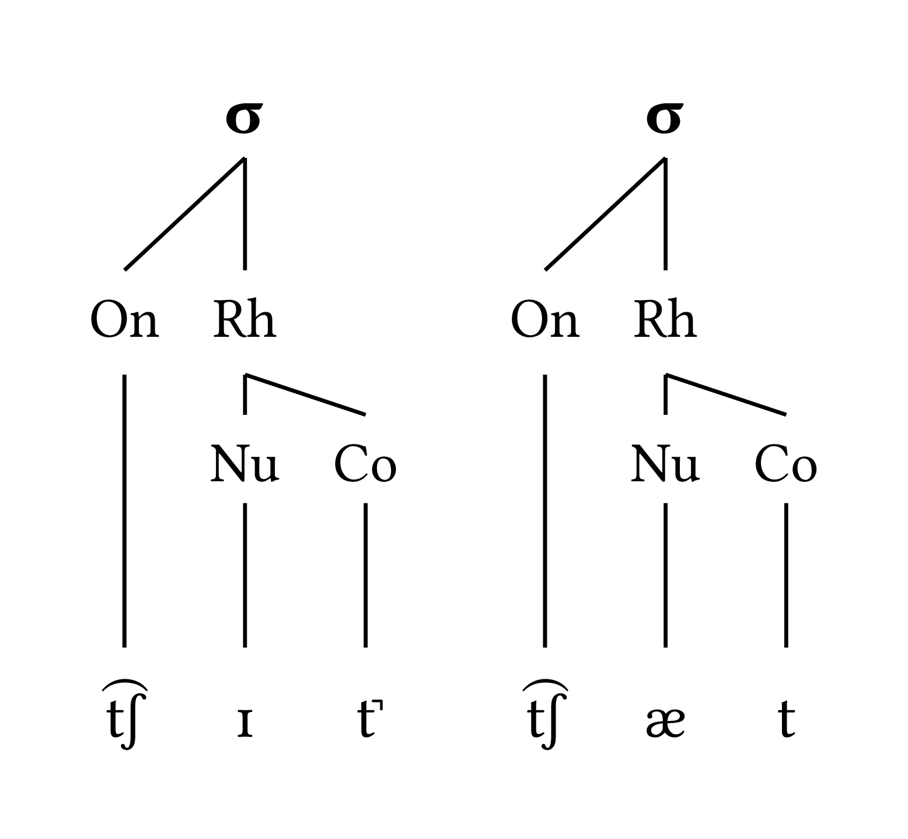
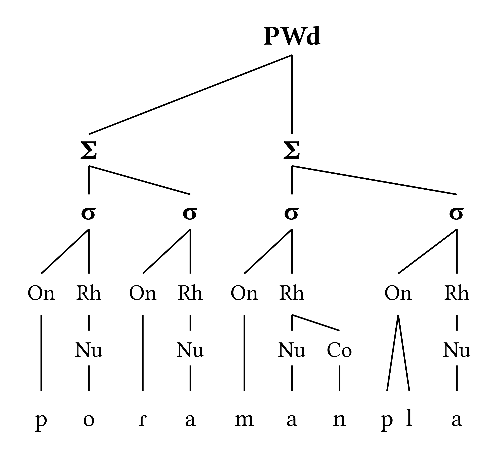
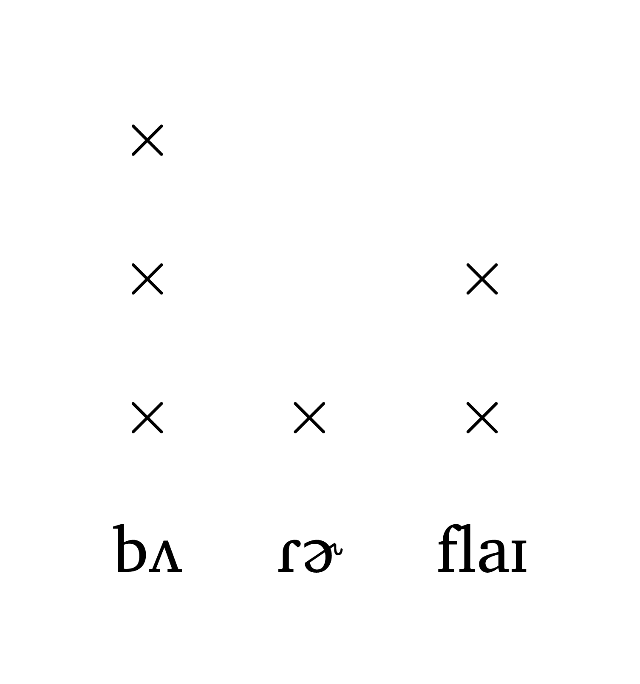
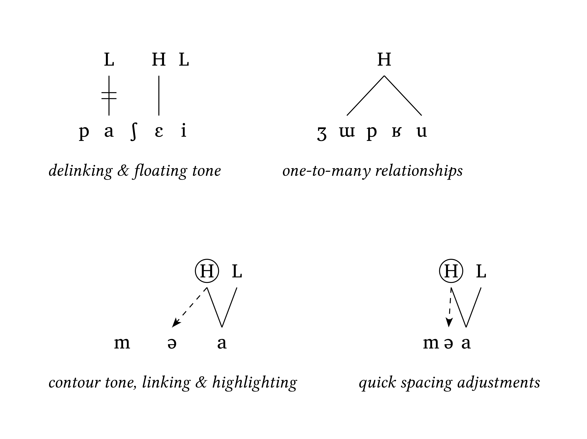
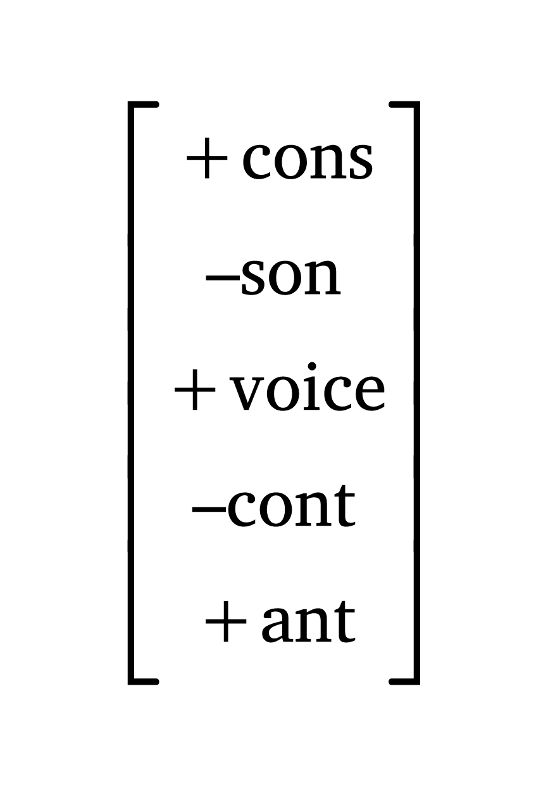
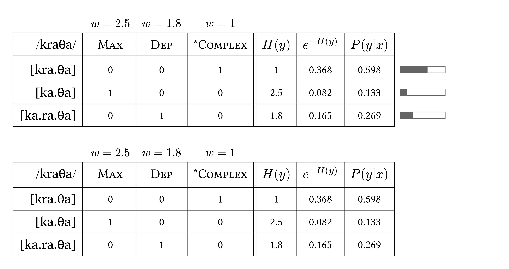

# Phonokit

<div align="center">
  <picture>
    <source media="(prefers-color-scheme: dark)" srcset="https://gdgarcia.ca/typst/logo_white.png">
    <source media="(prefers-color-scheme: light)" srcset="https://gdgarcia.ca/typst/logo.png">
    
  </picture>
</div>

<div align="center">

[](https://doi.org/10.5281/zenodo.17971031)
[](https://typst.app/universe/package/phonokit)
[](https://github.com/guilhermegarcia/phonokit/blob/main/LICENSE)
[](https://github.com/guilhermegarcia/phonokit/blob/main/vignette.pdf)

</div>

⚠️ **Charis SIL font is needed** for this package to work exactly as intended. If you don't already have this font installed, visit <https://software.sil.org/charis/download/>. New Computer Modern is used for arrows.

## Some examples

<!-- img width is set so the table gets evenly spaced by GitHubs css -->
<table>
<tr>
  <td>
    <a href="gallery/ipa_example.typ">
      
    </a>
  </td>
  <td>
    <a href="gallery/consonants_example.typ">
      
    </a>
  </td>
  <td>
    <a href="gallery/vowels_example.typ">
      
    </a>
  </td>
</tr>
<tr>
  <td>IPA transcription based on tipa</td>
  <td>Consonant inventories (with some pre-defined languages for quick plotting)</td>
  <td>Vowel trapezoids (with some pre-defined languages for quick plotting)</td>
</tr>
<tr>
  <td>
    <a href="gallery/sonority_example.typ">
      
    </a>
  </td>
  <td>
    <a href="gallery/syllable_example.typ">
      
    </a>
  </td>
  <td>
    <a href="gallery/word_example.typ">
      
    </a>
  </td>
</tr>
<tr>
  <td>Sonority profile with syllabification</td>
  <td>Syllable structure (onset-rhyme and moraic representations)</td>
  <td>Prosodic word (with metrical parsing)</td>
</tr>
  <tr>
    <td>
      <a href="gallery/grid_example.typ">
      

  </td>
  <td>
    <a href="gallery/autoseg_example_1.typ">
      
    </a>
  </td>
  
  <td>
      <a href="gallery/autoseg_example_3.typ">
      

  </td>
</tr>
<tr>
  <td>Metrical grids with support for IPA</td>
  <td>Autosegmental phonology: features</td>
  <td>Autosegmental phonology: tones</td>
</tr>
<tr>
    <td>
    <a href="gallery/spe_example.typ">
      
    </a>
  </td>
  <td>
    <a href="gallery/ot_example.typ">
      
    </a>
  </td>
  <td>
      <a href="gallery/maxent_example.typ">
      
    </a>
  </td>
  
</tr>
<tr>
  <td>SPE-style matrix</td>
  <td>Optimality theory tableaux with automatic shading</td>
  <td>MaxEnt tableaux with automatic calculation</td>
</tr>
</table>

*Click on the example image to go to the code.*

## Features

See package homepage or GitHub repository for a comprehensive demo (`vignette.pdf`). Here are the highlights of the package.

### IPA Module

- **tipa-style input**: Use familiar LaTeX tipa notation instead of hunting for Unicode symbols
- **Comprehensive symbol support**: most common IPA consonants, vowels, and diacritics
- **Vowel charts**: Plot vowels on the IPA vowel trapezoid with accurate positioning
- **Consonant tables**: Display consonants in the pulmonic IPA consonant table
- **Scalable charts**: Adjust size to fit your document layout (scaling includes text as expected)

### Prosody Module

- **Prosodic structure visualization**: Draw syllable structures (onset-rhyme and moraic representations) as well as feet and prosodic words with simple and intuitive syntax
- **Metrical grids**: Inputs as strings or tuples
- **Sonority profile**: Visualize the sonority of a string

### Autosegmental Module

- **Features and tones**: Create autosegmental representation for both features and tones
- **Support for common processes**: Easily add linking, delinking, floating tones, one-to-many relationships and highlighting. Additional options for spacing and annotation also available

### SPE module

- **Feature matrices**: Easily display feature matrices for SPE-style rules

### Optimality Theory Module

- **OT tableaux**: Create publication-ready Optimality Theory tableaux with automatic formatting
- **Automatic shading**: Cells are automatically grayed out after fatal violations
- **Winner indication**: Optimal candidates automatically marked with ☞ (pointing finger)
- **IPA support**: Input and candidate forms can use tipa-style IPA notation
- **Hasse diagrams**: Generate Hasse diagrams to visualize constraint rankings

### Maximum Entropy Module

- **MaxEnt tableaux**: Generate Maximum Entropy grammar tableaux with probability calculations
- **Automatic calculations**: Computes harmony scores H(x), unnormalized probabilities P*(x), and normalized probabilities P(x)
- **Visual probability bars**: Optional graphical representation of candidate probabilities
- **IPA support**: Input and candidate forms can use tipa-style IPA notation

## Installation

### Package Repository

- `http://github.com/guilhermegarcia/phonokit` [(most up-to-date version)](http://github.com/guilhermegarcia/phonokit)
- `https://typst.app/universe/package/phonokit` [(published on Typst)](https://typst.app/universe/package/phonokit)

### Package website

For the most up-to-date information about the package, vignettes and demos, visit <https://gdgarcia.ca/phonokit>.

## Usage

### IPA Transcription

```typst
// Basic transcription
#ipa("'sIRi")  // → ˈsɪɾi

// With nasalization
#ipa("\\~ E")  // → ɛ̃

// With devoicing
#ipa("\\r z")  // → z̥

// Syllabic segments 
#ipa("\\v n")  // → n̩

// Affricates
#ipa("\\t ts")  // → t͡s

// Complex example with multiple features
#ipa("'sIn,t \\ae ks")  // → ˈsɪnˌtæks

```

See package homepage for a complete notation reference.

### IPA Charts

Phonokit provides functions for visualizing IPA vowel and consonant inventories with proper phonetic positioning.

#### Vowel Charts

```typst
// Plot English vowel inventory
#vowels("english")

// Plot specific vowels using IPA notation
#vowels("aeEioOu")

// Plot French vowels with custom scale
#vowels("french", scale: 0.5)

// All available vowels
#vowels("all")
```

**Note:** The `vowels()` function now accepts tipa-style IPA input. Diacritics and non-vowel symbols will be automatically ignored during plotting.

**Available vowel language inventories:** `all`, `english`, `spanish`, `french`, `german`, `italian`, `japanese`, `portuguese`, `russian`, `arabic`, `mandarin`

#### Consonant Tables

```typst
// Plot complete pulmonic consonant chart
#consonants("all")

// Plot English consonant inventory
#consonants("english")

// Plot specific consonants using IPA notation
#consonants("ptk")

// Include affricates row with language-specific affricates
#consonants("english", affricates: true)  // Shows t͡ʃ, d͡ʒ

// Include aspirated consonants (phonemic aspiration)
#consonants("mandarin", affricates: true, aspirated: true)  

// Plot Spanish consonants with custom scale
#consonants("spanish", scale: 0.6)
```

**Notes:**

- The `consonants()` function accepts tipa-style IPA input
- Use `affricates: true` to show a dedicated affricate row (appears after fricatives)
- Use `aspirated: true` to show aspirated consonant rows (for languages with phonemic aspiration)
- /w/ (labiovelar approximant) appears in both bilabial and velar columns when /ɰ/ (velar approximant) is not present; otherwise only under bilabial
- Diacritics and non-consonant symbols are automatically ignored during plotting

**Available consonant language inventories:** `all`, `english`, `spanish`, `french`, `german`, `italian`, `japanese`, `mandarin`, `portuguese`, `russian`, `arabic`

### Prosodic Structures

Phonokit provides three functions for visualizing different levels of prosodic structure. The functions `syllable()`, `foot()` and `word()` below also have a `scale` argument (float) for adjusting the size of the resulting prosodic tree. Crucially, the scaling includes the tree, the text and the thickness of the lines in the tree. Furthermore, the length of each line dynamically adapts to the complexity of the representation, which results in a visually balanced figure.

#### Syllable Level

```typst
// Visualize a single syllable's internal structure (σ)
#syllable("man")
#syllable("'to") // stress symbol makes no difference here
```

#### Mora Level

```typst
// Visualize syllable weight using moras (μ)
#mora("ka")  // Light syllable (CV) = 1 mora
#mora("kan") // Light syllable (CVN) = 1 mora (coda doesn't count by default)
#mora("kan", coda: true) // Heavy syllable where coda contributes to weight
#mora("ka:") // Heavy syllable (CVV) = 2 moras
```

#### Foot Level

```typst
// Visualize foot (Σ) and syllable (σ) levels
#foot("man.'tal") // right-headed foot
#foot("'man.tal") // left-headed foot
```

#### Word Level

```typst
// Visualize prosodic word (PWd), foot (Σ), and syllable (σ) levels
#word("(ma.'va).ro")  // One iamb; one footless syllable

// Right-aligned prosodic word (default)
#word("ma.('va.ro)")  // One trochee; one footless syllable

// Disyllabic word
#word("('ka.va)")

// A dactyl
#word("('ka.va.mi)")

// Multiple feet, where foot = main foot is to the left
#word("('ka.ta)('vas.lo)", foot: "L") 
```

**Prosody notation:**

- `.` separates syllables
- `'` before a syllable marks it as the head of a foot
- `()` marks foot boundaries (used in `#word()`)
- Characters within syllables are automatically parsed into onset, nucleus, and coda
- Geminates are automatically detected for `#foot()` and `#word()`
- For long vowels, use `:`; `vv` will produce a complex nucleus (e.g., a diphthong)

#### Metrical grids

Easy-to-use function to design metrical grids with two types of inputs (strings or tuples).

```typst
// Input uses numbers for number xs on grid
#met-grid("bu3.tter1.fly2"),

// Use tuples to include IPA symbols
#met-grid(
    ("b2", 3),
    ("R \\schwar", 1),
    ("flaI", 2)
)
```

### Autosegmental phonology

Represent both features and tones as well as common processes (e.g., spreading, delinking, etc.).

```typst
// A simple spreading of [+nas]
#autoseg(
  ("k", "\\ae", "n", "t"),
  features: ("", "", "[+nas]", ""),
  links: ((2, 1),),
  spacing: 1.0,
  arrow: true,
)
```

Tone-related processes can be represented using the same function. See vignette for more details.

```typst
// A simple spreading of [+nas]
#autoseg(
  ("m", "u", "s", "u"),
  features: ("", "L", "", "H"),
  tone: true,
  spacing: 0.5, // keep consistent
  baseline: 37%,
  gloss: [_woman_],
) +
#autoseg(
  ("k", "u", "n", "d", "u"),
  features: ("", "H", "", "", ""), // H at position 1, but will be repositioned
  tone: true,
  float: (1,), // Mark H as floating so it doesn't draw vertical stem
  multilinks: ((1, (1, 4)),), // H links to segments at positions 1 and 4
  spacing: 0.5,
  baseline: 37%,
  arrow: false,
  gloss: [_short_],
) #a-r
#autoseg(
  ("m", "u", "s", "u", "–", "k", "u", "n", "d", "u"),
  features: ("", "L", "", "H", "", "", "H", "", "", ""),
  links: ((1, 3),), // link between L and H
  delinks: ((3, 3),),
  arrow: false,
  multilinks: ((6, (6, 9)),), // automatically erases vertical line in position 6
  tone: true,
  baseline: 37%,
  spacing: 0.50,
  gloss: [_short woman_],
)
```

### SPE Feature Matrices

Create SPE-style phonological feature matrices:

```typst
// Features as separate arguments
#feat("+consonantal", "–sonorant", "+voice")

// Features as comma-separated string
#feat("+cons,–son,+voice,–cont,+ant")

// Use in inline text
The segment #feat("+syl,–cons,+high,–back") represents /i/.
```

### Distinctive Feature Matrices

Display complete distinctive feature specifications for IPA segments based on Hayes (2009).

```typst
// Display feature matrix for a consonant
#feat-matrix("p")  // Shows all specified features for /p/

// Display feature matrix for a vowel
#feat-matrix("i")  // Shows features for /i/

// Using tipa-style notation
#feat-matrix("t \\t s")  // Feature matrix for affricate /t͡s/

// Show all features including unspecified (0) values
#feat-matrix("k", all: true)

// Use in comparative analysis
Comparing #feat-matrix("p") and #feat-matrix("b") shows they differ only in [voice].
```

**Features included:**

- **Consonants**: consonantal, sonorant, continuant, delayed release, approximant, tap, trill, nasal, voice, spread glottis, constricted glottis, labial, round, labiodental, coronal, anterior, distributed, strident, lateral, dorsal, high, low, front, back, tense
- **Vowels**: syllabic, consonantal, sonorant, continuant, voice, high, low, tense, front, back, round

**Available segments:** All IPA consonants and vowels from Hayes (2009) *Introductory Phonology*, including single place articulations, complex segments, and all standard vowels.

### Optimality Theory Tableaux

Create OT tableaux with automatic violation marking and shading:

```typst
// Basic OT tableau
// With IPA input and dashed constraint boundaries
#tableau(
  input: "kraTa",
  candidates: ("kra.Ta", "ka.Ta", "ka.ra.Ta"),
  constraints: ("Max", "Dep", "*Complex"),
  violations: (
    ("", "", "*"),
    ("*!", "", ""),
    ("", "*!", ""),
  ),
  winner: 1, // <- Position of winning cand
  dashed-lines: (1,) // <- Note the comma
)
```

### Hasse diagrams

Create OT tableaux with automatic violation marking and shading:

```typst
// Basic scenario
#hasse(
  (
    ("*Complex", "Max", 0),
    ("*Complex", "Dep", 0),
    ("Onset", "Max", 0),
    ("Onset", "Dep", 0),
    ("Max", "NoCoda", 1),
    ("Dep", "NoCoda", 1),
  ),
  scale: 0.9
)
```

### Maximum Entropy Grammar

Create MaxEnt tableaux with probability calculations:

```typst
// MaxEnt tableau with probability visualization
#maxent(
    input: "kraTa",
    candidates: ("[kra.Ta]", "[ka.Ta]", "[ka.ra.Ta]"),
    constraints: ("Max", "Dep", "*Complex"),
    weights: (2.5, 1.8, 1),
    violations: (
      (0, 0, 1),
      (1, 0, 0),
      (0, 1, 0),
    ),
    visualize: true, // Show probability bars (default)
  )
```

## License

MIT

## Author

**Guilherme D. Garcia** \
Email: <guilherme.garcia@lli.ulaval.ca>

## Citation

If you use this software in your research, please cite it using the metadata from the `CITATION.cff` file or click the "Cite this repository" button in the GitHub sidebar.

## Contributing

Contributions are welcome! Please feel free to submit issues or pull requests.
