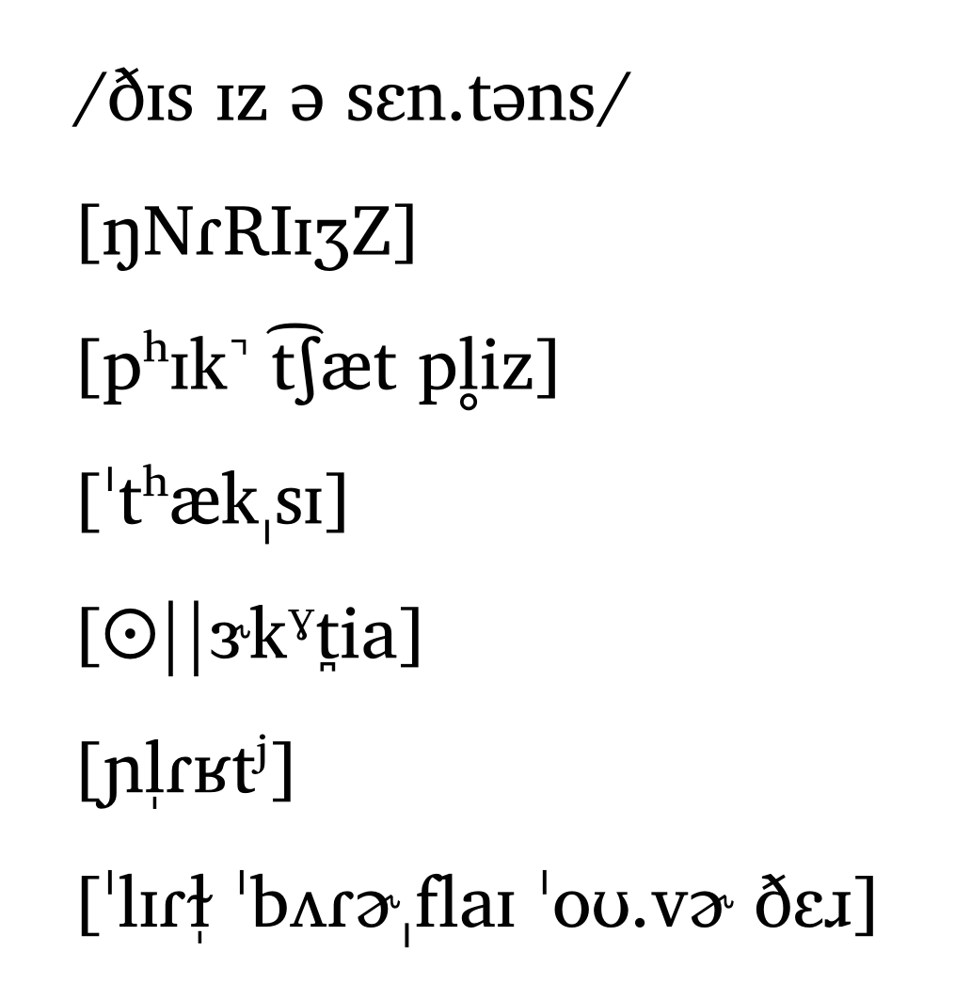
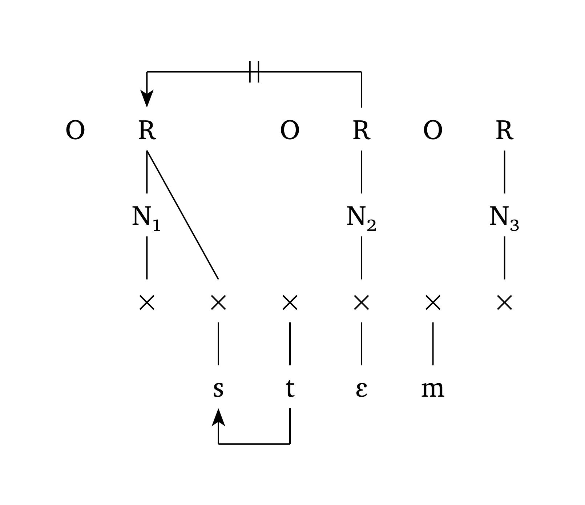

<div align="center">
  <picture>
    <source media="(prefers-color-scheme: dark)" srcset="https://gdgarcia.ca/typst/logo_white.png">
    <source media="(prefers-color-scheme: light)" srcset="https://gdgarcia.ca/typst/logo.png">
    
  </picture>
</div>

<div align="center">

[](https://doi.org/10.5281/zenodo.17971031)
[](https://typst.app/universe/package/phonokit)
[](https://github.com/guilhermegarcia/phonokit/blob/main/LICENSE)
[](https://doi.org/10.5281/zenodo.18260076)

</div>

**Charis SIL font is needed** for this package to work exactly as intended, but you can also use your own font with `#phonokit-init(font: "...")`. New Computer Modern is used for arrows.

## Some examples

<table>
<tr>
  <td align="center" width="33%">
    <a href="gallery/ipa_example.typ"></a>
    <br><sub>IPA transcription based on tipa</sub>
  </td>
  <td align="center" width="33%">
    <a href="gallery/consonants_example.typ"></a>
    <br><sub>Consonant inventories (with pre-defined languages)</sub>
  </td>
  <td align="center" width="33%">
    <a href="gallery/vowels_example.typ"></a>
    <br><sub>Vowel trapezoids (with pre-defined languages)</sub>
  </td>
</tr>
<tr>
  <td align="center">
    <a href="gallery/multi-tier_example.typ"></a>
    <br><sub>Multi-tier representations</sub>
  </td>
  <td align="center">
    <a href="gallery/syllable_example.typ"></a>
    <br><sub>Syllable structure (onset-rhyme and moraic)</sub>
  </td>
  <td align="center">
    <a href="gallery/word_example.typ"></a>
    <br><sub>Prosodic word (with metrical parsing)</sub>
  </td>
</tr>
<tr>
  <td align="center">
    <a href="gallery/grid_example.typ"></a>
    <br><sub>Metrical grids with IPA support</sub>
  </td>
  <td align="center">
    <a href="gallery/autoseg_example_1.typ"></a>
    <br><sub>Autosegmental phonology: features</sub>
  </td>
  <td align="center">
    <a href="gallery/autoseg_example_3.typ"></a>
    <br><sub>Autosegmental phonology: tones</sub>
  </td>
</tr>
<tr>
  <td align="center">
    <a href="gallery/spe_example.typ"></a>
    <br><sub>SPE-style feature matrix</sub>
  </td>
  <td align="center">
    <a href="gallery/ot_example.typ"></a>
    <br><sub>OT tableaux with automatic shading</sub>
  </td>
  <td align="center">
    <a href="gallery/maxent_example.typ"></a>
    <br><sub>MaxEnt tableaux with automatic calculation</sub>
  </td>
</tr>
</table>

<sub>Click on any image to view its source code.</sub>

## Manual 🔍

Download [**manual**](https://doi.org/10.5281/zenodo.18260076) for a comprehensive demonstration of available functions and their usage.

## Fonts

As of version `0.3.7`, the package allows the user to choose a global font for all functions. By default, Charis SIL is used (Typst has a fallback font should you not have it installed). However, you can use whichever font you prefer with the following command:

```typst
#import "@preview/phonokit:0.4.1": *
#phonokit-init(font: "New Computer Modern") // <- add to the top of your document
```

### IPA Module

- **tipa-style input**: Use familiar LaTeX tipa notation instead of hunting for Unicode symbols
- **Comprehensive symbol support**: most common IPA consonants, vowels, and diacritics
- **Vowel charts**: Plot vowels on the IPA vowel trapezoid with accurate positioning
- **Consonant tables**: Display consonants in the pulmonic IPA consonant table
- **Scalable charts**: Adjust size to fit your document layout (scaling includes text as expected)

### Prosody Module

- **Prosodic structure visualization**: Draw syllable structures (onset-rhyme and moraic representations) as well as feet and prosodic words with simple and intuitive syntax. You can also define which symbols you prefer to use for different prosodic domains
- **Multi-tier representations**: Create complex non-linear representations
- **Metrical grids**: Inputs as strings or tuples
- **Sonority profile**: Visualize the sonority of a string

### Autosegmental Module

- **Features and tones**: Create autosegmental representation for both features and tones
- **Support for common processes**: Easily add linking, delinking, floating tones, one-to-many relationships and highlighting. Additional options for spacing and annotation also available

### SPE module

- **Feature matrices**: Easily display feature matrices for SPE-style rules

### Optimality Theory Module

- **OT tableaux**: Create publication-ready Optimality Theory tableaux with automatic formatting
- **Automatic shading**: Cells are automatically grayed out after fatal violations
- **Winner indication**: Optimal candidates automatically marked with ☞ (pointing finger)
- **IPA support**: Input and candidate forms can use tipa-style IPA notation
- **Hasse diagrams**: Generate Hasse diagrams to visualize constraint rankings

### Maximum Entropy Module

- **MaxEnt tableaux**: Generate Maximum Entropy grammar tableaux with probability calculations
- **Automatic calculations**: Computes harmony scores H(x), unnormalized probabilities P*(x), and normalized probabilities P(x)
- **Visual probability bars**: Optional graphical representation of candidate probabilities
- **IPA support**: Input and candidate forms can use tipa-style IPA notation

### Harmonic Grammar Module

- **HG tableaux**: Generate HG tableaux with automatic calculation of harmony given constraint weights and violations
- **Noisy HG**: Generate NHG tableaux with automatic calculation of harmony and probabilities derived from simulated noise and multiple evaluations

### General Module

- **Numbered examples**: Create examples and sub-examples with labels and correct alignment
- **Shortcuts**: Quick commands to add a range of arrows, angle brackets for extrametricality, and SPE-style underlines for context

## Installation

### Package Repository

- `https://github.com/guilhermegarcia/phonokit` [(most up-to-date version)](http://github.com/guilhermegarcia/phonokit)
- `https://typst.app/universe/package/phonokit` [(published on Typst)](https://typst.app/universe/package/phonokit)

### Package website

For the most up-to-date information about the package, vignettes and demos, visit <https://gdgarcia.ca/phonokit>.

## License

MIT

## Author

**Guilherme D. Garcia** \
Email: <guilherme.garcia@lli.ulaval.ca> \
Website: <https://gdgarcia.ca>

## Citation

If you use this package in your research, please visit its GitHub repository and cite it using the metadata from the `CITATION.cff` file or click the "Cite this repository" button in the GitHub sidebar.

## Contributing

Contributions are welcome! Please feel free to submit issues or pull requests.
