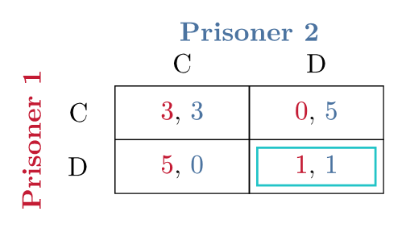
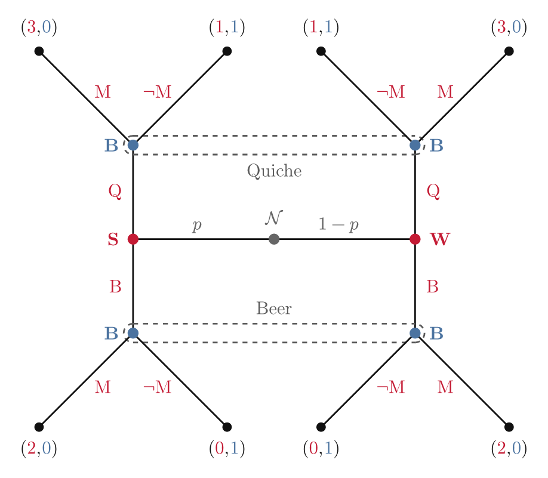

# pi-games

Typesetting tools for **game theory** in Typst: draw **normal-form payoff
matrices** and **extensive-form game trees** with consistent per-player
colours across both representations.

`pi-games` is an umbrella module that bundles three libraries — a shared colour
palette, normal-form tables, and extensive-form trees (built on
[CeTZ](https://github.com/cetz-package/cetz)) — behind a single import.

**Normal form — Prisoner's Dilemma**



**Extensive form — Beer–Quiche signalling game**



## Usage

```typst
#import "@preview/pi-games:0.1.0": *
```

Extensive-form trees are drawn inside a `cetz.canvas` block, so import CeTZ as
well when you need them:

```typst
#import "@preview/cetz:0.5.2" as cetz
#import "@preview/pi-games:0.1.0": *
```

### Normal form

`game-normal-form` covers the same kind of normal-form games as the
[`game-theoryst`](https://typst.app/universe/package/game-theoryst/) Typst
package by Connor T. Wiegand — players, strategy lists, a payoff matrix and
per-player best-response underlines — but with its own CeTZ-based API: payoffs
are a single nested array and best responses are passed as `(row, col)`
coordinate lists, rather than `game-theoryst`'s table cells with inline
`hul()`/`vul()` markers.

`game-normal-form` returns ready-to-place content (no canvas needed). The
Prisoner's Dilemma above is produced by:

```typst
#game-normal-form(
  [Prisoner 1], [Prisoner 2],
  ([C], [D]),
  ([C], [D]),
  (
    (([$3$], [$3$]), ([$0$], [$5$])),
    (([$5$], [$0$]), ([$1$], [$1$])),
  ),
  p1-best: ((1, 0), (1, 1)),   // underline Player 1 best responses
  p2-best: ((0, 1), (1, 1)),   // underline Player 2 best responses
  nash: ((1, 1),),             // outline the Nash equilibrium cell
)
```

Use `game-three-player-normal-form` for three-player games, rendered as one
sub-matrix per Player 3 strategy.

### Extensive form

The tree style replicates the look of the
[`xgames`](https://carlabernard.ch/beni/downloads/xgames.pdf) LaTeX package by
Benjamin Bernard — per-player coloured node labels, action labels and payoff
vectors — reimplemented natively in Typst/CeTZ.

Build trees from nodes, branches, terminals and information sets inside a
`cetz.canvas`. The Beer–Quiche signalling game above uses `game-nature`,
`game-node`, `game-branch`, `game-prob`, `game-terminal` and bracket-style
`game-infoset` calls. A minimal tree:

```typst
#cetz.canvas({
  import cetz.draw: *
  game-branch((0, 0), (-1.5, -2), action: [Out], player: 1, side: "w")
  game-terminal((-1.5, -2), payoffs: ([0], [2]))
  game-branch((0, 0), (1.5, -2), action: [In], player: 1, side: "e")
  game-terminal((1.5, -2), payoffs: ([1], [1]))
  game-node((0, 0), player: 1, label: [Player 1], la: "n")
})
```

## Public API

**Normal form**

| Function | Description |
|---|---|
| `game-normal-form(p1, p2, s1, s2, payoffs, ...)` | N×M payoff matrix with coloured payoffs, best-response underlines and Nash highlights |
| `game-three-player-normal-form(p1, p2, p3, s1, s2, s3, payoffs, ...)` | Three-player game as a row of N×M sub-matrices |

**Extensive form**

| Function | Description |
|---|---|
| `game-node(pos, player, label, ...)` | Decision node (filled, open, or dot style) |
| `game-nature(pos, label, ...)` | Nature / chance node (grey) |
| `game-terminal(pos, payoffs, ...)` | Terminal node with a coloured payoff vector |
| `game-branch(from, to, action, ...)` | Branch with an optional action label |
| `game-prob(from, to, action, ...)` | Nature-branch probability label (wrapper around `game-branch`) |
| `game-infoset(...pts, player, style, ...)` | Information set, `"dashed"` or `"bracket"` style |
| `game-subgame(apex, depth, width, ...)` | Proper-subgame triangle marker |
| `game-highlight(from, to, color, ...)` | Bold overlay marking an equilibrium path |
| `game-payoffs(payoffs, parens)` | Inline coloured payoff vector for body text |
| `game-player(player, label)` / `game-player-default(player)` | Player name in the player's colour |

## Styling

All colours and geometry are plain `let` bindings exposed by the package and can
be overridden after import — e.g. the player palette `game-pal`, the Nash
outline `game-nash-color`, the highlight colour `game-highlight-color`, and tree
geometry such as `game-node-radius`, `game-terminal-radius`, `game-gap`, …

```typst
#import "@preview/pi-games:0.1.0": *
#let game-pal = (              // custom player colours
  rgb("#005f73"), rgb("#94d2bd"), rgb("#e9d8a6"),
  rgb("#ee9b00"), rgb("#ae2012"),
)
```

## Dependencies

- [`@preview/cetz`](https://typst.app/universe/package/cetz) `0.5.2` (requires Typst ≥ 0.14.0)

## Acknowledgements

- The normal-form games cover the same ground as the
  [`game-theoryst`](https://typst.app/universe/package/game-theoryst/) Typst
  package by Connor T. Wiegand, reimplemented here with a different,
  CeTZ-based API.
- The extensive-form trees replicate the visual style of the
  [`xgames`](https://carlabernard.ch/beni/downloads/xgames.pdf) LaTeX package by
  Benjamin Bernard. The original colour-coded design is his; `pi-games` only
  reimplements that look in Typst/CeTZ. Full credit for the design goes to him.

## License

MIT © Piotr Kuszewski — see [`LICENSE`](LICENSE).
