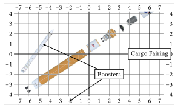
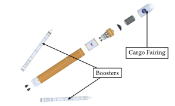

# Piclabeler

*Typst package to annotate images with labels and arrows.*

Piclabeler uses the Typst drawing library [CeTZ](https://github.com/cetz-package/cetz) to place an image on a canvas with a guiding grid and provides functions to annotate it.
It is similar to the LaTeX packages [overpic](https://ctan.org/pkg/overpic) or [tikz-imagelabels](https://ctan.org/pkg/tikz-imagelabels).

## Example
The following code creates an annotated image with two labels:
```typ
#import "@preview/piclabeler:0.1.0" as pl

#pl.annotated-image(
  width: 10cm,
  image-width: 80%,
  // https://images.nasa.gov/details/B1B_Cargo_Expanded_View
  image("B1B_Cargo_Expanded_View.jpg"),
  {
    let label = pl.label.with(
      frame: "rect",
      padding: 0.4em,
      mark: (
        end: ">>",
        fill: black,
        stroke: none
      ),
    )
    label([Cargo Fairing], (6, 0), to: (6, 4.3))
    label([Boosters], (2, -2), to: ((-4.6, 1), (-2, -4.7)))
  },
)
```


After placing the labels and arrows, the grid can be disabled by setting `grid: none`:
```typ
#pl.annotated-image(
    grid: none,
    // ...
)
```
